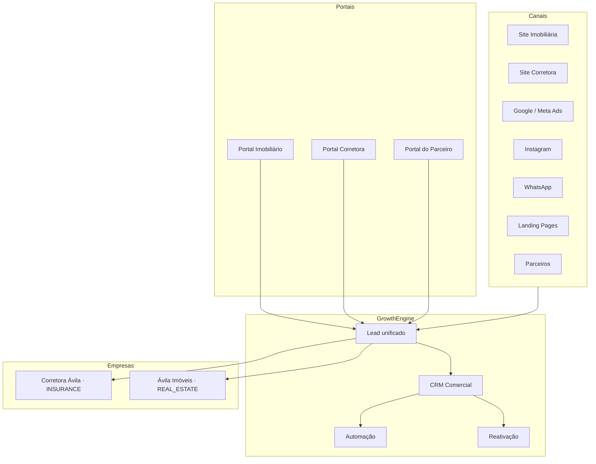

# Grupo Ávila — Growth Engine (Arquitetura)

**Status:** Documento oficial de arquitetura  
**Data:** 2026-08-25  
**Escopo:** Corretora Ávila + Ávila Imóveis — aquisição, CRM, automação, parceiros e multiempresa

---

## 1. Princípio central

**Todo canal de aquisição gera Lead.**

Não existem entradas “soltas” no funil comercial. Site, anúncios, WhatsApp, landing pages e parceiros devem criar (ou atualizar) um **Lead** com:

| Campo / conceito | Obrigatório |
|------------------|-------------|
| `source` / canal | Sim — identificador do canal (ver §2) |
| `businessUnitId` ou vínculo BU | Sim — Corretora Ávila **ou** Ávila Imóveis |
| Origem rastreável | UTM, parceiro, campanha, propertyId quando imobiliário |
| Responsável (`ownerUserId`) | Atribuição conforme regra de roteamento |
| Consentimento / LGPD | Conforme canal |

### 1.1 Canais oficiais de aquisição

| Canal | Empresa típica | Lead `source` sugerido |
|-------|----------------|------------------------|
| Site Imobiliária | Ávila Imóveis | `site-imobiliaria` |
| Site Corretora | Corretora Ávila | `site-corretora` |
| Google Ads | Ambas (por campanha) | `google-ads` |
| Meta Ads | Ambas | `meta-ads` |
| Instagram | Ambas | `instagram` |
| WhatsApp | Ambas | `whatsapp` |
| Landing Pages | Ambas (por LP) | `landing-page` |
| Parceiros | Ambas (por parceiro) | `parceiro:{id}` |

Implementação técnica: constante `ACQUISITION_CHANNELS` em `packages/auth/src/governance.ts`.

---

## 2. Visão do ecossistema

---

## 3. Multiempresa (Business Units)

| Empresa | Slug | Tipo | Operação |
|---------|------|------|----------|
| Corretora Ávila | `corretora-avila` | `INSURANCE` | Seguros, CRM comercial, cotações, apólices |
| Ávila Imóveis | `avila-imoveis` | `REAL_ESTATE` | Imóveis, visitas, portal, leads imobiliários |

**Separação completa:**

- Membership via `user_business_units`
- ACL em API: `business-unit-acl.util.ts` + `currentBusinessUnitId` no JWT
- Selector “Todas” apenas para perfis com `business-units:view-all` ou `admin`
- Dados comerciais filtrados por BU (leads, clientes, deals)

**Perfis RBAC por empresa (referência):**

| Perfil | Corretora Ávila | Ávila Imóveis |
|--------|:---------------:|:-------------:|
| Administrador | ✓ | ✓ |
| Gerência / Comercial / Operacional | ✓ | — |
| Corretor Imobiliário | — | ✓ |
| Parceiro | escopo compartilhado | escopo compartilhado |

Perfil **Corretor Imobiliário** (catálogo Fase 2A, seed Fase 2B):

- `dashboard:view`
- `properties:view`, `properties:manage`
- `leads:view`, `leads:manage`

Sem acesso a cotações, apólices ou CRM de seguros.

---

## 4. Portal Imobiliário

**Objetivo:** Captação de interessados em imóveis → Lead imobiliário.

| Fluxo | Saída |
|-------|--------|
| Busca / ficha de imóvel | Lead com `propertyId`, BU `avila-imoveis` |
| Formulário “Tenho interesse” | Lead + activity |
| Agendamento de visita | Lead + evento visita (módulo imobiliário) |
| Publicação portal externo | `properties:manage` + config portal |

Rotas Web existentes: `/real-estate/*` · Permissão: `properties:view|manage`.

---

## 5. Portal Corretora

**Objetivo:** Captação de leads de seguros (cotação, contato, simulação).

| Fluxo | Saída |
|-------|--------|
| Formulário de contato | Lead BU `corretora-avila` |
| Simulação / cotação online | Lead + questionário / quote pipeline |
| Chat / WhatsApp widget | Lead `source=whatsapp` |

Integração futura com landing pages e tags de campanha (UTM → metadata do Lead).

---

## 6. CRM Comercial

**Escopo:** Pipeline de negócios, clientes, leads, questionários, importação.

| Módulo | Permissões RBAC |
|--------|-----------------|
| Leads | `leads:view`, `leads:manage`, `leads:share` |
| Clientes | `clients:view`, `clients:manage` |
| Negócios / CRM | `crm:view`, `crm:manage` |
| Questionários | `questionnaires:view`, `questionnaires:manage` |

**Funil de Leads (conceitual):**

1. **Captação** — canal → Lead criado  
2. **Qualificação** — status, score, questionário  
3. **Distribuição** — owner, equipe, BU  
4. **Negócio** — Deal no pipeline  
5. **Conversão** — Cliente + Apólice (seguros) ou Imóvel fechado (imobiliário)

Ownership: `dataScope` por perfil (`own`, `team`, `tenant`, `shared`).

---

## 7. Automação

**Escopo atual:** templates, comunicação interna, reativação, cross-sell, follow-ups.

| Área | Permissões |
|------|------------|
| Automação | `automation:view`, `automation:manage` |

Automações devem **sempre** referenciar Lead/Cliente existente — nunca mensagem sem registro pai.

---

## 8. Reativação de Leads

Configuração por tenant (`leadReactivationSetting`) + logs (`leadReactivationLog`).

| Etapa | Regra |
|-------|--------|
| Detecção | Lead idle N dias |
| Tentativa | Template + canal (WhatsApp/e-mail interno) |
| Limite | `maxAttempts` por configuração |
| Resultado | Activity + atualização status Lead |

Canal WhatsApp futuro continua gerando/atualizando Lead antes do envio.

---

## 9. Parceiros (módulo preparado)

Arquitetura alvo — **não implementado na Fase 2A**:

| Capacidade | Descrição |
|------------|-----------|
| Cadastro de parceiros | Entidade parceiro vinculada a tenant (+ BU opcional) |
| Indicação de leads | Lead com `source=parceiro:{id}` |
| Rastreabilidade | `LeadShare`, metadata de indicação, auditoria |
| Comissões | Regras + `sales_commissions` (schema preparado) |
| Portal do parceiro | Perfil `parceiro` + `leads:view` escopo `shared` |

Domínio RBAC UI: **Parceiros** (`leads:share` hoje; permissões granulares na Fase 3).

---

## 10. Comissões

Modelo existente: `sales_commissions`, `commission_rules` (parcialmente seedado).

| Regra | Growth Engine |
|-------|---------------|
| Toda venda/conversão rastreável | Lead → Deal → Policy / Property |
| Comissão de parceiro | Vinculada ao Lead de origem `parceiro:*` |
| Comissão interna | `brokerUserId` / owner do Deal |

---

## 11. Integração RBAC ↔ Growth Engine

| Camada | Responsabilidade |
|--------|------------------|
| Governança UI | `/configuracoes/governanca/*` — perfis, matriz, usuários, empresas, auditoria |
| Login API | Permissões achatadas do **banco** (autoritativo) |
| Catálogo `@repo/auth/governance` | Labels, domínios, perfil Corretor Imobiliário (planejado) |
| BU ACL | Isolamento Corretora vs Imóveis |

---

## 12. Roadmap sugerido

| Fase | Entrega |
|------|---------|
| **2A** (atual) | UI Governança somente leitura |
| **2B** | Seed `corretor_imobiliario` no DB; API memberships user×BU |
| **3** | Portal parceiro, comissões, permissões `parceiros:*` |
| **4** | Portais públicos corretora/imobiliária com criação automática de Lead |
| **5** | WhatsApp + Ads integrados (sempre → Lead) |

---

## Referências

- `docs/reports/rbac-governance-audit.md` — auditoria Fase 1  
- `docs/reports/rbac-governance-redesign.md` — implementação Fase 2A  
- `packages/auth/src/governance.ts` — catálogo e canais  
- `apps/api/src/common/utils/business-unit-acl.util.ts` — ACL multi-BU  
