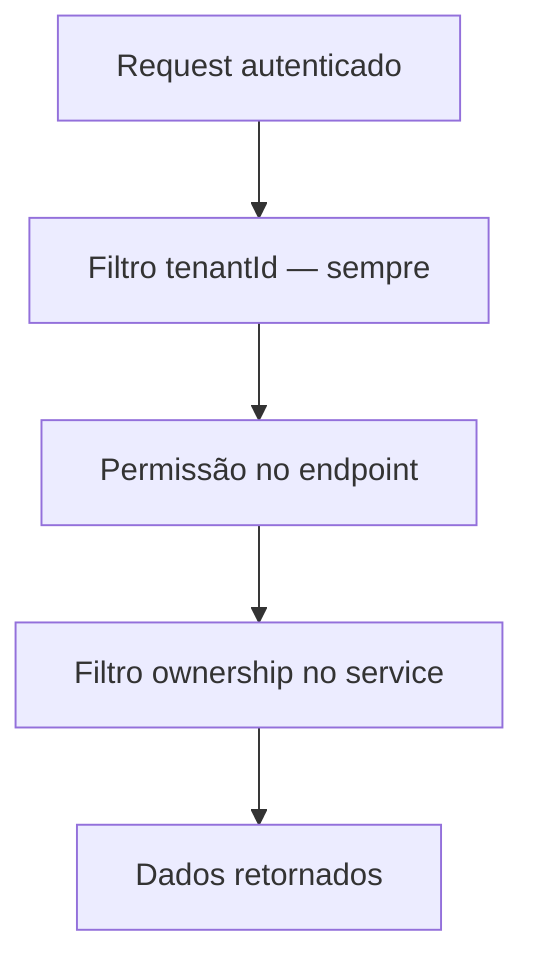
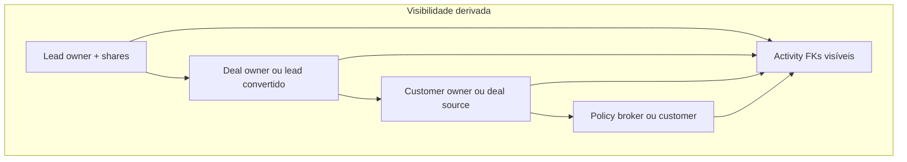
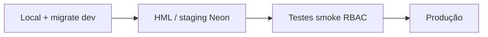

# Arquitetura de Ownership — Sprint 1 (modelagem)

**Status:** Planejado — Sprint 1 Ownership + RBAC Foundations  
**Data:** 2026-05-27  
**Relacionado:** [rbac-architecture.md](./rbac-architecture.md) · [rbac-phase-2-matrix.md](./rbac-phase-2-matrix.md) · [rbac-ownership-matrix.md](./rbac-ownership-matrix.md) · [ADR-006](../decisions/ADR-006-rbac-and-ownership.md) · [ADR-001](../decisions/ADR-001-multi-tenant-architecture.md)

**Escopo desta sprint:** modelagem, proposta de schema, plano de migração e rollout **local → HML → produção**.  
**Fora de escopo:** WhatsApp, IA, automações, financeiro, dashboards avançados, implementação completa dos services.

---

## 1. Princípio central

Autorização em **duas dimensões independentes**:

| Dimensão | Pergunta | Mecanismo |
|----------|----------|-----------|
| **Permissão (RBAC)** | O usuário **pode** executar esta ação no módulo? | `Permission` + `Role` + `@RequirePermissions` |
| **Ownership (ABAC leve)** | O usuário **pode ver/editar este registro**? | `ownerUserId`, `ownerTeamId`, `LeadShare`, escopo `own \| team \| tenant \| shared` |



**Regra de ouro:** esconder menu no frontend **não** substitui filtro no backend. Parceiro com URL direta não pode ver pipeline interno.

---

## 2. Cenários de negócio → escopo técnico

| Persona | O que vê | O que não vê | Escopo |
|---------|----------|--------------|--------|
| **Parceiro** | Leads (e derivados) **compartilhados** com ele | Pipeline completo, outros leads, financeiro, clientes não vinculados | `shared` |
| **Comercial** | Seus leads, negócios, clientes da sua carteira | Registros de outros corretores (salvo share) | `own` |
| **Gerência** | Carteira da **equipe** | Outras equipes (configurável) | `team` |
| **Admin** | Todo o **tenant** | Outros tenants | `tenant` |

### 2.1 Matriz persona × recurso

| Recurso | Parceiro | Comercial | Gerência | Admin |
|---------|:--------:|:---------:|:--------:|:-----:|
| Leads (lista) | Só com `LeadShare` | `ownerUserId = eu` | `ownerTeamId ∈ minhas equipes` | Todos |
| Deals / pipeline | ❌ (sem rota ou 403) | Próprios + herdados do lead | Equipe | Todos |
| Customers | ❌ ou só via lead share | Próprios / source deal próprio | Equipe | Todos |
| Policies | ❌ | Via customer acessível | Equipe | Todos |
| Activities (agenda global) | ❌ | Contexto dos registros visíveis | Equipe | Todos |
| Financeiro (futuro) | ❌ | ❌ | Config | Config |

---

## 3. Análise das entidades atuais (as-is)

### 3.1 Resumo por entidade

| Entidade | `tenantId` | Ownership hoje | FK usuário | Relacionamentos relevantes |
|----------|:----------:|----------------|------------|----------------------------|
| **Lead** | ✅ | `assignedTo` (texto) | ❌ | `dealId` → Deal; submissions; activities |
| **Deal** | ✅ | `assignedTo` (texto) | ❌ | `customerId`; `convertedLead`; policies |
| **Customer** | ✅ | — | ❌ | `sourceDealId`; deals; policies |
| **Policy** | ✅ | `brokerUserId` | ✅ | `customerId`, `dealId` |
| **Activity** | ✅ | `performedById` (autor) | ✅ | `leadId`, `dealId`, `customerId`, `policyId` |

### 3.2 `assignedTo` — problema atual

- Tipo: `String?` sem FK.
- Valores observados na prática: **nome**, **email**, ou ocasionalmente **userId** (inconsistente).
- **Lead:** filtro `?mine=true` resolve `[userId, name, email]` (`LeadsService.resolveMineAssignedToValues`).
- **Deal:** listagem `CrmService.findDeals` usa apenas `{ tenantId }` — **sem ownership**.
- **Customer:** sem campo de responsável; carteira inferida só por `sourceDealId` / deals.

### 3.3 Activity — autoria ≠ ownership

- `performedById` registra quem executou a interação.
- Listagens globais (agenda/tarefas) filtram por `tenantId` + status/data — **não** por carteira do usuário.
- Acesso por contexto (sheet lead/deal) herda visibilidade do pai — hoje o pai não restringe por usuário.

### 3.4 Policy — único modelo “correto”

- `brokerUserId` → `User` é o padrão a replicar para Lead/Deal/Customer.
- Renovações e comissões (futuro financeiro) devem respeitar o mesmo escopo do customer/policy broker.

### 3.5 Diagrama de dependência de visibilidade (atual vs alvo)



---

## 4. Modelo alvo — ownership via FK

### 4.1 Novas entidades organizacionais

```prisma
/// Equipe comercial dentro do tenant (carteira agregada para gerência)
model Team {
  id        String   @id @default(cuid())
  tenantId  String
  tenant    Tenant   @relation(fields: [tenantId], references: [id], onDelete: Cascade)
  name      String
  slug      String
  isActive  Boolean  @default(true)
  createdAt DateTime @default(now())
  updatedAt DateTime @updatedAt

  members   TeamMember[]
  leads     Lead[]
  deals     Deal[]
  customers Customer[]

  @@unique([tenantId, slug])
  @@index([tenantId])
  @@map("teams")
}

model TeamMember {
  teamId   String
  userId   String
  /// Gerente da equipe — escopo team inclui todos os membros
  isLead   Boolean  @default(false)
  joinedAt DateTime @default(now())

  team Team @relation(fields: [teamId], references: [id], onDelete: Cascade)
  user User @relation(fields: [userId], references: [id], onDelete: Cascade)

  @@id([teamId, userId])
  @@index([userId])
  @@map("team_members")
}
```

**Regras:**

- Usuário pode pertencer a **várias equipes** (ex.: parceiro + comercial interno — evitar conflito via role).
- `TeamMember.isLead` define quem aparece como “gerente” na UI; escopo `team` usa `teamId` dos membros onde o usuário é membro **ou** gerente.

### 4.2 Campos de ownership nas entidades comerciais

```prisma
model Lead {
  // ... campos existentes ...

  /// Dono comercial (FK) — substitui assignedTo
  ownerUserId  String?
  ownerUser    User?   @relation("LeadOwner", fields: [ownerUserId], references: [id], onDelete: SetNull)
  ownerTeamId  String?
  ownerTeam    Team?   @relation(fields: [ownerTeamId], references: [id], onDelete: SetNull)

  /// Legado — deprecar após backfill (manter nullable até Fase 3)
  assignedTo   String?

  shares       LeadShare[]

  @@index([tenantId, ownerUserId])
  @@index([tenantId, ownerTeamId])
}

model Deal {
  // ...
  ownerUserId  String?
  ownerUser    User?   @relation("DealOwner", fields: [ownerUserId], references: [id], onDelete: SetNull)
  ownerTeamId  String?
  ownerTeam    Team?   @relation(fields: [ownerTeamId], references: [id], onDelete: SetNull)
  assignedTo   String? // legado

  @@index([tenantId, ownerUserId])
  @@index([tenantId, ownerTeamId])
}

model Customer {
  // ...
  ownerUserId  String?
  ownerUser    User?   @relation("CustomerOwner", fields: [ownerUserId], references: [id], onDelete: SetNull)
  ownerTeamId  String?
  ownerTeam    Team?   @relation(fields: [ownerTeamId], references: [id], onDelete: SetNull)

  @@index([tenantId, ownerUserId])
  @@index([tenantId, ownerTeamId])
}

model Policy {
  // brokerUserId existente — alinhar semântica:
  // brokerUserId === owner comercial da apólice
  // Opcional: ownerTeamId denormalizado do customer para queries
}
```

### 4.3 Regras de preenchimento (negócio)

| Evento | `ownerUserId` | `ownerTeamId` |
|--------|---------------|---------------|
| Criar lead (comercial logado) | `sub` do JWT | equipe primária do usuário (config) |
| Converter lead → deal | Copiar do lead | Copiar do lead |
| Ganhar deal → customer | Copiar do deal (ou lead) | Copiar |
| Criar policy | `brokerUserId` = owner; herdar team do customer | idem |
| Reassign (admin/gerente) | novo user | nova team opcional |

**Equipe primária:** `User.primaryTeamId` (opcional) ou primeira `TeamMember` — definir na implementação.

---

## 5. Compartilhamento com parceiros

### 5.1 Por que não `sharedUsers[]` no Lead

- Array em coluna JSON dificulta índices, auditoria e revogação.
- Preferir tabela de junção **`LeadShare`** (normalizada, auditável).

### 5.2 Modelo `LeadShare`

```prisma
enum LeadSharePermission {
  read
  /// Registrar interação limitada (futuro — não na sprint 1 implementação)
  comment
}

model LeadShare {
  id           String              @id @default(cuid())
  tenantId     String
  leadId       String
  lead         Lead                @relation(fields: [leadId], references: [id], onDelete: Cascade)
  /// Usuário parceiro (deve ter role `parceiro`)
  sharedWithUserId String
  sharedWithUser   User            @relation("LeadSharedWith", fields: [sharedWithUserId], references: [id], onDelete: Cascade)
  /// Quem compartilhou (comercial/admin)
  sharedByUserId   String
  sharedByUser     User            @relation("LeadSharedBy", fields: [sharedByUserId], references: [id], onDelete: Restrict)
  permission   LeadSharePermission @default(read)
  expiresAt    DateTime?
  revokedAt    DateTime?
  createdAt    DateTime            @default(now())

  @@unique([leadId, sharedWithUserId])
  @@index([tenantId, sharedWithUserId])
  @@index([leadId])
  @@map("lead_shares")
}
```

### 5.3 Comportamento parceiro

| Ação | Permitido |
|------|-----------|
| Ver lead compartilhado | ✅ |
| Editar lead | ❌ (default) ou `leads:manage` + share + política explícita (fase 2) |
| Ver deal do lead | ❌ — parceiro **não** acessa pipeline |
| Ver customer | ❌ |
| Ver lista de todos os leads | ❌ — só IDs com share ativo |
| Criar lead | ❌ (default) |

**Listagem parceiro:** `WHERE tenantId AND id IN (SELECT leadId FROM lead_shares WHERE sharedWithUserId = :sub AND revokedAt IS NULL AND (expiresAt IS NULL OR expiresAt > now()))`

### 5.4 Alternativa futura: link externo

- `LeadShareToken` (magic link, expiração) para parceiro **sem** conta — **fora** da Sprint 1.

---

## 6. Escopos de acesso (`DataScope`)

### 6.1 Enum

```typescript
type DataScope = 'own' | 'team' | 'tenant' | 'shared';
```

### 6.2 Resolução por role (proposta)

| Role slug | `DataScope` principal | Observação |
|-----------|----------------------|------------|
| `parceiro` | `shared` | Ignora `own` em listagens globais |
| `comercial` | `own` | |
| `gerencia` / `manager` | `team` | |
| `admin` | `tenant` | |
| `leitura` | `tenant` | read-only via permissões |

Armazenar em **`Role.defaultDataScope`** (enum Prisma) **ou** permissão `records.scope.team` — ver [rbac-architecture.md](./rbac-architecture.md).  
**Recomendação Sprint 1:** `Role.defaultDataScope` + override por permissão explícita `records.scope.tenant` para casos especiais.

### 6.3 Composição do filtro Prisma (conceito)

Para **Lead**, o `where` final é sempre:

```
tenantId = :tenantId
AND (
  scope = tenant  → (sem filtro extra)
  scope = own     → ownerUserId = :userId
  scope = team    → ownerTeamId IN (:teamIds)
  scope = shared  → id IN (:sharedLeadIds)   // subquery LeadShare
)
```

**Combinação admin:** usuário com role `comercial` + `admin` usa o escopo **mais permissivo** (`tenant`) — resolver no login: `effectiveDataScope = max(scope)`.

### 6.4 Tabela de decisão HTTP

| Situação | Código |
|----------|--------|
| Registro não existe no tenant | `404` |
| Existe mas fora do ownership | `404` (preferido) ou `403` |
| Sem permissão de módulo | `403` |

**Não vazar** existência de ID alheio em respostas diferentes.

---

## 7. Backend — plano (`OwnershipService`)

### 7.1 Módulo sugerido

```
apps/api/src/modules/access/
  access.module.ts
  ownership.service.ts
  ownership.types.ts
  policies/
    lead-access.policy.ts
    deal-access.policy.ts
    customer-access.policy.ts
    policy-access.policy.ts
    activity-access.policy.ts
```

### 7.2 `AccessContext` (montado no login ou por request)

```typescript
type AccessContext = {
  tenantId: string;
  userId: string;
  roles: string[];
  permissions: string[];
  dataScope: DataScope;
  teamIds: string[];       // TeamMember onde user participa
  sharedLeadIds?: string[]; // cache opcional no JWT — cuidado com tamanho
};
```

**JWT:** incluir `dataScope` e `teamIds` no payload (ou resolver no service a cada request via cache Redis — fase 2).

### 7.3 API do serviço (planejada)

```typescript
class OwnershipService {
  /** Contexto efetivo do usuário (scope + teams + shares) */
  async resolveContext(user: JwtAccessPayload): Promise<AccessContext>;

  /** Cláusula WHERE para listagens */
  buildLeadAccessWhere(ctx: AccessContext): Prisma.LeadWhereInput;
  buildDealAccessWhere(ctx: AccessContext): Prisma.DealWhereInput;
  buildCustomerAccessWhere(ctx: AccessContext): Prisma.CustomerWhereInput;
  buildPolicyAccessWhere(ctx: AccessContext): Prisma.PolicyWhereInput;
  buildActivityAccessWhere(ctx: AccessContext): Prisma.ActivityWhereInput;

  /** Validação ponto a ponto (detail/update/delete) */
  async assertCanAccessLead(ctx: AccessContext, leadId: string): Promise<void>;
  // ... demais recursos
}
```

### 7.4 Integração com guards

| Camada | Responsabilidade |
|--------|------------------|
| `JwtAuthGuard` | Autenticação |
| `PermissionsGuard` | `@RequirePermissions('leads:view')` |
| `OwnershipService` | Dentro do **service**, após permissão |

**Não** duplicar ownership em cada controller — injetar `OwnershipService` em `LeadsService`, `CrmService`, `CustomersService`, `PoliciesService`, `ActivitiesService`.

### 7.5 Impacto nas queries existentes

| Service / método | Hoje | Alvo |
|------------------|------|------|
| `LeadsService.findLeads` | `tenantId` + opcional `mine` | `tenantId` + `buildLeadAccessWhere(ctx)`; deprecar `mine` |
| `LeadsService.findLead` | `tenantId` + id | + `assertCanAccessLead` |
| `CrmService.findDeals` | `tenantId` | + `buildDealAccessWhere` |
| `CustomersService.findCustomers` | `tenantId` | + `buildCustomerAccessWhere` |
| `PoliciesService.*` | `tenantId` | + scope via customer/broker |
| `ActivitiesService.findActivities` | `tenantId` + FKs query | + restringir FKs a registros visíveis |
| Agenda (web) | lista pending tenant-wide | mesma API filtrada |

### 7.6 Performance

- Índices: `(tenantId, ownerUserId)`, `(tenantId, ownerTeamId)`, `(tenantId, sharedWithUserId)` em `lead_shares`.
- `sharedLeadIds` no JWT: só se < N (ex. 500); senão subquery sempre.
- Cache Redis `access:ctx:{userId}` TTL 60s — fase 2.

### 7.7 Auditoria (futura)

| Evento | `AuditLog` |
|--------|------------|
| `lead.share.created` | leadId, sharedWithUserId |
| `lead.share.revoked` | leadId |
| `lead.owner.changed` | old/new ownerUserId |
| `access.denied` | resource, resourceId, scope |

---

## 8. Frontend — plano

### 8.1 Sessão estendida

```typescript
type SessionPayload = {
  // existente...
  roles: string[];
  permissions: Permission[];
  dataScope: DataScope;
  teamIds?: string[];
};
```

Fonte: BFF `/api/auth/me` enriquecido após login (API retorna scope no JWT ou endpoint dedicado).

### 8.2 Rotas e navegação

| Persona | Rotas visíveis |
|---------|----------------|
| Parceiro | `/leads` (subset), perfil — **ocultar** `/crm`, `/clientes`, pipeline |
| Comercial | CRM, leads, clientes (carteira) |
| Gerência | + filtros “Minha equipe” |
| Admin | + configurações, usuários |

Implementar via `packages/auth` `ROUTE_RULES` + novo helper `canAccessRoute(session, path)` considerando **role + scope**.

### 8.3 Componentes

| Componente | Uso |
|------------|-----|
| `PermissionGate` | Ação permitida no módulo (`leads:manage`) |
| `OwnershipGate` (novo) | `dataScope === 'tenant'` ou registro próprio |
| `ScopeFilterBar` (novo) | Tabs: Meus \| Equipe \| Todos (só se scope permitir) |

**Importante:** tabs “Todos” para comercial **não** devem aparecer — só enviar query `scope=all` se backend aceitar (admin).

### 8.4 UX multiusuário

- Select “Responsável” em lead/deal: lista `User` do tenant (não texto livre).
- Badge “Compartilhado com parceiro” no lead.
- Empty state: “Nenhum lead na sua carteira” vs “Sem permissão”.
- Pipeline: comercial vê colunas só com deals próprios/equipe.

### 8.5 BFF

- Propagar `Authorization` como hoje.
- **Não** aplicar ownership no BFF — confiar na API filtrada.
- Opcional: header `X-Data-Scope` apenas para debug em HML.

---

## 9. Multiusuário e equipes

### 9.1 Gerente visualiza equipe

1. Usuário com `dataScope = team`.
2. `teamIds` = todas as equipes em que é `TeamMember`.
3. Listagem: `ownerTeamId IN teamIds` **OU** `ownerUserId IN membros das equipes` (definir política única).

**Recomendação:** filtrar por **`ownerTeamId`** — exige que registros tenham team setado no create/reassign.

### 9.2 Consistência lead → deal → customer

| Cenário | Regra |
|---------|-------|
| Lead convertido | Deal herda `ownerUserId` / `ownerTeamId` |
| Deal ganho | Customer herda do deal |
| Reassign lead após conversão | Propagar? **Fase 2:** job de sync ou trigger lógico no service |

### 9.3 Parceiro vs membro interno

- Mesmo `User` não deve ser `parceiro` + `comercial` sem regra clara — validar no admin (warning).
- Role `parceiro` força `dataScope = shared` independente de team.

---

## 10. Ambiente e rollout seguro

### 10.1 Ordem obrigatória



| Etapa | Ações |
|-------|--------|
| **Local** | Branch `feature/ownership-s1`; `prisma migrate dev`; seed teams demo; testes manuais 4 personas |
| **HML** | `APP_ENV=staging prisma migrate deploy`; deploy API + Web preview; validar com dados anonimizados |
| **Produção** | Backup Neon; janela; `migrate deploy`; deploy; monitorar 403/404; **sem** `--execute` destrutivo em scripts de limpeza |

### 10.2 Feature flags (recomendado)

`Tenant.settings.ownershipEnforcement`:

```json
{
  "ownershipEnforcement": "off" | "shadow" | "on"
}
```

| Modo | Comportamento |
|------|----------------|
| `off` | Só grava FKs novos; listagens antigas |
| `shadow` | Loga divergência assignedTo vs ownerUserId |
| `on` | Filtra por ownership |

Permite validar HML sem quebrar produção.

### 10.3 Checklist pré-produção

- [ ] Migration aplicada em HML
- [ ] Backfill `ownerUserId` revisado (amostra 100 leads)
- [ ] Parceiro de teste vê só shares
- [ ] Comercial não vê lead alheio (404)
- [ ] Admin vê tenant inteiro
- [ ] Gerente vê equipe
- [ ] Pipeline não vaza deals
- [ ] Rollback plan: flag `off` + revert deploy (migration forward-only)

---

## 11. Proposta de migrations (fases)

### Migration 1 — `ownership_foundations` (additive, safe)

- Criar `teams`, `team_members`
- Adicionar `owner_user_id`, `owner_team_id` em `leads`, `deals`, `customers` (nullable)
- Criar `lead_shares`
- Adicionar `Role.default_data_scope` (enum, default `own`)
- **Não** remover `assigned_to`

### Migration 2 — `ownership_backfill` (data script, não DDL)

Script idempotente `packages/database/prisma/scripts/backfill-ownership.ts`:

1. Para cada lead com `assignedTo`:
   - Tentar match `User` por id, email, name (tenant)
   - Setar `ownerUserId` se match único
2. Deals: copiar do `convertedLead` ou match `assignedTo`
3. Customers: copiar de `sourceDeal`
4. Policies: `ownerUserId` já é `brokerUserId` onde aplicável
5. Logar ambíguos para revisão manual

### Migration 3 — `ownership_indexes` (opcional)

- Índices compostos adicionais após backfill

### Migration 4 — deprecação (somente após `on` em prod)

- Remover uso de `assignedTo` no código
- Migration drop column ( **última** etapa)

Arquivo de referência completo: [ownership-schema-proposal.prisma](./ownership-schema-proposal.prisma).

---

## 12. Riscos e mitigação

| Risco | Impacto | Mitigação |
|-------|---------|-----------|
| Backfill errado (nome homônimo) | Lead atribuído ao usuário errado | Match prioritário: id > email > name; fila de revisão |
| `assignedTo` legado vazio | Registros órfãos sem owner | Admin-only list + job de atribuição em massa |
| Parceiro vê pipeline via API | Vazamento comercial | Negar `crm:view` + ownership em deals |
| JWT grande com sharedLeadIds | Header overflow | Subquery, não cachear IDs no token |
| Performance listagens | Slow queries | Índices + EXPLAIN em HML |
| Regressão agenda/tarefas | UX quebrada | Feature flag shadow → on |
| Migração em prod sem backup | Perda de dados | Backup Neon obrigatório |

---

## 13. Entregáveis Sprint 1 (esta documentação)

| # | Entregável | Arquivo / local |
|---|------------|-----------------|
| 1 | Arquitetura ownership | Este documento |
| 2 | Proposta Prisma | [ownership-schema-proposal.prisma](./ownership-schema-proposal.prisma) |
| 3 | Plano de migrations | Secção 11 |
| 4 | Estratégia backend | Secção 7 |
| 5 | Estratégia frontend | Secção 8 |
| 6 | Impacto queries | Secção 7.5 |
| 7 | Rollout local/HML/prod | Secção 10 |
| 8 | Riscos / migração | Secção 12 |
| 9 | Nota de sprint | [sprint-notes/sprint-1-ownership-rbac.md](../sprint-notes/sprint-1-ownership-rbac.md) |

**Próximo passo (Sprint 2 — implementação):** Migration 1 additive + `OwnershipService` em leads apenas + flag `shadow` + testes e2e.

---

## 14. Referências no código

| Tópico | Caminho |
|--------|---------|
| Schema atual | `packages/database/prisma/schema.prisma` |
| Filtro `mine` (lead) | `apps/api/src/modules/leads/leads.service.ts` |
| Deals sem filtro | `apps/api/src/modules/crm/crm.service.ts` |
| JWT payload | `apps/api/src/common/interfaces/jwt-payload.interface.ts` |
| Guards | `apps/api/src/common/guards/` |
| RBAC geral | `docs/architecture/rbac-architecture.md` |
