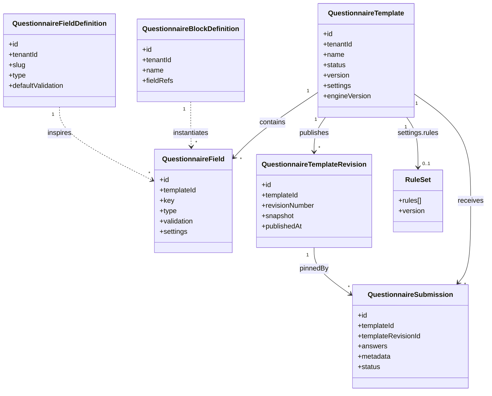
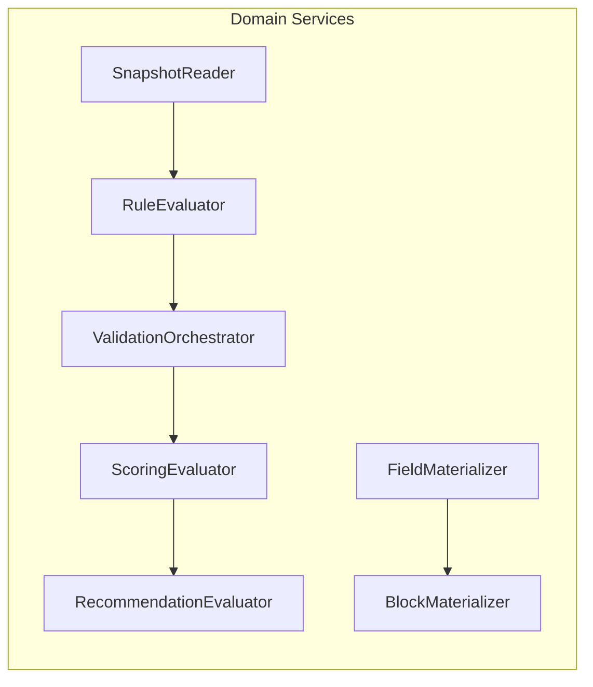
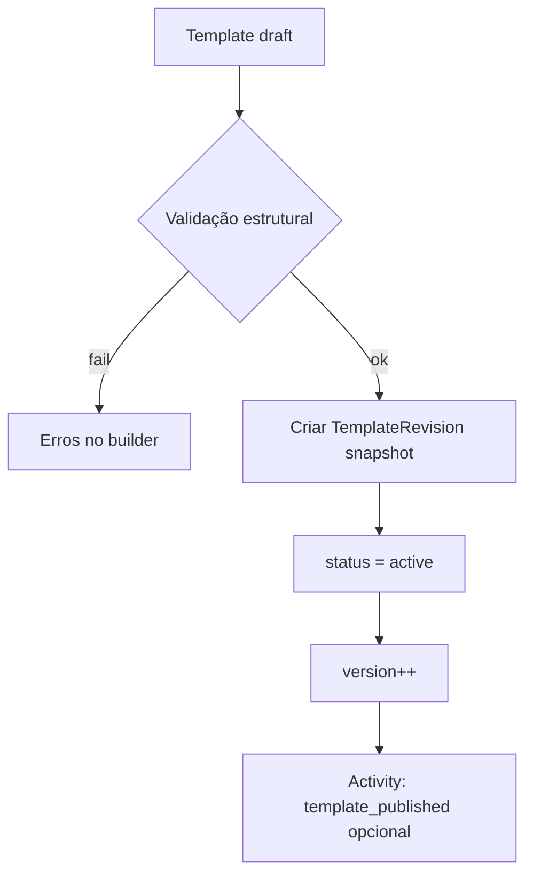
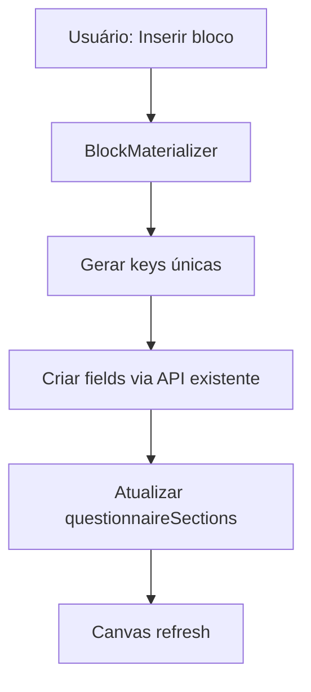
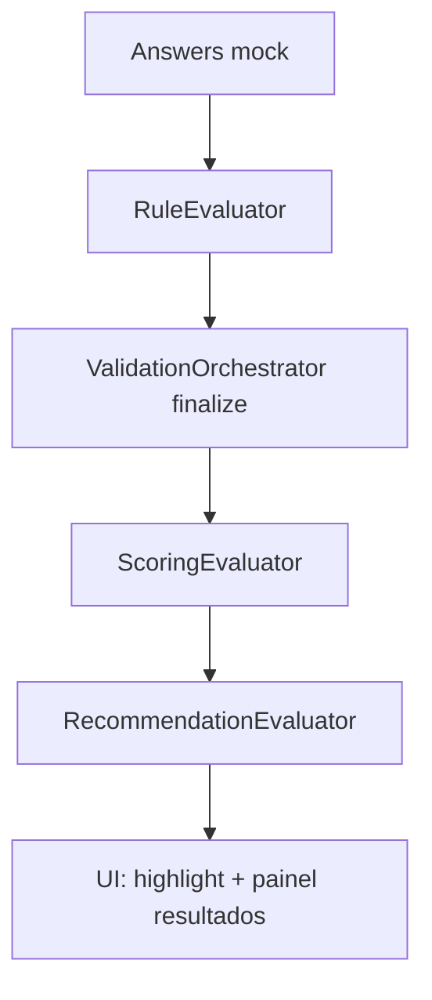

# Questionnaire Domain v2 — Modelo de Domínio

**Sprint:** 6.8 (design only)  
**Status:** Proposta  
**Relacionado:** [smart-forms-engine.md](./smart-forms-engine.md), [questionnaire-roadmap.md](./questionnaire-roadmap.md)

---

## 1. Contexto delimitado (Bounded Context)

O domínio **Smart Forms** engloba autoria, execução e inteligência comercial de formulários de seguros. Interage com:

| Contexto upstream | Relação |
|-------------------|---------|
| **CRM** (Lead, Deal, Customer) | Submissões vinculadas; score alimenta jornada |
| **Quotes** | Submit/review dispara sync de comparação |
| **Activities** | Eventos `questionnaire_submitted`, `questionnaire_reviewed` |
| **RBAC / Tenant** | Isolamento por `tenantId`; permissões existentes |

O domínio **não** passa a owned leads/deals — apenas emite eventos e metadata.

---

## 2. Mapa de agregados



---

## 3. Agregados existentes (v1) — preservados

### 3.1 QuestionnaireTemplate (raiz)

**Invariantes atuais (mantidas):**

- `(tenantId, name, version)` único
- Apenas `active` aceita novas submissões finalizadas
- Delete com submissões → archive, não hard delete

**Extensões v2 (via `settings`):**

```typescript
interface TemplateSettingsV2 extends TemplateSettingsV1 {
  engineVersion?: 1 | 2
  questionnaireSections?: string[]
  branch?: "auto" | "life" | "health" | "business" | string
  blocks?: BlockInstanceRef[]          // fase JSON-only
  rules?: RuleV1[]                     // fase JSON-only
  scoring?: ScoringConfigV1
  recommendations?: RecommendationRuleV1[]
  catalogSourceId?: string             // fork de template sistema
}
```

### 3.2 QuestionnaireField (entidade)

**Invariantes:**

- `(templateId, key)` único
- `key` snake_case estável — **nunca alterado** após submissões existentes
- `order` define sequência dentro do template

**Extensões v2:**

```typescript
interface FieldSettingsV2 extends FieldSettingsV1 {
  section?: string
  inputKind?: InsuranceQuestionKind
  mask?: MaskKind
  defaultValue?: unknown
  fieldDefinitionId?: string           // origem na Field Library
  originBlockId?: string               // bloco que originou instância
  visibilityRule?: RuleV1                // regra inline (alternativa a template.rules)
}
```

### 3.3 QuestionnaireSubmission (raiz)

**Invariantes:**

- `answers` keyed by field `key`
- Draft não exige required; submitted/reviewed exige
- `templateId` imutável após create

**Extensões v2 (`metadata`):**

```typescript
interface SubmissionMetadataV2 {
  templateRevisionId?: string
  engineVersion?: number
  commercialScore?: {
    value: number
    tier: CommercialScoreTier
    computedAt: string
    dimensions?: Record<string, number>
  }
  recommendations?: CommercialRecommendation[]
  simulation?: boolean                 // true se originado do simulador
  clientInfo?: { userAgent?: string; viewport?: string }
}
```

---

## 4. Novos agregados (v2)

### 4.1 QuestionnaireFieldDefinition

**Raiz de agregado** — biblioteca de campos reutilizáveis.

| Campo | Tipo | Descrição |
|-------|------|-----------|
| `id` | cuid | PK |
| `tenantId` | string | FK Tenant; `null` + flag para catálogo sistema |
| `slug` | string | Identificador estável (`cpf`, `vehicle_plate`) |
| `label` | string | Rótulo default |
| `type` | enum | `QuestionnaireFieldType` |
| `inputKind` | string? | Semântica insurance |
| `defaultValidation` | Json | ValidationSchemaV1 |
| `defaultSettings` | Json | Máscara, placeholder, help |
| `tags` | string[] | Categorização |
| `isSystem` | boolean | Catálogo InsureFlow (read-only tenant) |

**Invariantes:**

- `(tenantId, slug)` único por tenant
- System definitions não editáveis por tenant (fork gera cópia tenant)

**Comportamento:**

- `instantiate(templateId, overrides?)` → cria `QuestionnaireField` com key única

### 4.2 QuestionnaireBlockDefinition

**Raiz de agregado** — biblioteca de blocos.

| Campo | Tipo |
|-------|------|
| `id` | cuid |
| `tenantId` | string |
| `name` | string |
| `description` | string? |
| `items` | Json | ordered list of field definition refs or inline specs |
| `tags` | string[] |

**Comportamento:**

- `materialize(templateId, section?, keyPrefix?)` → N fields + update sections

### 4.3 QuestionnaireTemplateRevision

**Raiz de agregado** — versionamento imutável.

| Campo | Tipo |
|-------|------|
| `id` | cuid |
| `tenantId` | string |
| `templateId` | string |
| `revisionNumber` | int |
| `snapshot` | Json | Ver §5 |
| `publishedBy` | string (userId) |
| `publishedAt` | DateTime |
| `changelog` | string? |

**Invariantes:**

- Append-only — revisões nunca editadas
- `(templateId, revisionNumber)` único
- Publicar incrementa `template.version` e cria revision

---

## 5. Snapshot de revisão (estrutura)

```typescript
interface TemplateRevisionSnapshot {
  version: 1
  capturedAt: string
  template: {
    name: string
    description?: string
    settings: TemplateSettingsV2
  }
  fields: Array<{
    key: string
    label: string
    type: QuestionnaireFieldType
    required: boolean
    order: number
    placeholder?: string
    helpText?: string
    options?: FieldOption[]
    validation?: ValidationSchemaV1
    settings?: FieldSettingsV2
  }>
  rules: RuleV1[]
  scoring?: ScoringConfigV1
  recommendations?: RecommendationRuleV1[]
}
```

**Uso:** runtime de submissão com `metadata.templateRevisionId` carrega snapshot em vez de fields live.

---

## 6. Value Objects

### 6.1 FieldKey

- Formato: `^[a-z][a-z0-9_]*$` (já enforced no DTO)
- Imutável após primeira submissão ao template

### 6.2 ValidationSchemaV1

```typescript
interface ValidationSchemaV1 {
  version: 1
  rules: ValidationRule[]
}

type ValidationRule =
  | { type: "required"; when?: RuleCondition }
  | { type: "minLength"; value: number }
  | { type: "maxLength"; value: number }
  | { type: "min"; value: number }
  | { type: "max"; value: number }
  | { type: "pattern"; value: string; message?: string }
  | { type: "email" }
  | { type: "cpf" }
  | { type: "cnpj" }
  | { type: "phone" }
  | { type: "cep" }
  | { type: "plate" }
  | { type: "date"; format?: "iso" | "br" }
  | { type: "oneOf"; values: unknown[] }
```

### 6.3 RuleV1 (Conditional Rules)

```typescript
interface RuleV1 {
  id: string
  target: { fieldKey: string } | { section: string }
  effect: "show" | "hide" | "require" | "optional" | "disable" | "setValue"
  value?: unknown                        // para setValue
  when: RuleCondition
  priority?: number
}

type RuleCondition =
  | { all: RuleCondition[] }
  | { any: RuleCondition[] }
  | { not: RuleCondition }
  | { field: string; op: RuleOperator; value?: unknown }

type RuleOperator =
  | "eq" | "neq" | "gt" | "gte" | "lt" | "lte"
  | "in" | "notIn" | "empty" | "notEmpty" | "matches"
```

### 6.4 ScoringConfigV1

Ver [smart-forms-engine.md §4.6](./smart-forms-engine.md#46-commercial-score).

### 6.5 AnswerMap

```typescript
type AnswerMap = Record<FieldKey, unknown>
```

Normalização na borda:

- DATE → ISO string
- CPF/CNPJ/PHONE → digits or formatted per display policy
- MULTI_SELECT → `string[]`
- BOOLEAN → `boolean`

---

## 7. Serviços de domínio (Smart Forms Engine)

Estes serviços **não existem hoje** — serão extraídos de `QuestionnairesService` e módulos frontend.



| Serviço | Input | Output |
|---------|-------|--------|
| `RuleEvaluator` | rules, answers, field catalog | `{ visibleKeys, requiredKeys, disabledKeys, setValues }` |
| `ValidationOrchestrator` | fields, answers, mode: draft \| finalize | `{ valid, errors: FieldError[] }` |
| `ScoringEvaluator` | scoring config, answers | `CommercialScore` |
| `RecommendationEvaluator` | rules, answers, score? | `CommercialRecommendation[]` |
| `FieldMaterializer` | FieldDefinition, templateId | `QuestionnaireField` |
| `BlockMaterializer` | BlockDefinition, templateId | `QuestionnaireField[]` |
| `SnapshotReader` | revisionId \| templateId | frozen field catalog + rules |

**Localização proposta:** `packages/forms-engine/` (pure TS, zero Nest/React).

---

## 8. Fluxos de domínio

### 8.1 Publicar template (com versionamento)



### 8.2 Instanciar bloco



### 8.3 Executar simulador



### 8.4 Submissão com engine v2

1. Carregar contexto: revision snapshot ou fields live
2. `RuleEvaluator` → campos efetivos
3. `ValidationOrchestrator` → erros
4. Persistir `answers` (API existente)
5. Se finalize: `ScoringEvaluator` + `RecommendationEvaluator` → `metadata`
6. Side effects inalterados: Activity + Quotes

---

## 9. Eventos de domínio

| Evento | Disparo | Activity Engine | Payload extra v2 |
|--------|---------|-----------------|------------------|
| `questionnaire.template.published` | Publish | opcional | `revisionId`, `version` |
| `questionnaire.field.instantiated` | Library insert | — | `definitionId` |
| `questionnaire.submission.draft_saved` | PATCH draft | — | — |
| `questionnaire.submission.submitted` | PATCH submitted | **existente** | `score`, `recommendations` |
| `questionnaire.submission.reviewed` | PATCH reviewed | **existente** | idem |

**Compatibilidade Activity Engine:** apenas enriquecer metadata JSON nos handlers existentes — sem novos `kind` obrigatórios na fase 1.

---

## 10. Proposta de schema Prisma (fase persistência)

> **Nota:** não implementado na Sprint 6.8. Referência para Sprint 7.3+.

```prisma
model QuestionnaireFieldDefinition {
  id                 String   @id @default(cuid())
  tenantId           String?  // null = system catalog
  slug               String
  label              String
  type               QuestionnaireFieldType
  inputKind          String?
  defaultValidation  Json?
  defaultSettings    Json     @default("{}")
  tags               String[] @default([])
  isSystem           Boolean  @default(false)
  createdAt          DateTime @default(now())
  updatedAt          DateTime @updatedAt

  @@unique([tenantId, slug])
  @@index([tenantId])
  @@map("questionnaire_field_definitions")
}

model QuestionnaireBlockDefinition {
  id          String   @id @default(cuid())
  tenantId    String
  name        String
  description String?
  items       Json     // BlockItem[]
  tags        String[] @default([])
  createdAt   DateTime @default(now())
  updatedAt   DateTime @updatedAt

  @@index([tenantId])
  @@map("questionnaire_block_definitions")
}

model QuestionnaireTemplateRevision {
  id             String   @id @default(cuid())
  tenantId       String
  templateId     String
  template       QuestionnaireTemplate @relation(...)
  revisionNumber Int
  snapshot       Json
  publishedBy    String
  publishedAt    DateTime @default(now())
  changelog      String?

  @@unique([templateId, revisionNumber])
  @@index([tenantId, templateId])
  @@map("questionnaire_template_revisions")
}
```

**Alteração mínima em modelos existentes:**

- `QuestionnaireSubmission.metadata` — já nullable Json; passa a carregar score/revision
- Nenhuma coluna obrigatória nova em v1

---

## 11. Mapeamento v1 → v2

| Conceito v1 | Equivalente v2 | Ação |
|-------------|----------------|------|
| `field-library.ts` (UI) | `QuestionnaireFieldDefinition` | Seed system catalog |
| `settings.section` | Mantido | Sem mudança |
| `settings.inputKind` | `FieldDefinition.inputKind` | Backfill on publish |
| `validation: null` | `ValidationSchemaV1` default por type | Migration script sugere schema |
| CRM `field-resolvers.ts` | `RecommendationRuleV1` | Migração gradual por ramo |
| `template.version` | `TemplateRevision.revisionNumber` | Sync on first publish |
| Preview builder | Questionnaire Simulator | Extensão do `form-preview.tsx` |

---

## 12. Regras de negócio consolidadas

1. **Keys imutáveis** após submissão — renomear label OK, key não.
2. **Engine v1 default** — templates sem `engineVersion` comportam-se exatamente como hoje.
3. **Condicional não oculta validação em draft** — campos hidden ignorados; em finalize, mesma regra.
4. **Score não bloqueia submit** — informativo; armazenado em metadata.
5. **Recomendações não alteram answers** — apenas UI/CRM notes.
6. **System catalog** — tenant pode fork, não editar original.
7. **Tenant isolation** — toda query com `tenantId` do JWT.
8. **RBAC** — Field/Block library CRUD exige `questionnaires:manage`; simulador exige `view`.

---

## 13. Glossário

| Termo | Definição |
|-------|-----------|
| **Field Library** | Catálogo reutilizável de definições de campo |
| **Block Library** | Catálogo de grupos de campos materializáveis |
| **Rule** | Condição + efeito sobre campos/seções |
| **Revision** | Snapshot imutável de template publicado |
| **Engine** | Conjunto de evaluators puros em `@repo/forms-engine` |
| **Runtime** | Componentes que renderizam e validam formulário |
| **Simulator** | Runtime + mock answers no builder |
| **Branch template** | Template pré-configurado por ramo (auto, vida, …) |
