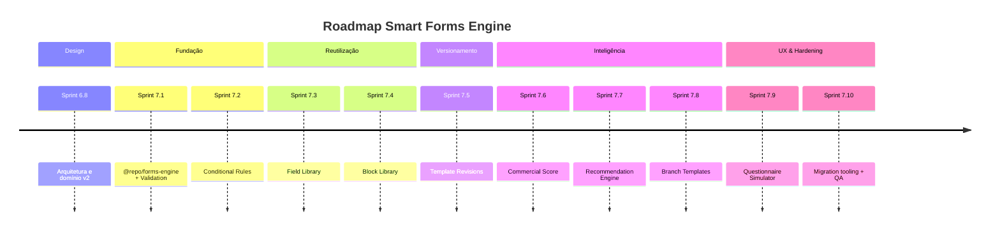

# Questionnaire Smart Forms — Roadmap de Implementação

**Sprint:** 6.8 (design only)  
**Status:** Proposta  
**Relacionado:** [smart-forms-engine.md](./smart-forms-engine.md), [questionnaire-domain-v2.md](./questionnaire-domain-v2.md)

---

## 1. Visão geral

Este roadmap implementa o **Smart Forms Engine** em incrementos compatíveis com produção. Cada fase entrega valor isolado e pode ser revertida via `engineVersion: 1`.

**Estimativa total:** ~10 sprints (~20–24 semanas) após 6.8, assumindo 1 squad parcial no módulo.

---

## 2. Sprint 6.8 — Arquitetura (atual) ✅

| Item | Entregável | Status |
|------|------------|--------|
| Análise Prisma, API, hooks, builder | Documentado | ✅ |
| Arquitetura proposta + diagramas | `smart-forms-engine.md` | ✅ |
| Modelo de domínio v2 | `questionnaire-domain-v2.md` | ✅ |
| Roadmap | Este documento | ✅ |
| Código | **Nenhum** | ✅ |

**Critério de done:** documentos revisáveis por engenharia + produto; ADRs 003–006 esboçados.

---

## 3. Sprint 7.1 — Validation Engine

**Objetivo:** unificar validação client/server usando `field.validation` schema v1.

### Escopo

| Área | Trabalho |
|------|----------|
| Package | Criar `packages/forms-engine/` (pure TS) |
| Validation | `ValidationOrchestrator`, regras v1, normalizers |
| Backend | Integrar em `validateAnswerValue` via adapter (fallback v1) |
| Frontend | Substituir lógica hardcoded em `questionnaire-field-validation.ts` |
| Builder | Persistir `validation` schema ao salvar propriedades |
| Template | `settings.engineVersion: 2` opt-in |

### Fora de escopo

- Conditional rules
- Novas tabelas Prisma

### Estimativa

| Papel | Dias |
|-------|------|
| Backend | 3–4 |
| Frontend | 4–5 |
| QA + golden tests | 2–3 |
| **Total** | **~2 semanas** |

### Riscos

- Regressão em submissões legadas → feature flag + testes de paridade v1/v2

### Critérios de done

- [ ] `@repo/forms-engine` publicado no monorepo
- [ ] ≥90% dos tipos atuais cobertos por schema v1
- [ ] Backend rejeita CPF inválido quando `validation.type: cpf`
- [ ] Templates sem `engineVersion` inalterados

---

## 4. Sprint 7.2 — Conditional Rules

**Objetivo:** visibilidade e required dinâmico via Rule DSL v1.

### Escopo

| Área | Trabalho |
|------|----------|
| Engine | `RuleEvaluator` em `@repo/forms-engine` |
| Storage | `template.settings.rules[]` (JSON fase 1) |
| Builder | Rule Editor básico (show/hide/require) |
| Runtime | `QuestionnaireAnswerField` + submission dialog respeitam visibility |
| Backend | Validar apenas campos visíveis em finalize |

### Estimativa

| Papel | Dias |
|-------|------|
| Engine + tests | 4 |
| Builder UI | 5 |
| Runtime integration | 3 |
| **Total** | **~2 semanas** |

### Dependências

- Sprint 7.1 (Validation Engine)

### Critérios de done

- [ ] Regra “se has_second_driver = sim → mostrar CPF 2º condutor” funcional E2E
- [ ] Simulação manual no preview (pré-simulator dedicado)

---

## 5. Sprint 7.3 — Field Library

**Objetivo:** persistir catálogo de campos reutilizáveis por tenant.

### Escopo

| Área | Trabalho |
|------|----------|
| Prisma | `QuestionnaireFieldDefinition` |
| API | CRUD `/field-definitions` (aditivo) |
| Seed | Migrar `field-library.ts` → system catalog |
| Builder | Drawer biblioteca lê API; “Salvar como definição” |
| Instanciar | `FieldMaterializer` + `settings.fieldDefinitionId` |

### Estimativa

| Papel | Dias |
|-------|------|
| DB + API | 4 |
| Frontend hooks | 3 |
| Builder UX | 4 |
| **Total** | **~2 semanas** |

### Dependências

- Sprint 7.1 (validation defaults na definition)

---

## 6. Sprint 7.4 — Block Library

**Objetivo:** blocos reutilizáveis de perguntas.

### Escopo

| Área | Trabalho |
|------|----------|
| Prisma | `QuestionnaireBlockDefinition` |
| API | CRUD `/blocks`, `POST /templates/:id/materialize-block` |
| Builder | “Inserir bloco” no canvas / library drawer |
| Engine | `BlockMaterializer` (keys únicas, prefix) |

### Estimativa

| Papel | Dias |
|-------|------|
| DB + API | 4 |
| Engine | 2 |
| Builder | 5 |
| **Total** | **~2 semanas** |

### Dependências

- Sprint 7.3 (Field Library)

### Bloqueador conhecido

- Tipo `FILE` ainda sem UI — blocos com upload ficam para 7.4b ou flag

---

## 7. Sprint 7.5 — Template Versioning

**Objetivo:** snapshots imutáveis ao publicar; submissões pinadas.

### Escopo

| Área | Trabalho |
|------|----------|
| Prisma | `QuestionnaireTemplateRevision` |
| API | `POST /templates/:id/publish` → cria revision |
| Submission | `metadata.templateRevisionId` |
| Runtime | `SnapshotReader` — load frozen catalog |
| Builder | `VersionsMenu` funcional (lista revisions) |

### Estimativa

| Papel | Dias |
|-------|------|
| DB + API | 5 |
| Engine | 2 |
| Frontend | 4 |
| Migration | 2 (backfill revision v1 para templates active) |
| **Total** | **~2,5 semanas** |

### Dependências

- Sprints 7.1–7.2 (snapshot inclui rules + validation)

---

## 8. Sprint 7.6 — Commercial Score

**Objetivo:** score configurável por template, persistido na submissão.

### Escopo

| Área | Trabalho |
|------|----------|
| Engine | `ScoringEvaluator` |
| Template | `settings.scoring` editor no builder |
| Submit | Calcular score → `metadata.commercialScore` |
| CRM | Adapter em `commercial-journey` lê metadata primeiro, fallback heurístico |

### Estimativa

| Papel | Dias |
|-------|------|
| Engine | 3 |
| Builder UI | 3 |
| CRM adapter | 3 |
| **Total** | **~1,5 semanas** |

### Dependências

- Sprint 7.1
- Recomendado: 7.5 (score sobre snapshot estável)

---

## 9. Sprint 7.7 — Recommendation Engine

**Objetivo:** recomendações declarativas no template.

### Escopo

| Área | Trabalho |
|------|----------|
| Engine | `RecommendationEvaluator` |
| Template | `settings.recommendations[]` |
| Submit | Persistir em `metadata.recommendations` |
| CRM | `CommercialRecommendations` consome metadata |
| Builder | Editor de regras de recomendação |

### Estimativa

| Papel | Dias |
|-------|------|
| Engine | 3 |
| Builder | 4 |
| CRM | 2 |
| **Total** | **~1,5 semanas** |

### Dependências

- Sprint 7.6 (score como input opcional de recomendações)

---

## 10. Sprint 7.8 — Branch Templates

**Objetivo:** catálogo de templates por ramo (auto, vida, empresarial).

### Escopo

| Área | Trabalho |
|------|----------|
| System templates | Seeds com `isSystem`, `branch` |
| API | `POST /templates/:id/fork` |
| Builder | Galeria “Começar por ramo” |
| Field/Block seeds | Pacotes por ramo |

### Estimativa

| Papel | Dias |
|-------|------|
| Conteúdo + seed | 4 |
| API fork | 2 |
| UI galeria | 4 |
| **Total** | **~2 semanas** |

### Dependências

- Sprints 7.3, 7.4 (blocos/campos nos templates seed)

---

## 11. Sprint 7.9 — Questionnaire Simulator

**Objetivo:** ferramenta no builder para testar rules, validation, score e recommendations.

### Escopo

| Área | Trabalho |
|------|----------|
| UI | Painel Simulator ao lado do preview |
| Engine | Orquestra todos evaluators |
| API opcional | `POST /templates/:id/simulate` |
| UX | Highlight campos afetados; painel de erros/score/recommendations |

### Estimativa

| Papel | Dias |
|-------|------|
| UI/UX | 5 |
| Engine wiring | 2 |
| API (opcional) | 2 |
| **Total** | **~2 semanas** |

### Dependências

- Sprints 7.1, 7.2, 7.6, 7.7 (simulador completo)

---

## 12. Sprint 7.10 — Hardening & Migration

**Objetivo:** produção-ready, backfill, documentação operacional.

### Escopo

| Área | Trabalho |
|------|----------|
| Scripts | Backfill `engineVersion`, revision v1, validation schemas |
| Testes | E2E questionário auto PF completo |
| Perf | Benchmark forms 100+ campos |
| Docs | ADRs 003–006 finalizados; runbook |
| Observability | Logs de evaluate no submit |

### Estimativa

| Papel | Dias |
|-------|------|
| Migration scripts | 3 |
| E2E + perf | 4 |
| Docs | 2 |
| **Total** | **~2 semanas** |

---

## 13. Resumo de estimativas

| Sprint | Foco | Duração | Dependências |
|--------|------|---------|--------------|
| **6.8** | Arquitetura | 1 sem | — |
| **7.1** | Validation Engine | 2 sem | 6.8 |
| **7.2** | Conditional Rules | 2 sem | 7.1 |
| **7.3** | Field Library | 2 sem | 7.1 |
| **7.4** | Block Library | 2 sem | 7.3 |
| **7.5** | Template Versioning | 2,5 sem | 7.1, 7.2 |
| **7.6** | Commercial Score | 1,5 sem | 7.1 |
| **7.7** | Recommendations | 1,5 sem | 7.6 |
| **7.8** | Branch Templates | 2 sem | 7.3, 7.4 |
| **7.9** | Simulator | 2 sem | 7.1–7.7 |
| **7.10** | Hardening | 2 sem | all |

**Total estimado:** ~21 semanas (~5 meses) após 6.8.

**Paralelização possível:**

- 7.6 pode iniciar em paralelo com 7.5 (após 7.1)
- 7.8 conteúdo (seeds) em paralelo com 7.5–7.7
- 7.9 UI mock pode começar após 7.2 com evaluators parciais

---

## 14. Priorização alternativa (MVP enxuto)

Se time limitado, **MVP Smart Forms** em 4 sprints pós-6.8:

| Ordem | Sprint | Entrega MVP |
|-------|--------|-------------|
| 1 | 7.1 | Validation unificada |
| 2 | 7.2 | Show/hide condicional |
| 3 | 7.5-lite | Snapshot JSON on publish (sem UI revisions elaborada) |
| 4 | 7.9-lite | Simulator básico no preview |

Field Library, Blocks, Score configurável e Branch catalog ficam **fase 2**.

---

## 15. Matriz de preservação (checklist por sprint)

Cada sprint deve validar:

- [ ] APIs REST existentes respondem igual para `engineVersion: 1`
- [ ] Submissões antigas legíveis e editáveis (draft)
- [ ] Activity events `questionnaire_submitted` / `reviewed` intactos
- [ ] Quotes sync inalterado
- [ ] RBAC `questionnaires:view` / `manage` suficiente (ou ADR para novos)
- [ ] `tenantId` isolation em novas tabelas
- [ ] React Query keys existentes estáveis; novos hooks aditivos

---

## 16. Métricas de sucesso

| Métrica | Baseline | Alvo pós-7.10 |
|---------|----------|---------------|
| Tempo criar template auto PF | ~45 min manual | ~15 min (branch + blocks) |
| Campos reutilizados entre templates | 0% | ≥60% |
| Submissões com score em metadata | 0% | 100% (templates v2) |
| Regressões validação submit | N/A | 0 em golden suite |
| Templates com rules condicionais | 0 | ≥3 piloto |
| Divergência client/server validation | Alta | 0 (shared package) |

---

## 17. Entregáveis de documentação contínua

| Sprint | Documento |
|--------|-----------|
| 7.1 | ADR-003 `@repo/forms-engine` |
| 7.2 | Rule DSL spec v1 (`docs/specs/rule-dsl-v1.md`) |
| 7.5 | ADR-004 Template Revision |
| 7.3 | ADR-005 Field Library copy vs ref |
| 7.6 | ADR-006 Score in metadata |
| 7.10 | Runbook migration + `docs/reports/smart-forms-launch.md` |

---

## 18. Referências

- Arquitetura: [smart-forms-engine.md](./smart-forms-engine.md)
- Domínio: [questionnaire-domain-v2.md](./questionnaire-domain-v2.md)
- Autosave: [ADR-002](../decisions/ADR-002-questionnaire-autosave.md)
- Builder UX: [sprint6-phase7](../reports/sprint6-phase7-ux-simplification.md)
