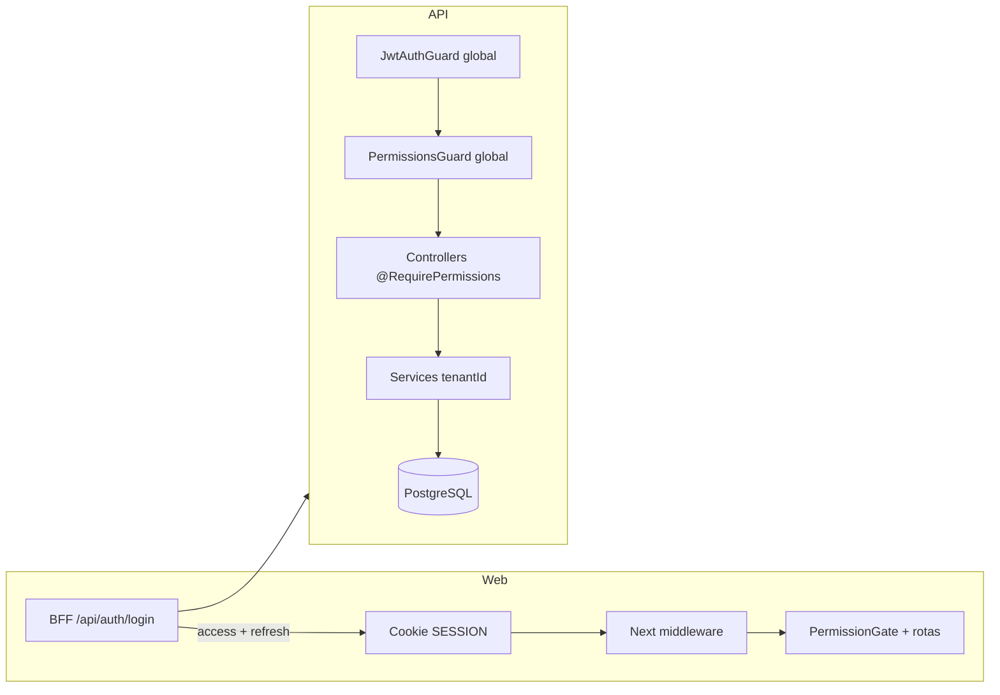
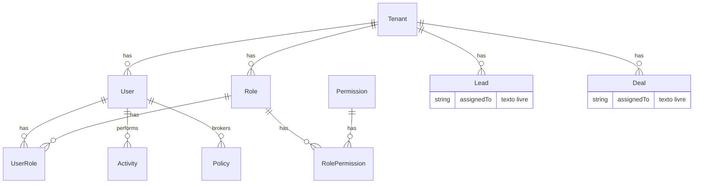
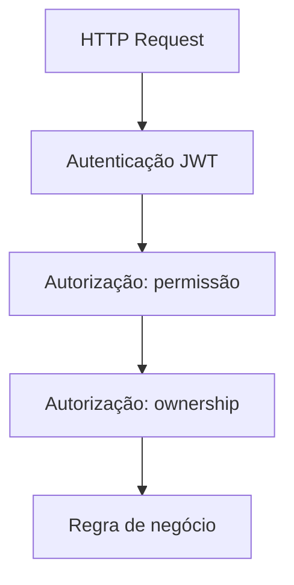
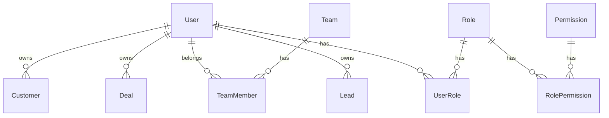

# Arquitetura RBAC — Usuários, grupos e controle de acesso

**Status:** Planejado (Fase 1 — modelagem)  
**Data:** 2026-05-27  
**Escopo:** modelagem e plano de implementação. **Não** inclui WhatsApp, IA, automações, financeiro, BI ou integrações externas.

> **Sprint 1 (ownership detalhado):** ver [ownership-architecture.md](./ownership-architecture.md) e [ownership-schema-proposal.prisma](./ownership-schema-proposal.prisma).

---

## 1. Objetivo da sprint

Preparar uma base **estrutural** para:

- multiusuário por corretora (tenant);
- perfis (roles) configuráveis;
- permissões granulares;
- **ownership** de registros (quem vê/edita o quê);
- auditoria de ações sensíveis.

A implementação virá em fases posteriores; este documento é a referência de arquitetura.

---

## 2. Estado atual (as-is)

### 2.1 Visão geral

O InsureFlow já possui **fundação RBAC no banco** e **autorização em dois níveis** (API + Web), mas com **duas fontes de verdade** para permissões e **ownership quase inexistente** no backend.



### 2.2 Autenticação

| Camada | Implementação |
|--------|----------------|
| **API** | `POST /api/v1/auth/login` com `tenantSlug` + email + senha; JWT access (`JWT_SECRET`, exp ~15m); refresh token persistido (`RefreshToken`, hash). |
| **Payload JWT** | `sub`, `email`, `tenantId`, `tenantSlug`, `roles[]`, `permissions[]` (permissões **achatadas** no login a partir de `UserRole` → `Role` → `RolePermission` → `Permission`). |
| **Guards globais** | `JwtAuthGuard` (Passport JWT) + `PermissionsGuard`; rotas `@Public()` liberadas. |
| **Web** | Login via BFF chama API; grava cookie de sessão (`AUTH_SECRET`, jose) + cookies `API_ACCESS_TOKEN` / `API_REFRESH_TOKEN` para proxy BFF → backend. |
| **Web middleware** | Redireciona não autenticado para `/login`; valida permissão por prefixo de rota (`packages/auth` `getRoutePermission`). |

Referências: `apps/api/src/modules/auth`, `apps/api/src/app.module.ts`, `apps/web/middleware.ts`, `apps/web/lib/auth/session.ts`.

### 2.3 Modelo de dados (Prisma)

**Já existem** (migration enterprise init):

| Entidade | Escopo | Notas |
|----------|--------|--------|
| `Tenant` | SaaS | Isolamento por `tenantId` em todas as entidades comerciais ([ADR-001](../decisions/ADR-001-multi-tenant-architecture.md)). |
| `User` | Por tenant | Email único por tenant; `passwordHash`, `isActive`, `lastLoginAt`. |
| `Permission` | **Global** | Catálogo único (`key` única, ex. `crm:view`). |
| `Role` | Por tenant | `slug` único por tenant; `isSystem` para papéis seed. |
| `RolePermission` | N:N | Role ↔ Permission. |
| `UserRole` | N:N | User ↔ Role (**múltiplos papéis suportados no DB**). |
| `AuditLog` | Por tenant | `action`, `resource`, `resourceId`, `metadata`, `severity`; gravação assíncrona via fila BullMQ. |
| `RefreshToken` | Por tenant/user | Revogação no logout. |

**Ownership parcial (campos soltos, sem política central):**

| Recurso | Campo | Tipo atual | Observação |
|---------|--------|------------|------------|
| `Lead` | `assignedTo` | `String?` | Texto livre (nome/email/id); filtro `mine` opcional na listagem. |
| `Deal` | `assignedTo` | `String?` | Idem; **sem** filtro `mine` no `CrmService`. |
| `Policy` | `brokerUserId` | FK → `User` | Único vínculo forte usuário ↔ registro. |
| `Activity` | `performedById` | FK → `User` | Autoria do evento, não ownership do lead/deal. |
| `Customer` | — | — | Sem responsável explícito. |

### 2.4 Permissões e papéis hoje

**Catálogo no banco (seed)** — 24 chaves no estilo `recurso:ação`:

`dashboard:view`, `crm:view`, `crm:manage`, `clients:view`, `clients:manage`, `leads:*`, `questionnaires:*`, `quotes:*`, `policies:*`, `claims:*`, `whatsapp:*`, `automation:*`, `settings:*`, `users:manage`, `tenants:manage`, `audit:view`.

**Papéis seed por tenant:** `admin`, `viewer`, `sales` apenas.

**Pacote `@repo/auth` (compile-time):** lista `PERMISSIONS`, mapa estático `ROLE_PERMISSIONS` com papéis `super_admin`, `admin`, `sales`, `broker`, `underwriter`, `viewer` — **não sincronizado 1:1** com roles do seed DB.

**Regra `:manage` implica `:view`:** implementada em `PermissionsGuard` (API) e `hasPermission` (Web).

### 2.5 API protegida

- Controllers usam `@RequirePermissions('…')` por endpoint (ex.: `leads:view`, `crm:manage`).
- **Sem** decorator de ownership; services recebem `tenantId` do JWT e, em leads, `userId` opcional só para query `?mine=true`.
- Módulo `users`: apenas **GET** list/detail com `users:manage` — sem CRUD de usuários/roles na API ainda.
- Módulo `permissions`: leitura do catálogo (administração futura).

### 2.6 Frontend

| Mecanismo | Uso |
|-----------|-----|
| `middleware.ts` | Bloqueio de rota por permissão mínima. |
| `PermissionGate` | Esconde botões/ações (ex. `crm:manage` na timeline). |
| `canAccessSegment` | Itens de navegação. |
| `SessionProvider` | `session.permissions`, **um** `session.role` (primeiro role do JWT mapeado). |

**Lacuna:** UI assume **papel único**; JWT já carrega `roles[]` múltiplos.

### 2.7 Auditoria

- `AuditLogsService.enqueue` + worker persiste em `AuditLog`.
- Uso pontual (ex. login); **não** há interceptor global em todos os mutating endpoints.

### 2.8 Diagrama de entidades (atual)



---

## 3. Lacunas e riscos (motivação da fase)

1. **Dupla fonte de permissões** — DB (runtime) vs `@repo/auth` (dev/legado); drift entre seed e `ROLE_PERMISSIONS`.
2. **Papel único na sessão Web** — subutiliza `UserRole` N:N.
3. **Ownership não sistemático** — qualquer usuário com `leads:view` vê todos os leads do tenant; `assignedTo` inconsistente (nome vs id).
4. **Sem gestão de usuários/roles na UI** — operação depende de seed/SQL.
5. **Permissões coarse** — `crm:manage` cobre deals + atividades; difícil separar comercial vs operacional vs financeiro.
6. **JWT com permissões embutidas** — alteração de role exige re-login ou TTL curto / endpoint de refresh de claims.
7. **Sem “grupos” organizacionais** — `Role` é perfil de acesso, não equipe comercial; gerente/equipe não modelados.

---

## 4. Arquitetura alvo (to-be)

### 4.1 Princípios

1. **Tenant primeiro** — toda query com `tenantId`; RBAC nunca substitui isolamento multi-tenant.
2. **Permissão = ação sobre recurso** — catálogo versionado, estável, documentado.
3. **Role = perfil de negócio** — agrupa permissões; configurável por tenant (com roles `isSystem` imutáveis).
4. **Ownership = segunda dimensão** — além de “pode editar leads?”, “quais leads?”.
5. **Deny by default** — endpoint sem `@RequirePermissions` continua autenticado, mas política explícita para mutações sensíveis.
6. **UI reflete API** — esconder menu não substitui enforcement no backend.

### 4.2 Camadas de autorização



| Camada | Pergunta | Onde |
|--------|----------|------|
| Autenticação | Quem é? | `JwtAuthGuard`, `@CurrentUser()` |
| Permissão | Pode fazer esta operação no módulo? | `@RequirePermissions`, `PermissionsGuard` |
| Ownership | Pode acessar **este** registro? | `AccessPolicy` / `buildOwnershipWhere` nos services |
| Auditoria | O que foi feito? | Interceptor + `AuditLogsService` |

### 4.3 Fonte única de permissões (decisão proposta)

| Ambiente | Fonte |
|----------|--------|
| **Runtime (API login)** | DB: `Permission` + `RolePermission` |
| **Tipos e validação TS** | `@repo/auth` gerado ou sincronizado a partir do catálogo DB (script `sync-permissions` na Fase 2) |
| **Seed** | Upsert catálogo + roles sistema por tenant |

Eliminar mapas estáticos divergentes (`ROLE_PERMISSIONS` hardcoded) após migração.

### 4.4 “Grupos” vs “Perfis”

| Conceito | Modelo proposto | Uso |
|----------|-----------------|-----|
| **Perfil (role)** | `Role` existente | RBAC: o que o usuário **pode fazer**. |
| **Grupo / equipe** | Nova entidade `Team` (Fase 2+) | Ownership: gerente vê registros da equipe. |
| **Super admin plataforma** | Fora do tenant ou flag `User.isPlatformAdmin` | Operações cross-tenant (`tenants:manage`); não misturar com admin da corretora. |

Na Fase 1 de implementação, **grupo = role** para simplificar; equipes entram quando ownership `team` for necessário.

---

## 5. Entidades principais (modelo lógico)

### 5.1 Existentes (manter)

- `users`, `roles`, `permissions`, `user_roles`, `role_permissions`, `audit_logs`, `refresh_tokens`.

### 5.2 Evoluções propostas (planejadas, não implementadas)

| Mudança | Motivo |
|---------|--------|
| `Lead.ownerUserId`, `Deal.ownerUserId` (FK `User`, nullable) | Substituir gradualmente `assignedTo` texto; migração backfill por nome/email. |
| `Customer.accountOwnerUserId` (FK opcional) | Ownership pós-venda / carteira. |
| `Team`, `TeamMember` (`userId`, `teamId`, `isLead`) | Escopo `team` para gerentes. |
| `Role.dataScope` enum `tenant \| team \| own` **ou** permissão `leads.read.team` | Evitar hardcode por slug de role. |
| `Permission.module`, `Permission.action`, `Permission.key` único | Suportar nomenclatura `resource.action` e relatórios. |
| `User.invitedAt`, `User.passwordResetToken` | Onboarding self-service (fase posterior). |

### 5.3 Diagrama alvo (simplificado)



---

## 6. Papéis padrão para corretora (proposta)

Slugs estáveis (`isSystem: true`). Nomes exibidos configuráveis por tenant.

| Slug | Nome sugerido | Propósito | Escopo de dados sugerido |
|------|----------------|-----------|---------------------------|
| `super_admin` | Super Admin (plataforma) | Operação InsureFlow / todos os tenants | `tenant` (cross-tenant) |
| `admin` | Administrador | Configuração, usuários, tudo no tenant | `tenant` |
| `comercial` | Comercial | Pipeline, leads, negócios, atividades | `own` (+ opcional `team`) |
| `operacional` | Operacional | Pós-venda, apólices, renovações, atividades cliente | `team` ou `tenant` (config) |
| `financeiro` | Financeiro | Comissões, faturamento (futuro), leitura apólices | `tenant` (leitura) / módulos financeiros |
| `parceiro` | Parceiro externo | Acesso limitado a subset (leads indicados) | `own` estrito |
| `leitura` | Somente leitura | Auditoria, diretoria | `tenant` read-only |

**Mapeamento do legado:**

| Atual (seed / auth) | Alvo |
|---------------------|------|
| `sales` | `comercial` |
| `viewer` | `leitura` |
| `broker` | `comercial` ou perfil dedicado com mais `policies` |
| `underwriter` | `operacional` |

---

## 7. Permissões granulares (proposta)

### 7.1 Convenção de nomenclatura

Duas opções (escolher uma na Fase 2 de implementação):

| Estilo | Exemplo | Prós |
|--------|---------|------|
| **Atual (colon)** | `leads:manage` | Já usado em código e seed; menos migração. |
| **Dot (sugerido pelo produto)** | `leads.write` | Familiar para RBAC enterprise; mapear `manage` → `write`, `view` → `read`. |

**Recomendação:** manter **colon no curto prazo** e introduzir aliases ou migração única com script; documentar matriz recurso × ação.

### 7.2 Matriz inicial (domínios desta fase)

| Domínio | read | write | delete | manage (admin) |
|---------|------|-------|--------|----------------|
| `users` | `users:view` * | — | — | `users:manage` |
| `roles` | `roles:view` * | — | — | `roles:manage` |
| `customers` | `clients:view` | `clients:manage` | `clients:delete` * | — |
| `leads` | `leads:view` | `leads:manage` | `leads:delete` * | — |
| `deals` | `deals:view` * | `deals:manage` * | `deals:delete` * | — |
| `policies` | `policies:view` | `policies:manage` | — | `policies:renew` * |
| `activities` | implícito em `crm:view` | `crm:manage` | `crm:manage` | — |
| `questionnaires` | `questionnaires:view` | `questionnaires:manage` | — | — |
| `audit` | `audit:view` | — | — | — |
| `settings` | `settings:view` | `settings:manage` | — | — |

\* = **novas chaves** a criar na migração de catálogo (hoje `crm:*` agrega deals).

### 7.3 Permissões de escopo (ownership) — proposta

Permissões opcionais que alteram o **filtro Prisma**, não a rota:

| Chave | Efeito |
|-------|--------|
| `records.scope.own` | Restringe listagens a `ownerUserId = sub` (ou equivalente). |
| `records.scope.team` | Restringe a membros da mesma `Team`. |
| `records.scope.tenant` | Sem filtro extra (além de `tenantId`). |

Alternativa: derivar escopo do **role principal** (`Role.defaultDataScope`) para reduzir combinatória.

### 7.4 Matriz role × permissão (resumo)

| Permissão / Papel | admin | comercial | operacional | financeiro | parceiro | leitura |
|-------------------|:-----:|:---------:|:-----------:|:----------:|:--------:|:-------:|
| `users:manage` | ✓ | | | | | |
| `roles:manage` | ✓ | | | | | |
| `leads:manage` | ✓ | ✓ | | | ✓* | |
| `leads:view` | ✓ | ✓ | ✓ | ✓ | ✓ | ✓ |
| `deals:manage` | ✓ | ✓ | | | | |
| `clients:manage` | ✓ | | ✓ | | | |
| `policies:manage` | ✓ | | ✓ | ✓ | | |
| `policies:renew` | ✓ | | ✓ | | | |
| `audit:view` | ✓ | | | ✓ | | ✓ |
| `records.scope.tenant` | ✓ | | ✓ | ✓ | | ✓ |

\* parceiro: apenas registros próprios + permissão `records.scope.own`.

---

## 8. Ownership (estratégia)

### 8.1 Regras de negócio

| Persona | Leads / Deals | Clientes / Apólices |
|---------|---------------|---------------------|
| Comercial | Cria e vê **próprios**; pode receber reassignment por admin | Leitura conforme vínculo com deal convertido |
| Gerente comercial | Vê **equipe** (`team`) | Idem, escopo equipe |
| Admin | **Tenant** inteiro | Tenant inteiro |
| Leitura | Tenant, sem mutação | Tenant, sem mutação |
| Parceiro | Apenas registros atribuídos a si | Restrito |

### 8.2 Implementação backend (planejamento)

1. **`OwnershipService` ou helper por recurso**  
   `buildLeadAccessWhere(user: JwtAccessPayload): Prisma.LeadWhereInput`  
   Combina: `tenantId` + escopo (`own` / `team` / `tenant`).

2. **Aplicar em**  
   - `findMany` / `count` / `search`;  
   - `findOne` / `update` / `delete` (404 se fora do escopo — não revelar existência);  
   - agregações (dashboard, agenda) — mesmo filtro.

3. **`assignedTo` legado**  
   - Fase migração: manter compat com `resolveMineAssignedToValues`;  
   - Fase final: só `ownerUserId`.

4. **Deals**  
   - Herdar ownership do lead convertido **ou** `deal.ownerUserId`;  
   - Regra documentada: “responsável do negócio = responsável do lead se convertido”.

5. **Activities**  
   - Listagem por contexto (lead/deal sheet) já filtra por FK;  
   - Listagens globais (agenda): filtrar por leads/deals acessíveis ou `performedById` conforme política.

6. **Policies**  
   - Usar `brokerUserId` + escopo team/tenant.

### 8.3 Impacto frontend (planejamento)

| Área | Comportamento |
|------|----------------|
| Listas CRM | Enviar `?mine=true` apenas quando UX “minha carteira”; backend **também** aplica escopo pelo JWT (não confiar só no query param). |
| Pipeline | Admin vê todos os estágios; comercial vê subset. |
| Empty states | Mensagem “sem registros na sua carteira” vs erro 403. |
| Atribuição | Select de usuários do tenant (`users:manage` ou `leads:manage` + lista limitada). |
| Configurações | Nova seção Usuários & Permissões (admin). |

### 8.4 Falhas a evitar

- Filtrar só no frontend (dados vazam via API direta).  
- `assignedTo` como string sem FK (impossível integridade referencial).  
- Misturar `crm:manage` com ownership “own” sem regra clara.

---

## 9. Backend — plano de implementação (não codar nesta fase)

### 9.1 Módulos Nest sugeridos

```
modules/
  rbac/                    # novo (opcional agrupador)
  users/                   # expandir: CRUD, invite, reset password
  roles/                   # novo: CRUD roles, assign permissions
  permissions/             # existente: catálogo + sync
  teams/                   # novo (fase ownership team)
```

### 9.2 Decorators e guards

| Artefato | Função |
|----------|--------|
| `@RequirePermissions(...)` | **Manter** — lista de chaves; suportar `anyOf` no futuro. |
| `@RequireOwnership('lead')` | **Novo** — valida `id` da rota contra política (ou integrar no service). |
| `@Public()` | Manter. |
| `@CurrentUser()` | Estender tipo com `dataScope?` cacheado no login. |

### 9.3 `PermissionResolver` (serviço)

- Entrada: `JwtAccessPayload` + recurso opcional.  
- Saída: `Set<permission>`, `dataScope`, `teamIds[]`.  
- Uso: guards e services; **único** lugar para regra `:manage` → `:view`.

### 9.4 Interceptor de auditoria

- `@Audit(action, resource)` em controllers mutating.  
- Payload: tenantId, userId, resourceId, diff sanitizado (sem PII sensível).  
- Assíncrono via fila existente.

### 9.5 JWT e refresh de permissões

| Opção | Tradeoff |
|-------|----------|
| A) Permissões só no JWT até expirar | Simples; mudança de role demora até refresh. |
| B) TTL curto access token (15m) | Já é o caso; aceitável. |
| C) Endpoint `GET /auth/permissions` + refresh sessão Web | UX admin imediata. |

**Recomendação:** B + C para painel admin de usuários.

### 9.6 Testes (fase implementação)

- Unit: `PermissionResolver`, `buildLeadAccessWhere`.  
- E2E: usuário comercial não lê lead de outro; admin lê todos; parceiro 404 em ID alheio.

---

## 10. Frontend — plano de implementação (não codar nesta fase)

### 10.1 Sessão

- Expor `roles: string[]` e `permissions: string[]` no `SessionProvider`.  
- `primaryRole` para UI + `hasRole('admin')`.  
- Sincronizar tipos `Permission` com catálogo API.

### 10.2 Proteção de rotas

- Expandir `ROUTE_RULES` em `packages/auth/src/routes.ts` para `/configuracoes/usuarios`, `/configuracoes/permissoes`.  
- Middleware: manter; adicionar testes de matriz rota × permissão.

### 10.3 Navegação e componentes

| Componente | Uso |
|------------|-----|
| `PermissionGate` | Manter; preferir permissões finas (`deals:manage`). |
| `RoleGate` | Novo — quando regra for por papel sistema. |
| `OwnershipHint` | Opcional — badge “Minha carteira” / “Equipe”. |

### 10.4 Páginas admin (futuro)

1. Listagem usuários (status, roles, último login).  
2. Editor usuário (roles checkboxes, equipe, ativo/inativo).  
3. Listagem roles (sistema vs custom).  
4. Matriz role × permission (read-only para system roles).  
5. Audit log viewer (`audit:view`).

### 10.5 BFF

- Rotas `/api/users`, `/api/roles` proxy para API v1.  
- Nunca expor `passwordHash`; alinhar DTOs com API.

---

## 11. Fases sugeridas de entrega

| Fase | Entregável | Dependências |
|------|------------|--------------|
| **1** | Este documento + ADR + alinhamento catálogo permissões | — |
| **2** | Catálogo DB unificado; script sync `@repo/auth`; roles sistema corretora | Migração SQL permissões novas |
| **3** | API CRUD users/roles; UI admin básica | Fase 2 |
| **4** | `ownerUserId` + `OwnershipService` em leads/deals | Migração dados `assignedTo` |
| **5** | Teams + escopo `team` | Fase 4 |
| **6** | Auditoria interceptor; relatórios `audit:view` | Fase 3 |

**Fora de escopo explícito:** WhatsApp, IA, automações, financeiro completo, BI, integrações.

---

## 12. Checklist de validação (quando implementar)

- [ ] Usuário `comercial` não acessa lead alheio (API 404/403).  
- [ ] Usuário `leitura` não executa POST/PATCH/DELETE.  
- [ ] Admin altera role; após refresh de sessão permissões atualizam.  
- [ ] Menu e botões ocultos sem permissão; API ainda bloqueia se forçado.  
- [ ] Atividade órfã / sem owner continua administrável por admin.  
- [ ] Auditoria registra create/update/delete em users e roles.

---

## 13. Referências no repositório

| Área | Caminho |
|------|---------|
| Schema RBAC | `packages/database/prisma/schema.prisma` |
| Seed permissões/roles | `packages/database/prisma/seed.ts` |
| Tipos e rotas Web | `packages/auth/src/` |
| Guards API | `apps/api/src/common/guards/` |
| Login e claims | `apps/api/src/modules/auth/auth.service.ts` |
| Exemplo ownership parcial | `apps/api/src/modules/leads/leads.service.ts` (`mine`) |
| Multi-tenant ADR | `docs/decisions/ADR-001-multi-tenant-architecture.md` |

---

## 14. Próximo passo recomendado

1. Revisar e **aprovar** slugs de roles e matriz de permissões (secção 6–7).  
2. Registrar **ADR-006** (RBAC + ownership) apontando para este documento.  
3. Abrir épico de implementação Fase 2 (catálogo + CRUD users) sem misturar com features de canal (WhatsApp).
