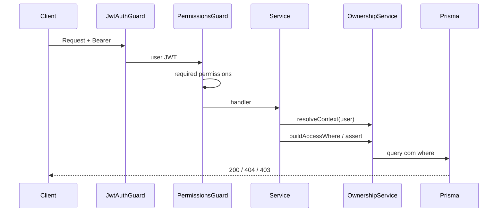

# Plano de enforcement — Backend e Frontend

**Status:** Planejado (Sprint 1b — Fase 2)  
**Sem implementação** nesta entrega.

---

## 1. Fluxo de autorização (ordem fixa)



| Ordem | Verificação | Falha |
|-------|-------------|-------|
| 1 | `tenantId` no token | 401 |
| 2 | `@RequirePermissions` | 403 |
| 3 | `OwnershipService` | 404 (preferido) ou 403 |
| 4 | Regras de negócio | 400/409 |

---

## 2. Backend — `OwnershipService`

### 2.1 Localização

```
apps/api/src/modules/access/
  ownership.service.ts
  permission-resolver.service.ts
  access-context.types.ts
```

### 2.2 `AccessContext` (por request ou cache)

```typescript
type AccessContext = {
  tenantId: string;
  userId: string;
  roles: string[];
  permissions: Set<string>;
  dataScope: 'own' | 'team' | 'shared' | 'tenant';
  teamIds: string[];
};
```

**Resolução `dataScope`:**

1. `max(scope)` dos roles do usuário (`shared` < `own` < `team` < `tenant`).
2. Override se `permissions.has('records.scope.tenant')`.

### 2.3 API planejada

| Método | Uso |
|--------|-----|
| `resolveContext(jwt)` | Login + cada request (ou cache 60s) |
| `buildLeadAccessWhere(ctx)` | `findLeads`, counts |
| `buildDealAccessWhere(ctx)` | `findDeals`, pipeline |
| `buildCustomerAccessWhere(ctx)` | `findCustomers` |
| `buildPolicyAccessWhere(ctx)` | `findPolicies` |
| `buildActivityAccessWhere(ctx)` | `findActivities`, agenda |
| `assertCanAccessLead(ctx, id)` | detail, patch, delete |
| `assertCanAccessDeal(ctx, id)` | idem |
| `assertCanAccessCustomer(ctx, id)` | idem |
| `assertCanAccessPolicy(ctx, id)` | idem |

### 2.4 Exemplos Prisma `where` (pseudocódigo)

**Lead — escopo `own`:**

```typescript
{ tenantId, ownerUserId: ctx.userId }
```

**Lead — escopo `team`:**

```typescript
{ tenantId, ownerTeamId: { in: ctx.teamIds } }
```

**Lead — escopo `shared`:**

```typescript
{
  tenantId,
  shares: {
    some: {
      sharedWithUserId: ctx.userId,
      revokedAt: null,
      OR: [{ expiresAt: null }, { expiresAt: { gt: new Date() } }],
    },
  },
}
```

**Lead — escopo `tenant`:**

```typescript
{ tenantId }
```

**Activity — derivado:**

```typescript
{
  tenantId,
  OR: [
    { leadId: { in: visibleLeadIds } }, // subquery ou join
    { dealId: { in: visibleDealIds } },
    { customerId: { in: visibleCustomerIds } },
    { policyId: { in: visiblePolicyIds } },
  ],
}
```

**Performance:** preferir subqueries correlacionadas com índices em `owner_user_id`, `owner_team_id`, `lead_shares.shared_with_user_id` em vez de carregar IDs no JWT.

### 2.5 Integração com guards

| Componente | Papel |
|------------|-------|
| `PermissionsGuard` | **Mantém** — permissão de módulo |
| `@RequireOwnership()` | **Opcional** — thin wrapper que chama `assert*`; default: asserts no service |
| `JwtAuthGuard` | Inalterado |

**Decisão:** asserts **dentro dos services** (menos decorators, mais testável).

### 2.6 Services impactados

| Service | Mudança |
|---------|---------|
| `LeadsService` | Substituir `mine` por `buildLeadAccessWhere`; create seta owner |
| `CrmService` | `buildDealAccessWhere` em `findDeals` |
| `CustomersService` | `buildCustomerAccessWhere` |
| `PoliciesService` | `buildPolicyAccessWhere` |
| `ActivitiesService` | `buildActivityAccessWhere` |
| `QuestionnairesService` | Derivado de lead/deal visível |

### 2.7 JWT

| Campo | Sprint 2 | Notas |
|-------|----------|-------|
| `permissions[]` | ✅ manter | |
| `roles[]` | ✅ manter | |
| `dataScope` | ✅ adicionar | escopo efetivo |
| `teamIds[]` | 🔶 opcional | se poucos; senão resolver no service |

---

## 3. Frontend

### 3.1 Sessão

Estender `SessionPayload`:

```typescript
{
  permissions: string[];
  roles: string[];
  dataScope: 'own' | 'team' | 'shared' | 'tenant';
  teamIds?: string[];
}
```

Fonte: BFF `/api/auth/me` após enriquecer API.

### 3.2 `PermissionGate` (existente)

- Continua checando **permissão** (`hasPermission`).
- Não resolve ownership de registro individual.

### 3.3 `ScopeGate` (novo — planejado)

```tsx
<ScopeGate minScope="team">
  <TeamFilterTabs />
</ScopeGate>
```

`minScope` compara ordem: shared < own < team < tenant.

### 3.4 Menus dinâmicos

| Rota | Permissão mínima | Ocultar para |
|------|------------------|--------------|
| `/crm` | `deals.view` ou `crm:view` | parceiro, financeiro |
| `/leads` | `leads.view` | — |
| `/clientes` | `customers.view` | parceiro |
| `/apolices` | `policies.view` | parceiro |
| `/configuracoes/usuarios` | `users.manage` | comercial, parceiro |
| Financeiro (futuro) | `finance.view` | comercial, parceiro |

Arquivo alvo: `packages/auth/src/routes.ts` + `apps/web/lib/navigation`.

### 3.5 Botões e ações

| UI | Condição |
|----|----------|
| Excluir lead | `leads.delete` + registro na carteira (API valida) |
| Compartilhar | `leads.share` + não parceiro |
| Exportar | `*.export` + scope team/tenant |
| Pipeline drag | `deals.edit` |
| Tab “Equipe” | `dataScope` ≥ team |

### 3.6 Filtros automáticos

| Comportamento | Detalhe |
|---------------|---------|
| **Não** confiar em `?mine=true` sozinho | Backend aplica scope sempre |
| Comercial | Default lista = own (sem tab “Todos”) |
| Gerência | Default = team; tab “Meus” opcional |
| Admin | Tab “Todos” |
| Parceiro | Sem tabs; só shared |

### 3.7 UX multiusuário

- Avatar/iniciais do `ownerUser` na lista.
- Badge “Compartilhado” em leads com share ativo.
- Select de responsável: lista usuários do tenant (admin/gerência).
- 403 → toast “Sem permissão”; 404 → “Registro não encontrado”.

---

## 4. Feature flag

`Tenant.settings.ownershipEnforcement`:

| Valor | API | UI |
|-------|-----|-----|
| `off` | Sem `buildAccessWhere` | Normal |
| `shadow` | Log divergência assignedTo vs ownerUserId | Normal |
| `on` | Enforcement ativo | Tabs/filtros por scope |

---

## 5. Testes planejados (Sprint 2)

| Tipo | Cobertura |
|------|-----------|
| Unit | `buildLeadAccessWhere` por scope |
| Unit | `PermissionResolver` alias `:` / `.` |
| E2E | Matriz V1–V13 ([rbac-roles-and-scopes.md](./rbac-roles-and-scopes.md)) |
| Contract | Snapshot permissões seed vs doc |

---

## 6. Referências

- Matriz permissões: [rbac-phase-2-matrix.md](./rbac-phase-2-matrix.md)
- Ownership: [rbac-ownership-matrix.md](./rbac-ownership-matrix.md)
- Auditoria: [rbac-audit-plan.md](./rbac-audit-plan.md)
