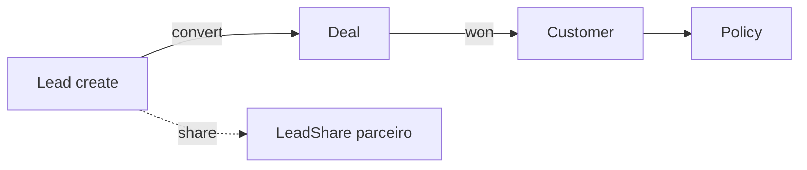

# Matriz de ownership por entidade

**Status:** Consolidado (Sprint 1b — Fase 2)  
**Data:** 2026-05-27

Define **quem é dono**, **como se compartilha** e **qual escopo padrão** aplica em cada entidade comercial.

---

## 1. Campos de ownership (modelo alvo)

| Campo | Tipo | Significado |
|-------|------|-------------|
| `ownerUserId` | FK → `User` | Responsável comercial principal |
| `ownerTeamId` | FK → `Team` | Equipe dona da carteira (gerência) |
| `LeadShare` | tabela N:N | Acesso `shared` para parceiros (só **Lead**) |
| `assignedTo` | string legado | **Deprecar** após backfill |

**Não usar** `sharedUsers[]` em JSON — usar `lead_shares`.

---

## 2. Matriz por entidade

### 2.1 Lead

| Aspecto | Regra |
|---------|--------|
| **Dono** | `ownerUserId` — quem criou ou recebeu reassignment |
| **Equipe** | `ownerTeamId` — equipe primária do dono no momento do create |
| **Parceiro** | `LeadShare` com `permission: read` (default) |
| **Escopo `own`** | `ownerUserId = sub` |
| **Escopo `team`** | `ownerTeamId IN user.teamIds` |
| **Escopo `shared`** | `id IN (SELECT leadId FROM lead_shares WHERE sharedWithUserId = sub AND revokedAt IS NULL)` |
| **Escopo `tenant`** | sem filtro extra |
| **Create** | `ownerUserId = sub`, `ownerTeamId = user.primaryTeamId` |
| **Reassign** | `leads.assign` + admin/gerência; atualiza owner + opcional team |
| **Delete** | Mesmo filtro de view; parceiro ❌ |

**Herança downstream:** ao converter → copiar owner/team para Deal.

### 2.2 Deal (negócio)

| Aspecto | Regra |
|---------|--------|
| **Dono** | `ownerUserId` — default: do lead convertido ou criador |
| **Equipe** | `ownerTeamId` — copiado do lead ou setado no create |
| **Parceiro** | **Sem acesso** (sem share em deal) |
| **Escopo `own`** | `ownerUserId = sub` OR lead convertido com `ownerUserId = sub` |
| **Escopo `team`** | `ownerTeamId IN teamIds` |
| **Escopo `tenant`** | todos |
| **Listagem pipeline** | `buildDealAccessWhere` obrigatório |
| **Visibilidade parceiro** | ❌ mesmo que conheça `dealId` por URL |

**Herança:** deal ganho → customer herda owner/team.

### 2.3 Customer (cliente)

| Aspecto | Regra |
|---------|--------|
| **Dono** | `ownerUserId` — do deal `sourceDeal` ou manual |
| **Equipe** | `ownerTeamId` |
| **Parceiro** | ❌ |
| **Escopo `own`** | `ownerUserId = sub` |
| **Escopo `team`** | `ownerTeamId IN teamIds` |
| **Escopo `tenant`** | todos |
| **Parceiro via lead** | ❌ não expõe customer mesmo com lead share |

**Nota:** parceiro vê **apenas** campos do lead compartilhado, não a conta customer vinculada.

### 2.4 Activity (atividade)

| Aspecto | Regra |
|---------|--------|
| **Autor** | `performedById` (quem registrou) — **≠ ownership** |
| **Visibilidade** | Derivada dos pais |
| **Filtro listagem global** | `OR`: `leadId IN visibleLeads` OR `dealId IN visibleDeals` OR `customerId IN visibleCustomers` OR `policyId IN visiblePolicies` |
| **Create** | Exige permissão `activities.create` + acesso ao pai |
| **Órfãs** (sem FK) | Visível só `tenant` scope; admin pode concluir/excluir |
| **Parceiro** | ❌ agenda global; 🔶 futuro: nota em lead share |

### 2.5 Policy (apólice)

| Aspecto | Regra |
|---------|--------|
| **Dono comercial** | `brokerUserId` (= `ownerUserId` semântico) |
| **Equipe** | `ownerTeamId` opcional denormalizado do customer |
| **Escopo `own`** | `brokerUserId = sub` OR customer.ownerUserId = sub |
| **Escopo `team`** | customer/deal na equipe |
| **Escopo `tenant`** | todos |
| **Parceiro** | ❌ |
| **Financeiro** | `tenant` + `policies.view` sem filtro own |

---

## 3. Tabela resumo ownership

| Entidade | ownerUserId | ownerTeamId | LeadShare | Escopo padrão comercial | Escopo parceiro |
|----------|:-----------:|:-----------:|:---------:|:-----------------------:|:---------------:|
| Lead | ✅ | ✅ | ✅ | own | shared |
| Deal | ✅ | ✅ | ❌ | own | — |
| Customer | ✅ | ✅ | ❌ | own | — |
| Activity | — (performedBy) | — | ❌ | derivado | — |
| Policy | ✅ (brokerUserId) | 🔶 | ❌ | team/own | — |

---

## 4. Fluxo de propagação

| Transição | Campos copiados |
|-----------|-----------------|
| Lead → Deal | `ownerUserId`, `ownerTeamId` |
| Deal → Customer | idem via `sourceDeal` |
| Customer → Policy | `brokerUserId = customer.ownerUserId` |
| Reassign Lead | **Fase 2:** opcional sync Deal; **Fase 3:** job explícito |

---

## 5. Compartilhamento parceiro (regras)

| Ação | Quem | Pré-condição |
|------|------|--------------|
| Criar share | comercial, gerencia, admin | `leads.share` + acesso ao lead |
| Revogar share | quem compartilhou, admin | `lead_shares.revokedAt` |
| Expirar | sistema / admin | `expiresAt` |
| Parceiro abre lead | parceiro | share ativo |

**Campos `LeadShare`:** `sharedWithUserId`, `sharedByUserId`, `permission`, `expiresAt`, `revokedAt`.

---

## 6. Casos especiais

| Caso | Tratamento |
|------|------------|
| Lead sem owner após migração | Visível só `tenant`; aparece em relatório “sem dono” para admin |
| Deal sem lead convertido | Ownership só `deal.ownerUserId` |
| Customer sem deal | `ownerUserId` manual no cadastro |
| Activity órfã | Admin/operacional tenant; comercial não lista |
| Usuário desativado | Owner permanece; reassign em massa (admin) |

---

## 7. Referências

- Schema proposto: [ownership-schema-proposal.prisma](./ownership-schema-proposal.prisma)
- Permissões: [rbac-phase-2-matrix.md](./rbac-phase-2-matrix.md)
- Enforcement: [rbac-enforcement-plan.md](./rbac-enforcement-plan.md)
