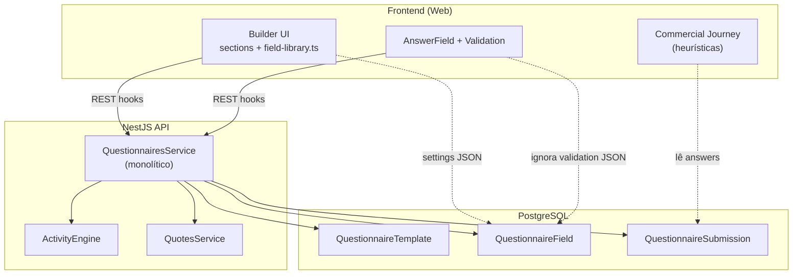
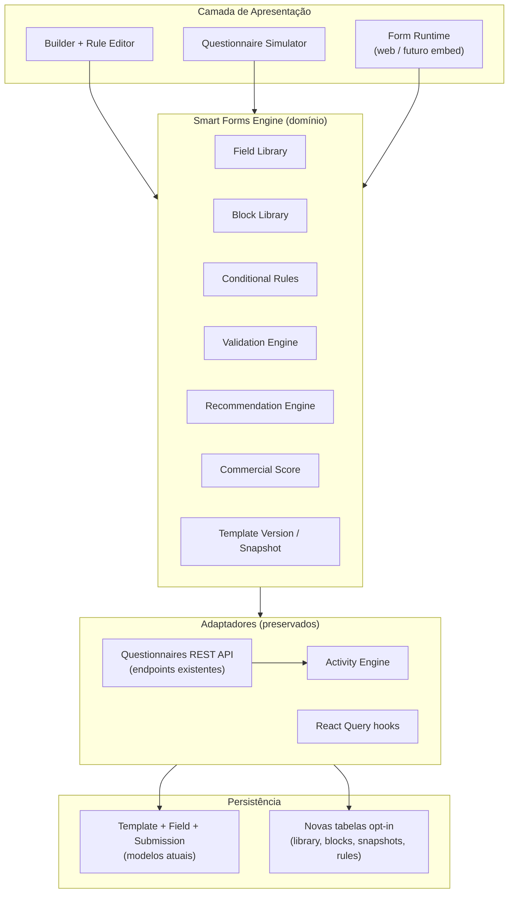
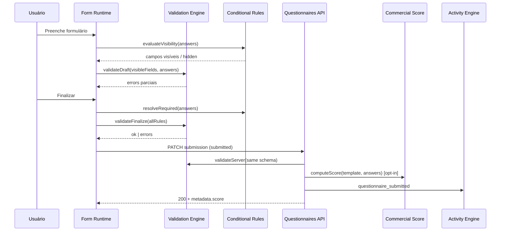
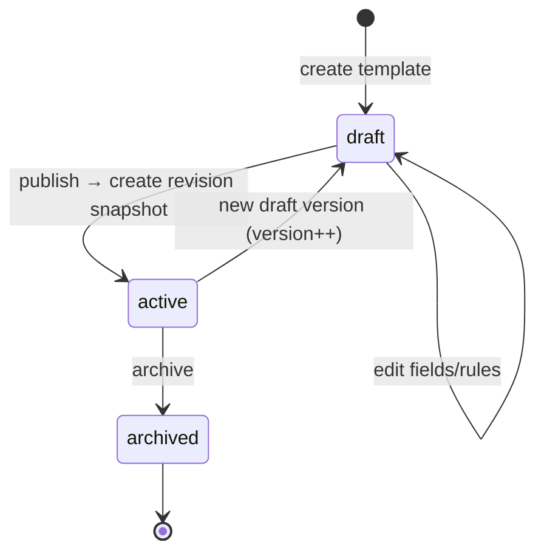
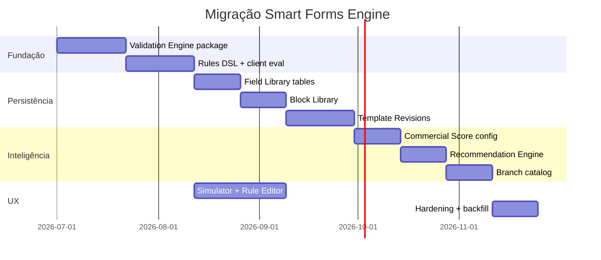

# Smart Forms Engine — Arquitetura Proposta

**Sprint:** 6.8 (design only)  
**Status:** Proposta  
**Escopo:** transformar o módulo Questionários em um motor inteligente **sem quebrar** APIs, dados, multi-tenant, RBAC ou Activity Engine.

---

## 1. Resumo executivo

O InsureFlow hoje possui um **CRUD de templates + submissões** com validação básica no backend e semântica rica no frontend (builder). O objetivo do **Smart Forms Engine** é extrair um **motor de domínio** reutilizável que suporte:

| Capacidade | Estado atual | Alvo |
|------------|--------------|------|
| Campos reutilizáveis | Catálogo UI-only (`field-library.ts`) | Field Library persistida por tenant |
| Blocos reutilizáveis | Seções em `template.settings` | Block Library com composição |
| Perguntas condicionais | Inexistente | Conditional Rules DSL |
| Regras / validações | `validation` JSON ignorado no server | Validation Engine unificado |
| Máscaras | `settings.mask` / `inputKind` (frontend) | Schema formal + engine |
| Versionamento | `version: Int` sem snapshot | Template Version imutável |
| Score comercial | CRM heurístico (`field-resolvers.ts`) | Commercial Score configurável |
| Recomendações | CRM heurístico | Recommendation Engine |
| Templates por ramo | Manual por tenant | Catálogo + fork |
| Simulador | Preview estático no builder | Questionnaire Simulator |

**Princípio rector:** evolução **aditiva** — dados legados continuam válidos; novas capacidades são opt-in via `settings.engineVersion` e tabelas novas.

---

## 2. Análise da arquitetura atual

### 2.1 Modelo de dados (Prisma)

```
Tenant
  └── QuestionnaireTemplate (status, version, settings JSON)
        ├── QuestionnaireField[] (key, type, options, validation, settings)
        └── QuestionnaireSubmission[] (answers JSON, CRM links)
```

**Arquivo:** `packages/database/prisma/schema.prisma`  
**Enums:** `QuestionnaireTemplateStatus`, `QuestionnaireFieldType`, `QuestionnaireSubmissionStatus`, etc.

**Características relevantes:**

- `@@unique([tenantId, name, version])` — versão é número, não histórico imutável
- `QuestionnaireSubmission.templateId` → `ON DELETE RESTRICT` — submissões pinadas ao template, não à versão
- Colunas JSON (`settings`, `validation`, `answers`) são **bags extensíveis** sem schema server-side
- Sem entidades para biblioteca, blocos, regras ou snapshots

### 2.2 Backend (NestJS)

| Componente | Arquivo | Observação |
|------------|---------|------------|
| Controller | `apps/api/src/modules/questionnaires/questionnaires.controller.ts` | REST `/api/v1/questionnaires/*` |
| Service | `apps/api/src/modules/questionnaires/questionnaires.service.ts` | ~945 linhas monolíticas |
| DTOs | `apps/api/src/modules/questionnaires/dto/questionnaire.dto.ts` | `validation`/`settings` como `Record<string, unknown>` |
| Integrações | Leads, Quotes, Activities | Eventos em submit/review |

**Validação server-side hoje:**

- Tipo Prisma (`TEXT`, `EMAIL`, `SELECT`, …)
- Required quando `status ∈ { submitted, reviewed }`
- Opções normalizadas para SELECT/MULTI_SELECT
- **`field.validation` não é lido**
- **`field.settings` não é lido**

**Utility comercial:** `apps/api/src/common/utils/questionnaire-commercial.util.ts` — deriva status para CRM, não score.

### 2.3 Frontend

| Camada | Local | Papel |
|--------|-------|-------|
| Data access | `apps/web/lib/data-access/modules/questionnaires/` | React Query hooks + normalizers |
| Builder | `apps/web/components/questionnaires/questionnaire-builder/` | Autoria visual (Sprint 6.7) |
| Validação | `apps/web/lib/questionnaires/questionnaire-field-validation.ts` | Masks BR, required, draft vs finalize |
| Render | `apps/web/components/questionnaires/questionnaire-answer-field.tsx` | 11 tipos; FILE não implementado |
| Score CRM | `apps/web/lib/crm/commercial-journey/` | Pattern-matching em keys/labels |

**De facto schema de campo** (`questionnaire-builder/types.ts`):

```typescript
type FieldSettings = {
  section?: string
  inputKind?: InsuranceQuestionKind  // cpf, plate, …
  mask?: "cpf" | "cnpj" | "cep" | "phone" | "plate"
  defaultValue?: string
}
```

### 2.4 Diagrama — estado atual



### 2.5 Lacunas identificadas

1. **Sem motor de regras** — lógica espalhada entre service, validation.ts e commercial-journey
2. **Biblioteca não persistida** — 21 tipos hardcoded no frontend
3. **Versionamento fraco** — `version` incrementável sem snapshot ou diff
4. **Validação duplicada** — backend e frontend com regras diferentes
5. **Condicionais inexistentes** — todos os campos sempre visíveis
6. **Score acoplado ao CRM** — não configurável por template/ramo
7. **Submissões desalinhadas** — template editado após submit altera semântica retroativa

---

## 3. Arquitetura proposta — Smart Forms Engine

### 3.1 Visão em camadas



### 3.2 Módulos conceituais do motor

| Módulo | Responsabilidade | Persistência inicial | Persistência alvo |
|--------|------------------|----------------------|-------------------|
| **Field Library** | Definições reutilizáveis de campo (tipo, máscara, validação default) | — | `QuestionnaireFieldDefinition` |
| **Block Library** | Grupos nomeados de campos (ex.: “Dados do veículo”) | `settings.blocks[]` (JSON) | `QuestionnaireBlock` + refs |
| **Conditional Rules** | Visibilidade, required dinâmico, enable/disable | `field.settings.rules[]` | `QuestionnaireRule` |
| **Validation Engine** | Avaliar `validation` + tipo + condição | In-memory | Compartilhado client/server |
| **Recommendation Engine** | Sugestões pós-resposta ou in-flow | `template.settings.recommendations[]` | `QuestionnaireRecommendationRule` |
| **Commercial Score** | Pontuação configurável por template | — | `template.settings.scoring` + engine |
| **Template Version** | Snapshot imutável ao publicar | `version` + nova tabela | `QuestionnaireTemplateRevision` |
| **Questionnaire Simulator** | Executar engine com answers mock | Stateless (client) | API opcional `/simulate` |

### 3.3 Diagrama de sequência — submissão inteligente



### 3.4 Pontos de extensão (sem breaking change)

| Ponto | Mecanismo | Fase |
|-------|-----------|------|
| Validação extra | `field.validation` schema v1 | 7.1 |
| Visibilidade | `field.settings.visibilityRule` | 7.2 |
| Blocos inline | `template.settings.blocks` | 7.4 |
| Engine version | `template.settings.engineVersion: 1 \| 2` | 7.1 |
| Snapshot | `submission.metadata.templateRevisionId` | 7.5 |
| Score em metadata | `submission.metadata.commercialScore` | 7.6 |
| Catálogo ramo | `template.settings.branch: "auto" \| "life"` | 7.8 |
| Field ref | `field.settings.fieldDefinitionId` | 7.3 |

**APIs existentes permanecem.** Novos endpoints sugeridos (aditivos):

```
GET  /questionnaires/field-definitions
POST /questionnaires/field-definitions
GET  /questionnaires/blocks
POST /questionnaires/templates/:id/revisions
POST /questionnaires/templates/:id/simulate
GET  /questionnaires/templates/:id/rules
```

---

## 4. Modelos conceituais

### 4.1 Field Library (implementado Sprint 7.3 — fase catálogo)

**Pacote:** `@repo/forms-library` — catálogo persistente in-memory (fase 1); evolução futura para tabelas tenant-scoped.

**Propósito:** catálogo de definições de campo especializadas para seguros, evoluindo o `field-library.ts` estático.

```typescript
interface FieldDefinition {
  id: string
  tenantId: string
  slug: string                    // "cpf", "vehicle_plate"
  label: string
  type: QuestionnaireFieldType
  inputKind?: InsuranceQuestionKind
  defaultValidation?: ValidationSchemaV1
  defaultSettings?: FieldSettings
  tags?: string[]                 // "documentos", "veiculos"
  scope: "tenant" | "system"      // system = catálogo InsureFlow
}
```

**Integração com template:** campo existente ganha `settings.fieldDefinitionId`. Ao inserir da biblioteca, copia-se snapshot local (desacoplamento) ou referência (sync explícito).

### 4.2 Block Library (implementado Sprint 7.3 — fase catálogo)

**Pacote:** `@repo/forms-library/src/blocks/` — blocos Auto, Vida, Residencial, Empresarial com `instantiateBlock()`.

**Propósito:** reutilizar conjuntos de perguntas entre templates (ex.: bloco “Condutor principal” em Auto PF e Auto PJ).

```typescript
interface BlockDefinition {
  id: string
  tenantId: string
  name: string
  description?: string
  fieldRefs: Array<{
    fieldDefinitionId?: string
    inlineField?: CreateFieldInput   // fallback
    order: number
  }>
  tags?: string[]
}
```

**Instanciação no template:** operação “Inserir bloco” materializa `QuestionnaireField[]` com keys únicas (`vehicle_plate`, `vehicle_plate_2`).

### 4.3 Rules Engine (implementado Sprint 7.2)

**Persistência:** `template.settings.rules[]` + `settings.engineVersion: 2`.

**Modelo JSON (sem DSL textual):**

```json
{
  "id": "show_second_driver",
  "name": "Segundo condutor",
  "enabled": true,
  "conditionLogic": "and",
  "conditions": [
    { "fieldKey": "has_second_driver", "operator": "equals", "value": "yes" }
  ],
  "actions": [
    { "type": "showField", "targetFieldKey": "second_driver_name" },
    { "type": "requireField", "targetFieldKey": "second_driver_name" }
  ]
}
```

**Grupos AND/OR:** item de `conditions` pode ser condição simples ou `{ "logic": "and"|"or", "conditions": [...] }`.

**Operadores nativos:** `equals`, `notEquals`, `greaterThan`, `greaterOrEqual`, `lessThan`, `lessOrEqual`, `contains`, `startsWith`, `endsWith`, `between`, `in`, `notIn`, `isEmpty`, `isFilled`, `exists`, `notExists`.

**Ações nativas:** `showField`, `hideField`, `requireField`, `optionalField`, `enableField`, `disableField`, `setValue`, `clearValue`, `showSection`, `hideSection`, `jumpToSection`.

**Componentes (`packages/forms-engine/src/rules/`):**

| Módulo | Responsabilidade |
|--------|------------------|
| `RuleEngine` | `evaluate`, `evaluateField`, `evaluateSection`, `evaluateTemplate`, `evaluateSubmission`, `testRule` |
| `RuleRegistry` | Registry pattern para operadores e ações |
| `ConditionEvaluator` | Avalia condições e grupos |
| `ActionExecutor` | Aplica efeitos sobre estado derivado |
| `ConditionalEngine` | Consumidor de alto nível — estados por campo/seção |

**Compatibilidade:** `engineVersion: 1` ignora regras; `engineVersion: 2` executa o motor. Frontend, backend e preview usam o **mesmo** `@repo/forms-engine`.

**Integração Validation Engine:** após regras, `ValidationContext` recebe `visibleFieldKeys`, `requiredFieldKeys`, `optionalFieldKeys`, `disabledFieldKeys`.

### 4.4 Validation Engine

**Schema v1** (armazenado em `field.validation`):

```json
{
  "version": 1,
  "rules": [
    { "type": "required", "when": "always" },
    { "type": "cpf" },
    { "type": "minLength", "value": 3 },
    { "type": "max", "value": 100000 },
    { "type": "pattern", "value": "^[A-Z]{3}[0-9][A-Z0-9][0-9]{2}$", "message": "Placa inválida" }
  ]
}
```

**Pipeline:**

1. Resolver campos visíveis (Conditional Rules)
2. Aplicar required estático + dinâmico
3. Validar tipo base (`QuestionnaireFieldType`)
4. Validar regras declarativas
5. Normalizar valor (ISO date, digits-only CPF)

### 4.5 Recommendation Engine

**Propósito:** substituir heurísticas fixas do CRM por regras declaradas no template.

```json
{
  "id": "suggest_comprehensive",
  "priority": 10,
  "when": {
    "all": [
      { "field": "vehicle_year", "op": "gt", "value": 2018 },
      { "field": "has_garage", "op": "eq", "value": false }
    ]
  },
  "recommendation": {
    "code": "coverage_comprehensive",
    "title": "Considere cobertura compreensiva",
    "body": "Veículo recente sem garagem — risco elevado.",
    "cta": { "type": "deal_note" }
  }
}
```

**Saída:** `CommercialRecommendation[]` — compatível com tipos existentes em `commercial-journey/types.ts`.

### 4.6 Commercial Score

**Propósito:** score configurável por template, complementando (não substituindo) o score global do CRM.

```json
{
  "version": 1,
  "maxScore": 100,
  "dimensions": [
    {
      "id": "data_completeness",
      "weight": 40,
      "rules": [{ "field": "cpf", "op": "notEmpty", "points": 10 }]
    },
    {
      "id": "risk_profile",
      "weight": 60,
      "rules": [{ "field": "claims_last_5y", "op": "eq", "value": 0, "points": 30 }]
    }
  ],
  "tiers": [
    { "min": 85, "tier": "excellent" },
    { "min": 70, "tier": "good" },
    { "min": 50, "tier": "regular" },
    { "min": 0, "tier": "low" }
  ]
}
```

**Persistência:** `submission.metadata.commercialScore` + exibição no CRM via adaptador existente.

### 4.7 Template Version

**Propósito:** imutabilidade ao publicar; submissões referenciam revisão.



**Entidade:** `QuestionnaireTemplateRevision`

- `templateId`, `revisionNumber`, `publishedAt`, `publishedBy`
- `snapshot: Json` — `{ template, fields, rules, scoring }` congelado
- Submissão: `metadata.templateRevisionId` (opcional; fallback = latest active)

### 4.8 Questionnaire Simulator

**Propósito:** no builder, testar condicionais/validação/score sem criar submissão.

**Fluxo:**

1. Builder carrega template + rules
2. Usuário define answers mock (painel lateral)
3. Engine retorna: visibilidade, erros, score, recomendações
4. UI destaca campos afetados

**Implementação:** package `@repo/forms-engine` consumido no client; endpoint `POST .../simulate` opcional para paridade server.

---

## 5. Estratégia de migração e compatibilidade

### 5.1 Princípios

| Princípio | Detalhe |
|-----------|---------|
| **Additive only** | Novas tabelas e campos JSON; zero alteração breaking em DTOs existentes |
| **Opt-in por template** | `settings.engineVersion: 2` habilita motor; default `1` = comportamento atual |
| **Answers estáveis** | Keys de campo nunca renomeadas em revisões publicadas; alias via metadata |
| **Submissões legadas** | Sem `templateRevisionId` → engine usa fields live (comportamento atual) |
| **RBAC unchanged** | `questionnaires:view` / `questionnaires:manage` + novos scopes apenas se necessário |
| **Activity Engine** | Mesmos eventos; payload enriquecido opcional (`score`, `recommendations`) |

### 5.2 Fases de migração



### 5.3 Matriz de compatibilidade

| Artefato | v1 (atual) | v2 (engine) |
|----------|------------|-------------|
| `QuestionnaireField.validation` | Ignorado | Schema v1 enforced |
| `field.settings.inputKind` | Frontend only | Mapeado em FieldDefinition |
| `template.settings.questionnaireSections` | Mantido | Mantido |
| Submissões draft | PATCH livre | Mesmo + visibility-aware validation |
| Hooks React Query | Inalterados | Novos hooks aditivos |
| Builder Sprint 6.7 | Base UX | + Rule Editor, Simulator |
| CRM Commercial Journey | Heurístico | Adapter lê score do submission.metadata |

---

## 6. Riscos

| Risco | Impacto | Mitigação |
|-------|---------|-----------|
| Divergência client/server na Validation Engine | Submissões rejeitadas inesperadamente | Package compartilhado `@repo/forms-engine` + testes golden |
| Complexidade do Rule DSL | Builder inutilizável | Editor visual + templates de regra; começar com `show/hide` |
| Performance em forms grandes | Lag no runtime | Avaliação incremental; indexar rules por fieldKey |
| Versionamento + submissões antigas | Interpretação inconsistente | Snapshot obrigatório ao publicar; fallback documentado |
| Scope creep | Atraso multi-sprint | Roadmap faseado; engineVersion opt-in |
| FILE type não implementado | Bloqueio em blocos com anexo | Sprint dedicada antes de blocos “documentos” |
| Multi-tenant leakage em library | Segurança | `tenantId` em todas as queries; system catalog read-only |

---

## 7. Relacionamento com documentos irmãos

| Documento | Conteúdo |
|-----------|----------|
| [questionnaire-domain-v2.md](./questionnaire-domain-v2.md) | Modelo de domínio detalhado, agregados, eventos |
| [questionnaire-roadmap.md](./questionnaire-roadmap.md) | Sprints, estimativas, dependências, critérios de done |

---

## 8. Decisões de arquitetura (ADRs futuros)

1. **ADR-003:** Package `@repo/forms-engine` como single source of truth para rules + validation — **implementado Sprint 7.1 (validation) + 7.2 (rules)**
2. **ADR-004:** Template Revision como snapshot JSON vs normalizado (recomendado: JSON snapshot + campos desnormalizados para query)
3. **ADR-005:** Field Library — referência vs cópia ao instanciar (recomendado: cópia com `originDefinitionId`)
4. **ADR-006:** Score no submission.metadata vs tabela `SubmissionScore` (recomendado: metadata primeiro)

---

## 9. Referências no codebase

| Área | Path |
|------|------|
| **Validation Engine (Sprint 7.1)** | `packages/forms-engine/src/validation/` |
| **Rules Engine (Sprint 7.2)** | `packages/forms-engine/src/rules/` |
| Frontend rules adapter | `apps/web/lib/questionnaires/questionnaire-rules.ts` |
| Rules builder UI | `apps/web/components/questionnaires/questionnaire-builder/rules-editor-panel.tsx` |
| Prisma models | `packages/database/prisma/schema.prisma` |
| API service | `apps/api/src/modules/questionnaires/questionnaires.service.ts` |
| DTOs | `apps/api/src/modules/questionnaires/dto/questionnaire.dto.ts` |
| Frontend validation | `apps/web/lib/questionnaires/questionnaire-field-validation.ts` → `@repo/forms-engine` |
| Builder types | `apps/web/components/questionnaires/questionnaire-builder/types.ts` |
| **Forms Library (Sprint 7.3)** | `packages/forms-library/` |
| Field catalog UI (legado quick-add) | `apps/web/components/questionnaires/questionnaire-builder/field-library.ts` |
| Block library UI | `apps/web/components/questionnaires/questionnaire-builder/block-library-drawer.tsx` |
| Commercial score (CRM) | `apps/web/lib/crm/commercial-journey/` |
| Autosave ADR | `docs/decisions/ADR-002-questionnaire-autosave.md` |
| Builder UX 6.7 | `docs/reports/sprint6-phase7-ux-simplification.md` |
