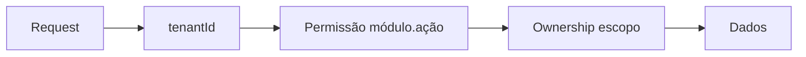
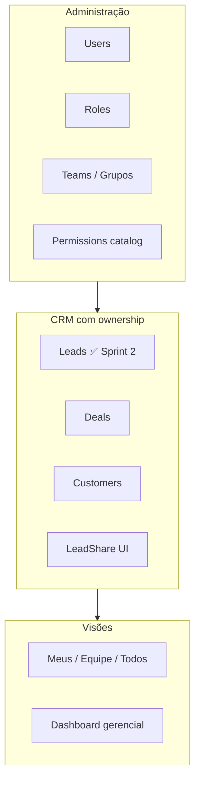

# Sprint 3 — Plano detalhado (Governança + RBAC + Ownership ampliado)

**Status:** Planejamento  
**Data:** 2026-06-03  
**Pré-requisito:** Sprint 2 aprovada ([sprint-2-closure.md](../sprint-notes/sprint-2-closure.md))  
**Produção:** Permanece `OWNERSHIP_ENFORCEMENT=off` durante toda a Sprint 3  
**Escopo:** Arquitetura, backlog e plano — **sem implementação neste documento**

---

## 1. Objetivo da Sprint 3

Entregar **governança operacional** da corretora (usuários, grupos, permissões) e **estender ownership** para o núcleo comercial (leads já feito · deals · clientes), com compartilhamento para parceiros e visão gerencial por equipe — validável em local/HML antes de qualquer rollout prod.

### 1.1 Objetivos mensuráveis

| # | Objetivo | Critério de done |
|---|----------|------------------|
| O1 | Admin gerencia usuários e papéis sem SQL | CRUD completo UI + API |
| O2 | Permissões por tela e por ação funcionam | Matriz V1–V4 + testes API |
| O3 | Ownership deals + customers | Shadow → `on` em piloto local |
| O4 | Parceiro só vê leads compartilhados (com `on`) | Zero vazamento pipeline |
| O5 | Gerência vê carteira da equipe | Filtros + listagens coerentes |
| O6 | Auditoria de share e transferência | Eventos enfileirados |

### 1.2 Fora de escopo Sprint 3

- WhatsApp, automação, financeiro completo
- Enforcement ownership em **policies** / **financeiro** (Sprint 4)
- Row-Level Security Postgres
- Multi-tenant admin (super_admin SaaS)
- Deploy produção com `on`

---

## 2. Arquitetura alvo

### 2.1 Modelo de autorização (mantido da Sprint 2)



| Camada | Pergunta | Mecanismo |
|--------|----------|-----------|
| RBAC | Pode executar a ação? | `Permission` + `@RequirePermissions` |
| Ownership | Pode ver/editar **este** registro? | `ownerUserId`, `ownerTeamId`, `LeadShare`, `dataScope` |
| UI | O que mostrar? | `PermissionGate` + escopo + navigation map |

### 2.2 Domínios Sprint 3



---

## 3. Épicos e backlog

### Epic E1 — Usuários (CRUD + convite + status)

**Estado atual:** API parcial (`UsersModule`); sem UI dedicada; seed manual.

| ID | Story | Aceite |
|----|-------|--------|
| E1.1 | Listar usuários do tenant com roles e equipes | Paginação, busca por nome/email |
| E1.2 | Criar usuário (email, nome, roles[], teams[]) | Senha temporária ou reset link |
| E1.3 | Editar usuário (roles, equipes, ativo/inativo) | Re-login invalida JWT antigo |
| E1.4 | Desativar usuário (soft) | Não aparece em selects; login bloqueado |
| E1.5 | Regras de conflito | `parceiro` ⊕ `comercial` no mesmo user |
| E1.6 | Endpoint re-sync sessão | Admin altera role → usuário refresh |

**API (novo/estendido):**

```
GET    /api/v1/users
POST   /api/v1/users
PATCH  /api/v1/users/:id
PATCH  /api/v1/users/:id/roles
PATCH  /api/v1/users/:id/teams
POST   /api/v1/users/:id/deactivate
```

**Permissões:** `users.view`, `users.manage` (split de `users:manage` legado)

**UI:** `/configuracoes/usuarios` — tabela, drawer create/edit, RoleBadge multi.

---

### Epic E2 — Grupos de usuários (Teams)

**Estado atual:** Schema `Team` + `TeamMember`; seed demo; sem CRUD.

| ID | Story | Aceite |
|----|-------|--------|
| E2.1 | CRUD equipes (nome, slug, isActive) | Admin + gerência (view) |
| E2.2 | Membros: add/remove, `isLead` | Gerente marcado |
| E2.3 | Primary team no create lead/deal/customer | `ownerTeamId` default |
| E2.4 | Usuário em N equipes | `teamIds` no JWT reflete todas |
| E2.5 | Empty state gerência sem equipe | Bloqueio claro + doc ops |

**API:**

```
GET/POST/PATCH/DELETE /api/v1/teams
POST/DELETE           /api/v1/teams/:id/members
```

**Permissões:** `teams.view`, `teams.manage`

**UI:** `/configuracoes/equipes` — árvore ou cards + membros.

---

### Epic E3 — Permissões por tela (navigation + route guards)

**Estado atual:** `mainNav` usa chaves legado `crm:view`, `leads:view`; parceiro ainda vê rotas se permissão errada no seed.

| ID | Story | Aceite |
|----|-------|--------|
| E3.1 | Mapa rota → permissão mínima | Documento + código único |
| E3.2 | Sidebar oculta módulos sem `*.view` | Parceiro: só Leads (+ dashboard se permitido) |
| E3.3 | `requirePermission` server components alinhado | 403 → `/unauthorized` |
| E3.4 | Breadcrumbs / deep links | URL direta respeita RBAC |
| E3.5 | Matriz tela × role publicada | QA checklist |

**Mapa rota → permissão (alvo):**

| Rota | Permissão mínima |
|------|------------------|
| `/` | `dashboard.view` |
| `/crm`, `/crm/negocios` | `deals.view` |
| `/leads` | `leads.view` |
| `/clientes` | `customers.view` |
| `/apolices` | `policies.view` |
| `/configuracoes` | `settings.view` |
| `/configuracoes/usuarios` | `users.view` |
| `/configuracoes/equipes` | `teams.view` |
| `/configuracoes/roles` | `roles.view` |

**Regra parceiro:** negar `deals.view`, `customers.view`, `crm:view` no seed **e** validar na navigation.

---

### Epic E4 — Permissões por ação (view / create / edit / delete)

**Estado atual:** Agregado `*:manage` + `*:view`; guards no backend por string legado.

| ID | Story | Aceite |
|----|-------|--------|
| E4.1 | Migration permissões granulares no catálogo | Alias `:` → `.` em runtime |
| E4.2 | Seed roles com matriz [rbac-phase-2-matrix](../architecture/rbac-phase-2-matrix.md) | Script validate catalog |
| E4.3 | Guards API por ação HTTP | GET=view, POST=create, … |
| E4.4 | `PermissionGate` com ação explícita | Botões create/edit/delete |
| E4.5 | Depreciar `crm:manage` gradualmente | Manter alias Sprint 3 |

**Matriz ação × endpoint (leads — referência):**

| Ação | Permissão | HTTP |
|------|-----------|------|
| view | `leads.view` | GET |
| create | `leads.create` | POST |
| edit | `leads.edit` | PATCH |
| delete | `leads.delete` | DELETE |
| share | `leads.share` | POST/DELETE share |

Replicar padrão para `deals.*`, `customers.*`.

**Componente UI:**

```tsx
<PermissionGate permission="leads.edit">
  <Button>Editar</Button>
</PermissionGate>
```

---

### Epic E5 — Ownership: leads (hardening) + deals + customers

**Estado atual:** Leads com ownership Sprint 2; Deal/Customer sem `ownerUserId` no schema.

#### E5.1 Leads (complemento Sprint 2)

| ID | Story | Aceite |
|----|-------|--------|
| E5.1.1 | Ativar `on` em piloto local | Lista/detail obedecem ownership |
| E5.1.2 | Reassign owner (gerência/admin) | `leads.assign` + audit |
| E5.1.3 | Remover dependência `?mine=true` legado | UI usa escopo JWT |

#### E5.2 Deals (negócios)

| ID | Story | Aceite |
|----|-------|--------|
| E5.2.1 | Migration: `Deal.ownerUserId`, `Deal.ownerTeamId` | Nullable, indexed |
| E5.2.2 | Backfill: deal ← lead convertido ou `assignedTo` | Dry-run script |
| E5.2.3 | `buildDealAccessWhere` + asserts | Pipeline filtrado |
| E5.2.4 | Create deal herda owner do lead/customer | Regra documentada |
| E5.2.5 | Parceiro: zero deals | 403/404 em `/crm` |

**Regra de derivação:**

```
Deal.owner ← Lead convertido.owner
          ← Customer.sourceDeal.owner (fallback)
          ← creator (create manual)
```

#### E5.3 Customers (clientes)

| ID | Story | Aceite |
|----|-------|--------|
| E5.3.1 | Migration: `Customer.ownerUserId`, `Customer.ownerTeamId` | |
| E5.3.2 | Backfill via `sourceDealId` | Dry-run |
| E5.3.3 | `buildCustomerAccessWhere` | Lista `/clientes` filtrada |
| E5.3.4 | Parceiro: sem clientes (exceto futuro share) | Menu oculto |

#### E5.4 Activities (derivadas — escopo reduzido)

| ID | Story | Aceite |
|----|-------|--------|
| E5.4.1 | Agenda filtra por registros pai visíveis | Sem leak cross-user |
| E5.4.2 | Create activity valida acesso ao pai | 404 |

---

### Epic E6 — Compartilhamento para parceiros (LeadShare)

**Estado atual:** Tabela + seed 1 share; sem UI.

| ID | Story | Aceite |
|----|-------|--------|
| E6.1 | API CRUD share | POST/DELETE `/leads/:id/shares` |
| E6.2 | UI modal "Compartilhar com parceiro" | Só users role `parceiro` |
| E6.3 | Permissão `leads.share` | Comercial/gerência/admin |
| E6.4 | Revogar share | Parceiro perde acesso imediato (com `on`) |
| E6.5 | Auditoria | `lead.share.created`, `lead.share.revoked` |
| E6.6 | Lista parceiro com `on` | Exatamente N shares ativos |

---

### Epic E7 — Visão gerencial por equipe

| ID | Story | Aceite |
|----|-------|--------|
| E7.1 | Filtro "Minha equipe" em leads/deals/customers | Escopo `team` |
| E7.2 | Admin: filtro por equipe (dropdown) | Escopo `tenant` |
| E7.3 | Contadores pipeline por equipe | Cards CRM gerência |
| E7.4 | Export CSV carteira equipe (opcional) | `deals.export` / `leads.export` |
| E7.5 | Dashboard widgets por equipe | Leads abertos, deals por estágio |

**UI — filtros por escopo:**

| Escopo | Filtros visíveis |
|--------|------------------|
| `own` | Meus |
| `team` | Meus + Equipe |
| `tenant` | Meus + Equipe + Todos (+ por equipe admin) |
| `shared` | Nenhum (lista já restrita) |

---

### Epic E8 — Roles admin (CRUD papéis customizados)

| ID | Story | Aceite |
|----|-------|--------|
| E8.1 | Listar roles sistema + custom | `isSystem` read-only slug |
| E8.2 | Criar role custom (nome, permissions[], defaultDataScope) | |
| E8.3 | Clonar role | Acelera onboarding corretora |
| E8.4 | Não deletar role com usuários | Soft ou block |

**Permissões:** `roles.view`, `roles.manage`

---

### Epic E9 — Auditoria e observabilidade

| ID | Story | Aceite |
|----|-------|--------|
| E9.1 | Eventos ownership/share | Fila BullMQ |
| E9.2 | Eventos users/roles/teams | Admin changes |
| E9.3 | UI `/configuracoes/auditoria` (read) | Filtro por domínio |
| E9.4 | Log `[ownership:denied]` amostragem | Métrica pré-prod |

Ver [rbac-audit-plan.md](./rbac-audit-plan.md).

---

## 4. Schema alvo (incremental)

```prisma
// Novos campos — migration Sprint 3
model Deal {
  ownerUserId  String?
  ownerTeamId  String?
  // assignedTo mantido
}

model Customer {
  ownerUserId  String?
  ownerTeamId  String?
}

// LeadShare — sem alteração estrutural
// Permission — novas chaves leads.create, deals.view, users.view, ...
```

Índices compostos: `(tenantId, ownerUserId)`, `(tenantId, ownerTeamId)` em Deal e Customer.

---

## 5. Plano de implementação (6 semanas sugeridas)

### Fase 3.1 — Fundação admin (Semana 1–2)

| Ordem | Entrega | Dependência |
|-------|---------|-------------|
| 1 | Permissões granulares + alias resolver | — |
| 2 | API + UI usuários (E1) | E4.1 |
| 3 | API + UI equipes (E2) | E1 |
| 4 | Navigation map + guards tela (E3) | E4.1 |

**Validação:** Admin cria usuário parceiro → menu correto sem CRM.

### Fase 3.2 — Ownership deals/customers (Semana 2–3)

| Ordem | Entrega | Dependência |
|-------|---------|-------------|
| 5 | Migration owner FKs deal/customer | — |
| 6 | Backfill scripts dry-run | 5 |
| 7 | OwnershipService deals/customers | 5, E4 |
| 8 | Integração API CRM + customers | 7 |
| 9 | Shadow mode deals/customers | 7 |

**Validação:** `hml:sprint3:validate` (script novo) 0 issues.

### Fase 3.3 — Share + enforcement piloto (Semana 3–4)

| Ordem | Entrega | Dependência |
|-------|---------|-------------|
| 10 | LeadShare API + UI (E6) | E1, E4 |
| 11 | Leads `on` piloto local | Sprint 2 stable |
| 12 | Deals/customers `on` piloto | 9, 11 |
| 13 | Filtros gerenciais (E7) | 7 |

**Validação:** V1 parceiro vê só shares; V3 gerência vê equipe.

### Fase 3.4 — Roles + auditoria + hardening (Semana 4–5)

| Ordem | Entrega | Dependência |
|-------|---------|-------------|
| 14 | Roles CRUD (E8) | E4, E1 |
| 15 | Auditoria eventos (E9) | E6, E1 |
| 16 | Testes e2e V1–V13 | Todas |
| 17 | Docs + runbook rollout | — |

### Fase 3.5 — Buffer / HML (Semana 5–6)

| Ordem | Entrega | Nota |
|-------|---------|------|
| 18 | Deploy HML se Railway disponível | Opcional |
| 19 | Browser checklist Sprint 3 | Obrigatório local |
| 20 | PR → develop | Sem prod `on` |

---

## 6. Matriz de validação (personas)

Reutilizar V1–V4 + expandir:

| ID | Persona | Usuários | Equipes | Telas | Ações | Ownership |
|----|---------|:--------:|:-------:|:-----:|:-----:|-----------|
| V1 | Parceiro | — | — | Só leads | view | shared only |
| V2 | Comercial | — | 1 equipe | CRM parcial | CRUD próprios | own |
| V3 | Gerência | view equipe | view | CRM equipe | + assign | team |
| V4 | Admin | manage | manage | todas | todas | tenant |
| V5 | Operacional | — | — | clientes/apólices | sem pipeline | team/tenant |
| V6 | Leitura | view | view | view only | sem mutate | tenant |

---

## 7. Feature flags Sprint 3

| Flag | Dev local | HML | Prod |
|------|-----------|-----|------|
| `OWNERSHIP_ENFORCEMENT` leads | `on` (piloto) | `shadow`→`on` | `off` |
| `OWNERSHIP_ENFORCEMENT` deals | `shadow`→`on` | `shadow`→`on` | `off` |
| `OWNERSHIP_ENFORCEMENT` customers | `shadow`→`on` | idem | `off` |
| `RBAC_GRANULAR` | `on` | `on` | alias legado |

Implementação sugerida: estender para `OWNERSHIP_ENFORCEMENT_DEALS`, `_CUSTOMERS` ou JSON tenant.settings.

---

## 8. Riscos Sprint 3

| Risco | Impacto | Mitigação |
|-------|---------|-----------|
| Granularidade quebra seed legado | Alto | Alias `manage` → bundle de ações |
| Deal sem owner pós-backfill | Alto | Dry-run + default creator |
| Parceiro vê pipeline via API | Crítico | Testes V1 + negar deals.view |
| UI admin scope creep | Médio | MVP CRUD; iterar UX |
| Performance joins LeadShare | Médio | Índices + EXPLAIN |
| Conflito roles múltiplos | Médio | Regras E1.5 + max scope |

---

## 9. Definition of Done — Sprint 3

- [ ] Epics E1–E9 entregues ou explicitamente descoped com ADR
- [ ] Matriz [rbac-phase-2-matrix](./rbac-phase-2-matrix.md) refletida no seed
- [ ] `npm run hml:sprint3:validate` (novo) — 0 issues local
- [ ] Browser checklist V1–V6 completo
- [ ] Produção **inalterada** (`off`, sem migration destrutiva)
- [ ] Documentação: closure Sprint 3 + runbook `shadow`→`on` prod (Sprint 4)

---

## 10. Referências

| Documento | Uso |
|-----------|-----|
| [sprint-2-closure.md](../sprint-notes/sprint-2-closure.md) | Baseline aprovada |
| [rbac-phase-2-matrix.md](./rbac-phase-2-matrix.md) | Catálogo permissões |
| [rbac-roles-and-scopes.md](./rbac-roles-and-scopes.md) | Personas |
| [ownership-architecture.md](./ownership-architecture.md) | Modelo derivado lead→deal→customer |
| [rbac-enforcement-plan.md](./rbac-enforcement-plan.md) | Ordem guards |
| [rbac-audit-plan.md](./rbac-audit-plan.md) | Eventos |
| [rbac-rollout-plan.md](./rbac-rollout-plan.md) | Ordem ambientes |
