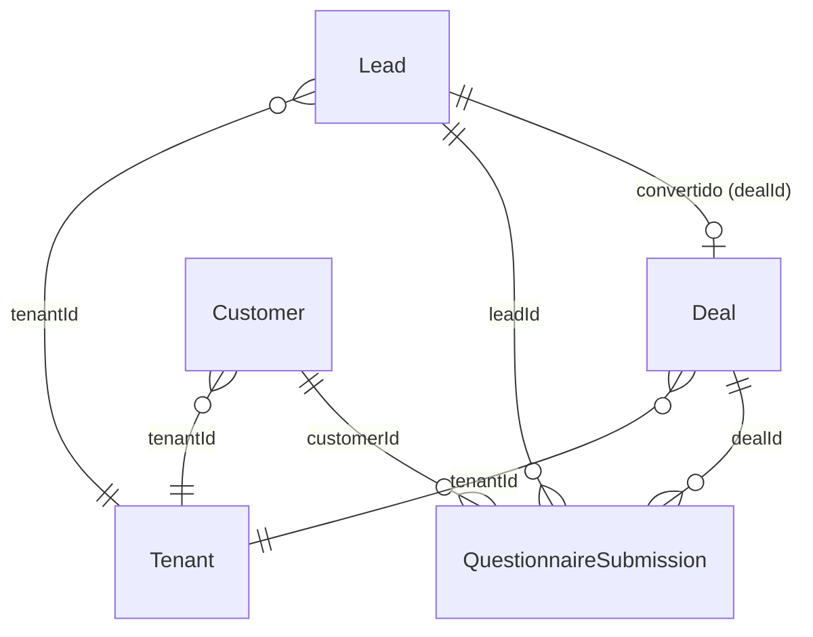

# Ciclo de vida comercial — Lead, Questionário, Negócio e Cliente

> **Status do documento:** alinhado ao código em `packages/database/prisma/schema.prisma` e módulos `leads`, `crm`, `questionnaires`, `customers`.

## Visão geral das entidades



| Entidade | Identificador forte | Ownership atual |
|----------|---------------------|-----------------|
| **Lead** | `document` (CPF/CNPJ) + contatos | `assignedTo` (nome do usuário; default na criação) |
| **Customer** | `@@unique([tenantId, document])` | Não modelado |
| **Deal** | Título + empresa | `assignedTo` (string livre) |
| **QuestionnaireSubmission** | Template + vínculos opcionais | Herda contexto do lead |

---

## LeadStatus

**Implementado** — validado em API (`apps/api/src/modules/leads/dto/lead.dto.ts`), armazenado como `String` no Prisma (não é enum de banco).

| Valor | Significado operacional | Transições típicas |
|-------|-------------------------|-------------------|
| `new` | Lead recém-captado (default) | → `contacted`, `qualified`, `lost` |
| `contacted` | Primeiro contato realizado | → `qualified`, `lost` |
| `qualified` | Perfil validado para proposta | → `converted`, `lost` |
| `converted` | Convertido em negócio (`dealId` preenchido) | Terminal (reversão não implementada) |
| `lost` | Descartado comercialmente | Terminal |

**Regras implementadas:**

- Criação exige `status` no body (sem default automático no DTO; default DB = `new` se omitido em insert direto).
- `POST /api/v1/leads/:id/convert` define `status: converted` e `dealId`.
- Conversão bloqueada se `lead.dealId` já existir (`409 Conflict`).
- Exclusão de lead: **hard delete**, sem validação de vínculos (`dealId`, questionários).

**Campos comerciais (implementado — Fase 1):**

- `documentType`: `cpf` | `cnpj`
- `document`: somente dígitos normalizados no banco
- `lastContactAt`: atualizado em criação, edição, conversão, questionário `submitted`, movimentação de deal vinculado

**Não implementado:**

- Reativação automática (listas stale), merge, arquivamento soft de lead
- Máquina de estados que restrinja transições inválidas (qualquer status pode ser PATCH manual)

---

## Normalização de documento

**Implementado** — `apps/api/src/common/utils/document.util.ts` (espelho web: `apps/web/lib/documents/document.ts`).

| Função | Comportamento |
|--------|---------------|
| `normalizeCpf` | 11 dígitos + dígitos verificadores válidos |
| `normalizeCnpj` | 14 dígitos + dígitos verificadores válidos |
| `normalizeDocument` | Combina tipo + valor; retorna `null` se inválido |

**Persistência:** documento inválido ou vazio → `document` e `documentType` ficam `null` (cadastro **não** bloqueado).

**UI:** máscara visual no formulário; API recebe dígitos via normalização client + server.

---

## Estratégia de duplicidade (warning-first)

**Implementado**

| Item | Detalhe |
|------|---------|
| Endpoint | `GET /api/v1/leads/duplicates?document=&excludeId=` |
| Escopo | Apenas `tenantId` do JWT |
| Consulta | Somente CPF (11) ou CNPJ (14) completos após `stripDocumentDigits` |
| Bloqueio | **Nenhum** — create/update sempre permitidos |
| UI | `CommercialWarningBanner` no dialog de lead |
| Debounce | 500 ms no client (`useLeadDuplicates`) |
| Ações | Abrir lead existente · Continuar mesmo assim |

**Não implementado:** merge, unicidade DB em lead, warnings na resposta JSON do POST.

---

## Ownership visual (leve)

**Implementado**

| Item | Detalhe |
|------|---------|
| Default `assignedTo` | Nome do `User` logado na criação (se omitido no DTO) |
| Filtro | `GET /leads?mine=true` — match por `id`, `name` ou `email` do usuário |
| UI | Coluna “Responsável”; checkbox “Meus leads” |

**Não implementado:** FK `assignedTo` → User, soft-lock, ownership modes, warnings ao editar lead de outro corretor.

---

## lastContactAt

**Implementado** — campo `DateTime?` em `Lead`.

| Evento | Atualiza |
|--------|----------|
| `POST /leads` | Sim (`now`) |
| `PATCH /leads/:id` | Sim (`now`) |
| `POST /leads/:id/convert` | Sim |
| Questionário `status: submitted` | Sim (`LeadsService.touchLastContact`) |
| `PATCH /crm/deals/:id` com lead convertido | Sim |

**Uso futuro:** listas de reativação (Fase 3 roadmap) — sem workflow dedicado ainda.

---

## DealStatus e DealStage

**Implementado** — `apps/api/src/modules/crm/dto/deal.dto.ts`.

### Stage (`stage`) — funil visual

| Valor | Uso |
|-------|-----|
| `novo` | Default na criação |
| `qualificacao` | Kanban / pipeline |
| `proposta` | Kanban |
| `negociacao` | Kanban |
| `fechado` | Kanban (não altera `status` automaticamente) |

### Status (`status`) — resultado comercial

| Valor | Uso |
|-------|-----|
| `open` | Default |
| `won` | Ganho |
| `lost` | Perdido |
| `archived` | Arquivado |

**Regras implementadas:**

- Kanban (web) atualiza apenas `stage` via drag-and-drop.
- `stage === fechado` **não** define `status: won` automaticamente.
- UI de contatos deriva “Cliente” quando `won` ou `stage === fechado` (apresentação apenas).

**Não implementado:**

- Sincronização stage ↔ status
- Filtros/paginação na API de listagem de deals

---

## QuestionnaireTemplateStatus

**Implementado** — enum Prisma.

| Valor | Significado |
|-------|-------------|
| `draft` | Template em edição |
| `active` | Disponível para novas submissões |
| `archived` | Inativo (soft archive quando há submissões) |

**Regras:**

- Submissões só podem ser criadas/atualizadas contra template `active`.
- Delete de template com submissões → `status: archived` (retorno `{ deleted: false, archived: true }`).
- Delete sem submissões → remoção física.

---

## QuestionnaireSubmissionStatus

**Implementado** — enum Prisma + validação condicional no service.

| Valor | Validação de campos obrigatórios | Uso na UI principal |
|-------|----------------------------------|---------------------|
| `draft` | Não exige required | Autosave, badge “rascunho” |
| `submitted` | Exige required + formato | Finalizar questionário |
| `reviewed` | Exige required (mesma regra que submitted) | **Sem fluxo dedicado na UI** |
| `archived` | Não exige required na validação de submit | **Sem fluxo dedicado na UI** |

**Modo e origem (implementado):**

- `mode`: `INTERNAL` | `EXTERNAL` (dialog web usa sempre `INTERNAL`)
- `origin`: `WHATSAPP`, `INSTAGRAM`, `SITE`, `INTERNAL`, `PHONE`, `INDICATION`

**Regras de rascunho (implementado):**

- Server: campos `required` do template ignorados quando `status` é `draft` ou `archived`.
- Server: chaves de `answers` devem existir no template; objeto plano obrigatório.
- Server: **não** há endpoint de autosave; PATCH/POST padrão.
- Server: **não** há unicidade “um draft por lead+template”.
- Client: debounce 2s, `localStorage` + API, `status: draft`, flag `autosave: true` na mutation.
- Client: hidratação prioriza draft remoto (`limit: 1`) e mescla com local; respostas remotas prevalecem.

**Regras de submissão (implementado):**

- Finalizar: client `validateQuestionnaireAnswersForFinalize` → `status: submitted` + `submittedAt` enviado pelo client.
- Server **não** preenche `submittedAt` automaticamente ao receber `submitted`.
- Edição de submissão já `submitted` **não** é bloqueada no backend.

---

## CustomerStatus

**Implementado** — DTO `apps/api/src/modules/customers/dto/customer.dto.ts`.

| Valor | Significado |
|-------|-------------|
| `active` | Default |
| `inactive` | Inativo |
| `archived` | Arquivado |

**Unicidade:** `@@unique([tenantId, document])` — conflito → `409` com mensagem “Documento já cadastrado neste tenant”.

**Lead ↔ Customer:** sem vínculo FK; conversão de lead **não** cria cliente.

---

## Ownership modes

| Modo | Status |
|------|--------|
| Campo `assignedTo` em Lead e Deal | **Implementado** (string opcional, max 120, sem FK para `User`) |
| Default = usuário logado na criação | **Implementado** (nome do user no tenant) |
| Filtro API “meus leads” (`mine=true`) | **Implementado** |
| `open` / `soft_lock` / `strict` via `Tenant.settings` | **Planejado** (ADR e roadmap) |
| Row-level security por corretor | **Não implementado** |

**Comportamento atual na conversão:** `assignedTo` do negócio = `ConvertLeadDto.assignedTo ?? lead.assignedTo`.

---

## Conversão Lead → Deal

**Implementado** — `LeadsService.convertLead`, permissões `leads:manage` **e** `crm:manage` (AND).

```
1. Validar lead no tenant
2. Rejeitar se dealId já existe
3. Transação:
   a. Criar Deal (title, company, value, stage, status=open, assignedTo)
   b. Atualizar Lead (status=converted, dealId)
   c. updateMany QuestionnaireSubmission WHERE tenantId + leadId SET dealId
4. Retornar { lead, deal }
```

| Campo Deal | Origem |
|------------|--------|
| `title` | `dto.title` ou `Lead: {lead.name}` |
| `company` | `lead.company` ou `lead.name` |
| `value` | `dto.value ?? 0` |
| `stage` | `dto.stage ?? 'novo'` |
| `assignedTo` | `dto.assignedTo ?? lead.assignedTo` |

**Não implementado:** criação de `Customer`, propagação de `customerId` em questionários.

---

## Regras de duplicidade

| Escopo | Implementado | Planejado |
|--------|--------------|-----------|
| Customer por documento no tenant | Sim (`409` hard block) | Normalização CPF/CNPJ no customer |
| Lead por CPF/CNPJ | Warning + lookup (`/leads/duplicates`) | Merge (Fase 6) |
| Lead por email/telefone | Não | Warnings opcionais |
| Merge de leads | Não | Fase 6 roadmap |

---

## Arquivamento

| Recurso | Mecanismo | Tipo |
|---------|-----------|------|
| QuestionnaireTemplate | `status: archived` se tem submissões | Soft |
| QuestionnaireSubmission | status `archived` (API) | Sem UI de transição |
| Deal | `status: archived` (API) | Manual via PATCH |
| Lead | Apenas `lost` / delete físico | Sem `archived` |
| Customer | `status: archived` | PATCH |

---

## Relacionamento Lead / Questionário / Deal / Customer

**Implementado:**

- `QuestionnaireSubmission.leadId` opcional
- `QuestionnaireSubmission.dealId` opcional — preenchido em massa na conversão do lead
- `QuestionnaireSubmission.customerId` opcional — validado se presente, sem auto-link na conversão

**Badge na lista de leads (web):**

- Prioridade: submission `draft` > mais recente por `updatedAt`
- Estados de UI: `draft`, `submitted`, `pending` (sem submissão)

**Índices Prisma relevantes:** `tenantId`, `leadId`, `dealId`, `customerId`, `status`, `createdAt`.

---

## Permissões (resumo)

| Ação | Permissão |
|------|-----------|
| Ver leads | `leads:view` |
| CRUD leads | `leads:manage` |
| Converter lead | `leads:manage` + `crm:manage` |
| Ver / gerenciar CRM | `crm:view` / `crm:manage` |
| Questionários | `questionnaires:view` / `questionnaires:manage` |
| Clientes | `clients:view` / `clients:manage` |

Role seed `sales`: `crm:manage`, `leads:manage`, `clients:view` — **sem** `questionnaires:*` nem `crm:view` (manage satisfaz view no guard).

---

## Referências de código

- Schema: `packages/database/prisma/schema.prisma`
- Leads: `apps/api/src/modules/leads/`
- CRM: `apps/api/src/modules/crm/`
- Questionários: `apps/api/src/modules/questionnaires/`
- Web leads: `apps/web/components/leads/leads-page.tsx`
- Web questionários: `apps/web/lib/questionnaires/`
