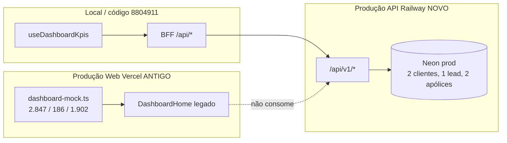

# AUD-001 — Dashboard em produção vs. local

**Data:** 24 de agosto de 2026  
**Ambiente analisado:** `https://corretoraavila.com.br/` (Vercel) + `https://api.corretoraavila.com.br` (Railway/Neon)  
**Restrição:** análise apenas — **nenhum código alterado**

---

## Conclusão executiva

# Causa raiz: deploy web Vercel desatualizado servindo dashboard mock estático

Os números **2.847 clientes**, **186 leads** e **1.902 apólices** exibidos em produção **não vêm do Neon**. São valores **hardcoded** no arquivo removido `apps/web/lib/dashboard-mock.ts`, ainda presente no **build Vercel em produção** (anterior ao commit `47702a5`).

A **API em produção** (pós INFRA-006) já retorna dados reais do banco: **2 clientes**, **1 lead**, **2 apólices**. Há **descompasso Web (mock) × API (Neon)**.

---

## Evidência visual (produção — browser)

URL: `https://corretoraavila.com.br/` após login `admin@insureflow.com`

| Elemento observado | Valor |
|--------------------|-------|
| Subtítulo | *"Métricas de carteira, pipeline e conversão — interface pensada para operações de seguros em escala enterprise."* |
| Total de clientes | **2.847** |
| Leads do mês | **186** |
| Cotações em andamento | **73** |
| Apólices ativas | **1.902** |
| Leads recentes | Marina Costa, Grupo Lopes Ltda., Carlos Mendes, Clínica Vida Plena, Transportes Sul |
| Seções | Desempenho mensal, Foco da semana, Leads recentes |
| Botões header | "Últimos 30 dias", "Exportar" |
| Branding sidebar | **InsureFlow Enterprise** |
| Seletor "Empresa" (BusinessUnit) | **Ausente** |

Esses textos e nomes **coincidem byte-a-byte** com o dashboard mock histórico no Git.

---

## 1. Qual componente Dashboard está sendo renderizado?

### Produção (Vercel — build antigo)

| Item | Valor |
|------|--------|
| Componente | `DashboardHome` **legado** (pré-CRM Ávila) |
| Arquivo histórico | `apps/web/components/dashboard/dashboard-home.tsx` **antes de `47702a5`** |
| Subcomponentes | `StatsCards`, `PerformanceChart`, `RecentLeadsTable`, `GlassCard` |
| Fonte de dados | **`apps/web/lib/dashboard-mock.ts`** (import estático) |

### Repositório atual (`8804911` / local)

| Item | Valor |
|------|--------|
| Rota | `apps/web/app/(dashboard)/[[...slug]]/page.tsx` → `<DashboardHome />` |
| Componente | `apps/web/components/dashboard/dashboard-home.tsx` **operacional** |
| Subcomponentes | `DashboardSummary`, `DashboardPipelineHero`, `DashboardCommercialFunnel`, etc. |
| Fonte de dados | **`useDashboardKpis()`** → APIs reais via React Query |
| Mock | **`dashboard-mock.ts` removido** (commit `47702a5`, 21/08/2026) |

### Prova no Git

```text
47702a5^:apps/web/lib/dashboard-mock.ts
  totalClientes: { value: "2.847", ... }
  leadsMes: { value: "186", ... }
  cotacoesAndamento: { value: "73", ... }
  apolicesAtivas: { value: "1.902", ... }
  recentLeads: Marina Costa, Grupo Lopes Ltda., ...

47702a5 feat(crm): pacote operacional Ávila
  - apps/web/lib/dashboard-mock.ts  (73 linhas removidas)
  ~ apps/web/components/dashboard/dashboard-home.tsx (reescrito)
```

---

## 2. Qual rota API está sendo consumida?

### Dashboard mock em produção (Vercel antigo)

| Consumo API | Situação |
|-------------|----------|
| KPIs principais (2847 / 186 / 1902) | **Nenhuma** — valores estáticos em `kpiStats` |
| Gráfico "Desempenho mensal" | **Nenhuma** — `performanceByMonth` mock |
| Tabela "Leads recentes" | **Nenhuma** — `recentLeads` mock |
| Prioridades "Foco da semana" | **Nenhuma** — array hardcoded no componente |

### Dashboard operacional (código atual / local)

| KPI | Hook | BFF | API backend |
|-----|------|-----|-------------|
| Leads ativos | `useDashboardKpis` | `GET /api/leads?status=…&limit=1` | `GET /api/v1/leads` |
| Clientes | idem | `GET /api/customers?limit=1` | `GET /api/v1/customers` |
| Negócios abertos | idem | `GET /api/crm/deals` | `GET /api/v1/crm/deals` |
| Atividades | idem | `GET /api/activities?…` | `GET /api/v1/activities` |
| Cotações | idem | `GET /api/quotes/metrics` | `GET /api/v1/quotes/metrics` |

---

## 3. Existe fallback mock ativo?

| Ambiente | Mock ativo? | Detalhe |
|----------|-------------|---------|
| **Produção web** | **Sim (legado)** | Mock **primário**, não fallback — dashboard inteiro estático |
| **Código atual (`8804911`)** | **Não** | Arquivo `dashboard-mock.ts` **não existe** |
| Placeholders atuais | Parcial | Apólices/Renovações/Sinistros mostram `—` ou `0` quando API não alimenta — **não** geram 2847/186/1902 |

---

## 4. Existe feature flag habilitando dashboard demo?

**Não.**

Não há `USE_MOCK_DASHBOARD`, `DASHBOARD_DEMO` ou equivalente. O comportamento em produção é efeito de **deploy desatualizado**, não de flag runtime.

Variáveis relacionadas (não controlam o dashboard mock):

| Variável | Impacto |
|----------|---------|
| `SEED_DEV_DATA` | Popula Neon em dev/HML (`0` em prod) — não altera UI mock |
| `OWNERSHIP_ENFORCEMENT` | Filtra dados reais — irrelevante enquanto mock estático estiver no ar |

---

## 5. Diferença localhost × produção

| Aspecto | Localhost (código atual) | Produção (`corretoraavila.com.br`) |
|---------|--------------------------|-------------------------------------|
| Versão do dashboard | Operacional (`useDashboardKpis`) | Mock estático (`dashboard-mock.ts`) |
| KPI Clientes | `meta.total` da API (ex.: 2) | **2.847** fixo |
| KPI Leads | Soma por status da API (ex.: 1) | **186** fixo |
| KPI Apólices | Placeholder `—` ou futuro endpoint | **1.902** fixo |
| Leads recentes | Não exibidos no home atual | Lista demo (Marina Costa…) |
| BusinessUnit switcher | Presente no topbar | **Ausente** |
| Commit web esperado | `8804911` | **Anterior a `47702a5`** (21/08/2026) |
| API backend | Neon dev ou prod | Neon prod (**atualizada** pós INFRA-006) |

---

## 6. Company Context (Business Unit)

| Item | Produção API (Neon) | Produção Web (Vercel antigo) | Local (dev seed) |
|------|---------------------|------------------------------|------------------|
| `GET /api/v1/business-units/context` | **200** — `units: []`, `currentBusinessUnitId: null`, `canViewAll: true` | Rota BFF **500** (build antigo sem handler ou erro Next) | Unidades `corretora-avila`, `avila-imoveis` após seed HML |
| Switcher "Empresa" | N/A na API | **Não renderizado** | Renderizado se `units.length > 0` |
| Componente | `BusinessUnitSwitcher` existe no código atual | Não incluído no layout mock antigo | Ativo |

**Conclusão:** Company Context **não está operacional** em produção — zero Business Units no Neon prod e UI antiga sem seletor.

---

## 7. Seleção da empresa Ávila Imóveis

| Verificação | Resultado |
|-------------|-----------|
| BU `avila-imoveis` no Neon prod | **Não existe** (`/api/v1/business-units` → `data: []`) |
| Seed de homologação | `seed-business-unit-homologation.ts` cria `corretora-avila` + `avila-imoveis` — **não executado em prod** |
| UI para selecionar Ávila Imóveis | **Indisponível** (sem switcher + sem unidades) |
| Branding | Sidebar exibe **InsureFlow Enterprise**, não Grupo Ávila |

---

## 8. BusinessUnit

| Campo | Valor produção |
|-------|----------------|
| Unidades cadastradas | **0** |
| `currentBusinessUnitId` (JWT) | `null` |
| `canViewAll` | `true` (admin) |
| Escopo nas queries | Tenant-wide (sem filtro por BU) |

---

## 9. Tenant

| Campo | Valor produção (Neon) |
|-------|------------------------|
| `slug` | **`insureflow`** (não `avila-imoveis` / `corretora-avila`) |
| `name` | **InsureFlow Corp** |
| `id` | `cmplu9lco000okw18md6aytow` |
| Login default | `tenantSlug: "insureflow"` no BFF |
| `settings.ownershipEnforcement` | `shadow` (tenant settings) vs `on` na Railway API env |

---

## 10. Os dados vêm do banco Neon?

### KPIs exibidos no dashboard produção (2847 / 186 / 1902)

# Não — são mock estático no bundle Vercel antigo.

### Dados reais no Neon prod (API direta, 24/08/2026)

| Recurso | Total real (`meta.total` ou count) |
|---------|-------------------------------------|
| Clientes | **2** |
| Leads | **1** |
| Apólices | **2** |
| Deals | **6** |
| Atividades | **9** |
| Business Units | **0** |
| Dashboard 360 (`activeCustomers`) | **2** |

### Prova cruzada BFF (produção web → API)

| Rota BFF | Status | Observação |
|----------|--------|------------|
| `GET /api/leads` | **200** | Dados reais (ex.: Leandro Henrique de Avila) |
| `GET /api/customers` | **200** | Dados reais (ex.: Oliveira Logística) |
| `GET /api/crm/deals` | **200** | 6 negócios reais |
| `GET /api/policies` | **500** | Build Vercel antigo — rota BFF ausente/quebrada |
| `GET /api/quotes/metrics` | **500** | Idem |
| `GET /api/business-units/context` | **500** | Idem |
| `GET /api/customers/dashboard-360` | **200** | `activeCustomers: 2` |

O **home `/` ignora essas APIs** enquanto servir o dashboard mock.

---

## Diagrama da divergência



---

## Classificação

# NOT READY (operacional)

| Critério | Status |
|----------|--------|
| Dashboard reflete Neon prod | **Falha** — mock estático |
| Paridade web × API | **Falha** — Vercel desatualizado |
| Ávila Imóveis / BU | **Falha** — sem unidades no banco, sem UI |
| Dados confiáveis para homologação | **Falha** |

**Tipo de problema:** **deploy / release management** (Vercel web), **não** bug de query ou seed em runtime.

---

## Ações recomendadas (fora do escopo desta auditoria)

1. **Redeploy Vercel** do branch `release/crm-operacao-avila` (`8804911`) — mesmo procedimento do INFRA-006 na API.
2. Confirmar pós-deploy: KPIs ≈ 2 clientes / 1 lead (não 2847/186).
3. Executar seed de Business Units Ávila em prod **somente se** aprovado (`corretora-avila`, `avila-imoveis`).
4. Validar `API_INTERNAL_URL=https://api.corretoraavila.com.br` no projeto Vercel.
5. Smoke BFF: `/api/policies`, `/api/business-units/context`, `/api/quotes/metrics` → 200.

---

## Anexo — comandos de verificação

```bash
# KPIs reais (API)
curl -s -H "Authorization: Bearer $TOKEN" \
  https://api.corretoraavila.com.br/api/v1/customers?limit=1

# Tenant + BU
curl -s -H "Authorization: Bearer $TOKEN" \
  https://api.corretoraavila.com.br/api/v1/tenants/me
curl -s -H "Authorization: Bearer $TOKEN" \
  https://api.corretoraavila.com.br/api/v1/business-units/context

# Histórico do mock removido
git show 47702a5^:apps/web/lib/dashboard-mock.ts
git show 47702a5 --stat -- apps/web/lib/dashboard-mock.ts
```

---

*AUD-001 — causa identificada. Correção requer redeploy web, não alteração de lógica de dashboard no código atual.*
