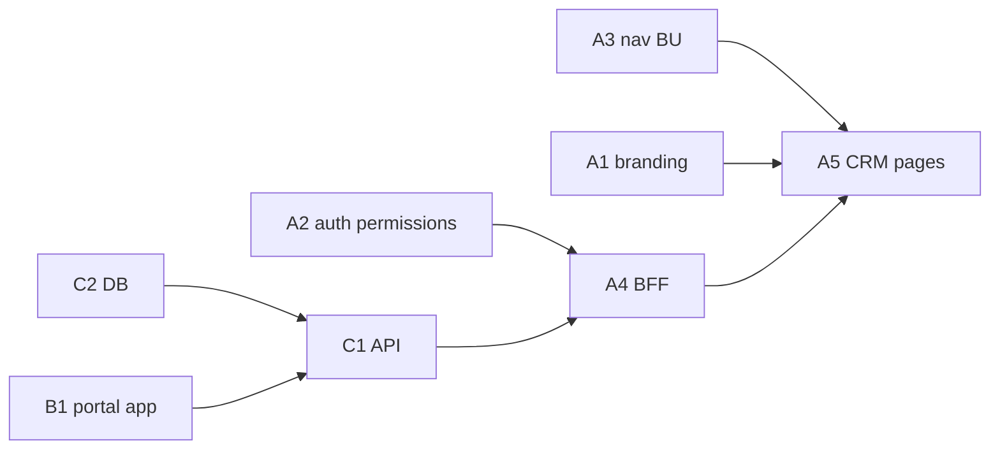

# GIT-001 — Consolidação do Frontend Homologado

**Data:** 2026-08-24  
**Branch:** `release/crm-operacao-avila` @ `8804911`  
**Objetivo:** Auditar working tree e definir plano de commits organizados  
**Restrição:** **nenhum** `git add`, `commit` ou `push` executado nesta tarefa

---

## Classificação final

# READY TO COMMIT

O working tree contém o frontend homologado de forma identificável e o plano abaixo permite commits limpos **desde que** a lista de exclusões (Fase 2) seja respeitada antes do staging.

**Ressalva:** commits de frontend (CRM-IMOB-001) **dependem** de commits paralelos de `packages/auth` (permissões). API/banco/portal público são trilhas separadas, documentadas como dependências — não bloqueiam o plano do front, mas bloqueiam deploy funcional end-to-end se omitidos.

---

## Resumo quantitativo

| Tipo | Quantidade |
|------|------------|
| Modificados (`M`) | 42 |
| Removidos (`D`) | 1 |
| Novos (`??`) | 336 |
| **Total paths pendentes** | **379** |

### Por área (estimativa)

| Área | Modificados | Novos (approx.) |
|------|-------------|-----------------|
| `apps/web` | 19 | 41 |
| `apps/api` | 6 | ~40 (módulo properties + logs) |
| `apps/portal-imobiliario-publico` | 0 | 44 |
| `packages/*` | 5 | ~130 (migrations + dist-test) |
| `docs/*` | 5 | ~200 |
| Raiz / scripts / turbo | 6 | 3 |

---

## Fase 1 — Auditoria por contexto

### UX-002 — Branding Grupo Ávila

**Novos**

| Path |
|------|
| `apps/web/app/avila-brand.css` |
| `apps/web/components/branding/grupo-avila-logo.tsx` |
| `apps/web/components/branding/powered-by-insureflow.tsx` |
| `apps/web/public/branding/grupo-avila-logo.png` |

**Modificados**

| Path | Nota |
|------|------|
| `apps/web/app/(auth)/layout.tsx` | Login split Grupo Ávila |
| `apps/web/app/globals.css` | Import tokens |
| `apps/web/app/layout.tsx` | Metadata “Grupo Ávila” |
| `apps/web/components/auth/login-form.tsx` | Visual login |
| `apps/web/components/dashboard/app-sidebar.tsx` | Logo, navy/gold, Powered by *(também CRM nav)* |
| `apps/web/components/dashboard/app-topbar.tsx` | Header visual |
| `apps/web/components/dashboard/business-unit-switcher.tsx` | Ícone gold *(compartilhado)* |
| `apps/web/components/dashboard/dashboard-shell.tsx` | Remoção blobs animados |
| `apps/web/lib/auth/session.ts` | Título sessão |
| `apps/web/lib/layout/operational-shell.ts` | Ajuste shell |

**Docs UX (referência, não runtime)**

| Path |
|------|
| `docs/reports/ux002-implementation.md` |
| `docs/reports/ux002-screenshots/` |
| `docs/ux/ux001-branding-grupo-avila.md` |
| `docs/ux/design-system/` |
| `docs/ux/mockups/ux001/` |

---

### CRM-IMOB-001 — CRM Imobiliário (`apps/web`)

**Novos — páginas**

| Path |
|------|
| `apps/web/app/(dashboard)/real-estate/properties/page.tsx` |
| `apps/web/app/(dashboard)/real-estate/properties/new/page.tsx` |
| `apps/web/app/(dashboard)/real-estate/properties/[id]/page.tsx` |
| `apps/web/app/(dashboard)/real-estate/leads/page.tsx` |
| `apps/web/app/(dashboard)/real-estate/owners/page.tsx` |
| `apps/web/app/(dashboard)/real-estate/portal/page.tsx` |
| `apps/web/app/(dashboard)/real-estate/visits/page.tsx` |

**Novos — componentes**

| Path |
|------|
| `apps/web/components/real-estate/dashboard-entry.tsx` |
| `apps/web/components/real-estate/real-estate-dashboard.tsx` |
| `apps/web/components/real-estate/properties-page.tsx` |
| `apps/web/components/real-estate/property-form.tsx` |
| `apps/web/components/real-estate/property-photos-tab.tsx` |
| `apps/web/components/real-estate/property-leads-page.tsx` |
| `apps/web/components/real-estate/owners-page.tsx` |
| `apps/web/components/real-estate/portal-management-page.tsx` |
| `apps/web/components/real-estate/visits-page.tsx` |

**Novos — BFF (Next.js API routes, não Nest)**

| Path |
|------|
| `apps/web/app/api/properties/route.ts` |
| `apps/web/app/api/properties/[id]/route.ts` |
| `apps/web/app/api/properties/[id]/publish/route.ts` |
| `apps/web/app/api/properties/[id]/unpublish/route.ts` |
| `apps/web/app/api/properties/[id]/leads/route.ts` |
| `apps/web/app/api/properties/[id]/images/upload/route.ts` |
| `apps/web/app/api/properties/[id]/images/order/route.ts` |
| `apps/web/app/api/properties/[id]/images/[imageId]/route.ts` |
| `apps/web/app/api/properties/[id]/images/[imageId]/cover/route.ts` |
| `apps/web/app/api/properties/leads/route.ts` |
| `apps/web/app/api/properties/dashboard-stats/route.ts` |
| `apps/web/app/api/persons/route.ts` |

**Novos — lib**

| Path |
|------|
| `apps/web/lib/business-units/nav-context.ts` |
| `apps/web/lib/navigation/use-operational-nav.ts` |
| `apps/web/lib/data-access/modules/properties/` (api, hooks, types, index) |
| `apps/web/lib/real-estate/` (labels, portal-url, use-real-estate-business-unit) |

**Modificados**

| Path |
|------|
| `apps/web/app/(dashboard)/[[...slug]]/page.tsx` |
| `apps/web/lib/navigation.ts` |
| `apps/web/lib/auth/nav-access.ts` |
| `apps/web/lib/data-access/modules/index.ts` |
| `apps/web/lib/data-access/query-keys.ts` |
| `apps/web/components/auth/permissions-panel.tsx` |
| `apps/web/components/dashboard/use-dashboard-breadcrumbs.ts` |
| `apps/web/components/crm/workspace-search.tsx` |
| `apps/web/components/dashboard/dashboard-summary.tsx` |

**Dependência auth (fora de `apps/web`, necessária ao CRM)**

| Path |
|------|
| `packages/auth/src/roles.ts` |
| `packages/auth/src/types.ts` |

**Docs homologação CRM**

| Path |
|------|
| `docs/reports/crm-imob-001.md` |
| `docs/reports/hml001-crm-imobiliario.md` |

---

### Portal — App público (`apps/portal-imobiliario-publico`)

**Novos (app completo, 44 arquivos)**

Inclui: `app/`, `components/`, `services/catalog.ts`, `catalog-api.ts`, **`services/catalog-mock.ts`** (fallback dev), `lib/config.ts`, `.env.example`, etc.

**Docs**

| Path |
|------|
| `docs/architecture/portal-imobiliario-publico.md` |
| `docs/architecture/portal-imobiliario-validacao.md` |
| `docs/architecture/re004-portal-producao.md` |

**Nota:** Portal management (`/real-estate/portal`) está em **CRM-IMOB-001** acima; este bloco é o **site público** `:3002`.

---

### Outros — Backend, banco, infra, documentação histórica

**API Nest (homologada, trilha separada do front)**

| Path |
|------|
| `apps/api/src/modules/properties/` (37 arquivos) |
| `apps/api/src/app.module.ts` |
| `apps/api/src/main.ts` |
| `apps/api/src/modules/access/business-unit-access.service.ts` |
| `apps/api/scripts/ensure-prisma-client.cjs` |
| `apps/api/.env.example`, `apps/api/.gitignore` |

**Banco / seed**

| Path |
|------|
| `packages/database/prisma/schema.prisma` |
| `packages/database/prisma/seed.ts` |
| `packages/database/prisma/seed-ownership.ts` |
| `packages/database/prisma/migrations/20260824140000_real_estate_inventory/` |
| `packages/database/prisma/migrations/20260824180000_re004_property_production/` |

**Monorepo / env templates**

| Path |
|------|
| `package.json`, `package-lock.json`, `turbo.json` |
| `.env.example`, `.env.local.example`, `.gitignore` |
| `vercel.json` (raiz — experimental services API) |

**Removido**

| Path |
|------|
| `scripts/railway-hml-bootstrap.cjs` |

**Documentação extensa (não runtime)** — ~40 reports em `docs/reports/`, screenshots sprint 5.x, audits, ADRs, questionnaire docs, etc.

---

## Fase 2 — Arquivos experimentais, temporários e exclusões

### Não commitar (obrigatório excluir)

| Path | Motivo |
|------|--------|
| `apps/api/tsc.log` | Log de compilação local |
| `railway-diagnose-out.txt` | Output diagnóstico local |
| `packages/forms-engine/dist-test/` | Build artefato de teste (~90 arquivos) |
| `packages/forms-engine/tsconfig.build.tsbuildinfo` | Cache TypeScript |
| `packages/forms-library/tsconfig.build.tsbuildinfo` | Cache TypeScript |
| `apps/api/uploads/*` (exceto `.gitkeep`) | Uploads locais — já no `.gitignore` |

### Screenshots — commit opcional (recomendado: commit docs separado ou omitir)

| Path | Contexto |
|------|----------|
| `docs/reports/ux002-screenshots/` | UX-002 homologação |
| `docs/sprint-5.*-screenshots/` | Sprints anteriores (~25 PNGs) |
| `docs/sprint-notes/sprint-4.6-screenshots/` | Sprint 4.6 |
| `docs/ux/mockups/ux001/screenshots/` | UX-001 mockups |

### Mocks (permitidos com ressalva)

| Path | Uso |
|------|-----|
| `apps/portal-imobiliario-publico/services/catalog-mock.ts` | Fallback quando API indisponível; **commitar** com portal app (comportamento documentado) |
| Dashboard mock produção | **Não** está no working tree — só build antigo em Vercel |

### Arquivos duvidosos — revisar antes do staging

| Path | Recomendação |
|------|--------------|
| `vercel.json` (raiz) | **Não incluir** no track frontend — experimental; projeto web usa `apps/web/vercel.json` |
| `docs/reports/avila-production-readiness.evidence.json` | Evidência gerada — opcional em commit `docs` |
| `docs/ux/mockups/ux001/index.html` | Referência design — opcional |
| `docs/reports/bug-*`, `sprint6-*`, `sprint7-*` | Histórico — **commit separado** ou omitir deste release |
| `packages/forms-engine/dist-test/` | **Nunca** |

### Já ignorados pelo Git (OK)

| Padrão | Exemplo |
|--------|---------|
| `.next/` | Build Next local |
| `node_modules/` | Dependências |
| `.env*` (secrets) | Credenciais locais |
| `apps/api/uploads/*` | Binários upload |

---

## Fase 3 — Plano de commits (staging limpo proposto)

> Ordem sugerida: dependências primeiro → UI → docs.  
> **Não executar** até revisar exclusões da Fase 2.

### Trilha A — Frontend homologado (objetivo GIT-001)

#### Commit A1 — Branding
```
feat(branding): grupo avila visual identity (UX-002)
```
**Paths:**
- `apps/web/app/avila-brand.css`
- `apps/web/app/(auth)/layout.tsx`
- `apps/web/app/globals.css`
- `apps/web/app/layout.tsx`
- `apps/web/components/auth/login-form.tsx`
- `apps/web/components/branding/**`
- `apps/web/public/branding/**`
- `apps/web/components/dashboard/app-topbar.tsx`
- `apps/web/components/dashboard/dashboard-shell.tsx`
- `apps/web/lib/auth/session.ts`
- `apps/web/lib/layout/operational-shell.ts`
- Parte visual de `business-unit-switcher.tsx` *(ou arquivo inteiro se indivisível)*

#### Commit A2 — Permissões imobiliárias
```
feat(auth): add properties permissions for real estate CRM
```
**Paths:**
- `packages/auth/src/roles.ts`
- `packages/auth/src/types.ts`
- `apps/web/components/auth/permissions-panel.tsx`

#### Commit A3 — Navegação e contexto BU
```
feat(web): real estate navigation and business unit context
```
**Paths:**
- `apps/web/lib/navigation.ts`
- `apps/web/lib/navigation/use-operational-nav.ts`
- `apps/web/lib/business-units/nav-context.ts`
- `apps/web/lib/auth/nav-access.ts`
- `apps/web/components/dashboard/app-sidebar.tsx`
- `apps/web/components/dashboard/business-unit-switcher.tsx`
- `apps/web/components/dashboard/use-dashboard-breadcrumbs.ts`
- `apps/web/app/(dashboard)/[[...slug]]/page.tsx`
- `apps/web/components/crm/workspace-search.tsx`
- `apps/web/components/dashboard/dashboard-summary.tsx` *(se alteração for só compatibilidade)*

#### Commit A4 — BFF e data-access
```
feat(web): real estate BFF routes and properties data access
```
**Paths:**
- `apps/web/app/api/properties/**`
- `apps/web/app/api/persons/route.ts`
- `apps/web/lib/data-access/modules/properties/**`
- `apps/web/lib/data-access/modules/index.ts`
- `apps/web/lib/data-access/query-keys.ts`
- `apps/web/lib/real-estate/**`

#### Commit A5 — Páginas CRM imobiliário
```
feat(real-estate): operational CRM pages and components
```
**Paths:**
- `apps/web/app/(dashboard)/real-estate/**`
- `apps/web/components/real-estate/**`

#### Commit A6 — Documentação homologação front
```
docs: ux002 and crm-imob homologation reports
```
**Paths:**
- `docs/reports/ux002-implementation.md`
- `docs/reports/ux002-screenshots/` *(opcional)*
- `docs/reports/crm-imob-001.md`
- `docs/reports/hml001-crm-imobiliario.md`
- `docs/reports/web001-vercel-redeploy.md`
- `docs/reports/web002-production-alignment.md`
- `docs/reports/git001-consolidacao.md`

---

### Trilha B — Portal público (homologado, escopo separado)

#### Commit B1
```
feat(portal): public real estate catalog app
```
**Paths:** `apps/portal-imobiliario-publico/**` (inclui `catalog-mock.ts`)

#### Commit B2
```
docs: portal architecture and validation
```
**Paths:**
- `docs/architecture/portal-imobiliario-publico.md`
- `docs/architecture/portal-imobiliario-validacao.md`
- `docs/architecture/re004-portal-producao.md`

---

### Trilha C — Backend + banco (dependência funcional, fora do escopo “só front”)

#### Commit C1
```
feat(api): real estate properties module
```
**Paths:** `apps/api/src/modules/properties/**` + wiring em `app.module.ts`, `main.ts`, `business-unit-access.service.ts`, `ensure-prisma-client.cjs`, `apps/api/.env.example`, `apps/api/.gitignore`

#### Commit C2
```
feat(db): real estate inventory schema and migrations
```
**Paths:** `packages/database/prisma/schema.prisma`, migrations `20260824140000_*`, `20260824180000_*`, `seed.ts`, `seed-ownership.ts`

#### Commit C3
```
chore(monorepo): workspace deps for portal and properties
```
**Paths:** `package.json`, `package-lock.json`, `turbo.json`, `.env.example`, `.env.local.example`, `.gitignore`

#### Commit C4
```
chore(scripts): remove obsolete railway hml bootstrap
```
**Paths:** delete `scripts/railway-hml-bootstrap.cjs`

---

### Trilha D — Documentação histórica (opcional, baixa prioridade)

```
docs: archive sprint and bug investigation reports
```
**Paths:** `docs/reports/bug-*`, `docs/reports/sprint*`, `docs/sprint-*-screenshots/`, `docs/audits/`, `docs/adr/`, etc.

---

## Fase 4 — Checklist pré-commit (executor humano ou GIT-002)

- [ ] Excluir `apps/api/tsc.log`, `railway-diagnose-out.txt`, `dist-test/`, `*.tsbuildinfo`
- [ ] Não incluir `vercel.json` da raiz no deploy web
- [ ] Confirmar que `app-sidebar.tsx` vai no commit A3 (nav), não A1 (branding)
- [ ] Commits A2 antes de A4/A5 (permissões)
- [ ] Trilha C antes de deploy funcional (API + migrations)
- [ ] Revisar `package-lock.json` — incluir só se deps do portal/properties forem intencionais

---

## Dependências entre trilhas



---

## Referências

| Documento | Uso |
|-----------|-----|
| [UX-002](ux002-implementation.md) | Escopo branding |
| [CRM-IMOB-001](crm-imob-001.md) | Escopo CRM web |
| [HML-001](hml001-crm-imobiliario.md) | Evidências homologação |
| [WEB-002](web002-production-alignment.md) | Motivação desta consolidação |

---

## Assinatura

| Campo | Valor |
|-------|-------|
| **Ticket** | GIT-001 |
| **Classificação** | **READY TO COMMIT** |
| **`git add` / `commit` / `push`** | **Não executados** |
| **Paths auditados** | 379 |
| **Commits propostos** | 6 (front) + 2 (portal) + 4 (backend/monorepo) + 1 opcional (docs hist.) |
