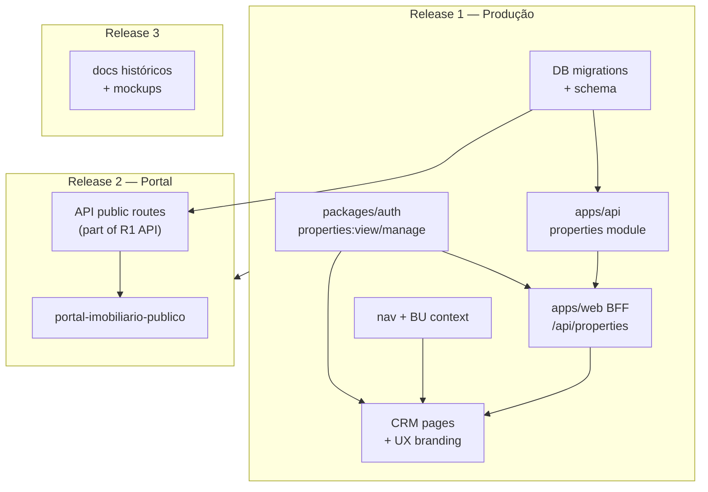

# GIT-002 — Planejamento de Releases

**Data:** 2026-08-24  
**Branch base:** `release/crm-operacao-avila` @ `8804911`  
**Escopo:** Classificar **379 paths pendentes** (129 entradas `git status`, ~337 arquivos expandidos em diretórios)  
**Restrição:** nenhum `git add`, `commit`, `push` ou alteração de código

---

## Classificação final

# READY FOR RELEASE

O plano de releases está completo, com dependências mapeadas e ordem de publicação definida.

**Execução de deploy produção (Release 1)** permanece **bloqueada** até: commits (GIT-001), credenciais Vercel (WEB-002) e migrations/API em produção. Isso não invalida o plano — são gates operacionais pós-planejamento.

---

## Inventário consolidado

| Métrica | Valor |
|---------|-------|
| Entradas `git status` | 129 |
| Arquivos expandidos (untracked) | ~337 |
| **Total referência GIT-001** | **~379 paths** |
| Modificados (`M`) | 42 |
| Removidos (`D`) | 1 |
| Diretórios untracked (top-level) | 86 |

---

## Fase 1 — Mapeamento por release

### Legenda

| Símbolo | Significado |
|---------|-------------|
| **R1** | Release 1 — Produção imediata (`corretoraavila.com.br` CRM) |
| **R2** | Release 2 — Portal público (`:3002` / domínio portal) |
| **R3** | Release 3 — Melhorias futuras / arquivo / não bloqueante |
| **⛔** | Excluir — nunca versionar |

---

### Release 1 — Produção imediata (~130 arquivos)

**Objetivo:** Publicar Grupo Ávila (UX-002) + CRM Imobiliário (CRM-IMOB-001) + backend mínimo funcional.

#### 1.1 Frontend CRM + Branding (`apps/web`) — **R1**

| Path | Tipo | Escopo |
|------|------|--------|
| `apps/web/app/avila-brand.css` | novo | UX-002 |
| `apps/web/app/(auth)/layout.tsx` | mod | UX-002 |
| `apps/web/app/globals.css` | mod | UX-002 |
| `apps/web/app/layout.tsx` | mod | UX-002 |
| `apps/web/components/auth/login-form.tsx` | mod | UX-002 |
| `apps/web/components/branding/` | novo (2) | UX-002 |
| `apps/web/public/branding/` | novo (1 PNG) | UX-002 |
| `apps/web/components/dashboard/app-topbar.tsx` | mod | UX-002 |
| `apps/web/components/dashboard/dashboard-shell.tsx` | mod | UX-002 |
| `apps/web/lib/auth/session.ts` | mod | UX-002 |
| `apps/web/lib/layout/operational-shell.ts` | mod | UX-002 |
| `apps/web/components/dashboard/app-sidebar.tsx` | mod | UX-002 + CRM nav |
| `apps/web/components/dashboard/business-unit-switcher.tsx` | mod | UX-002 + BU |
| `apps/web/components/dashboard/use-dashboard-breadcrumbs.ts` | mod | CRM |
| `apps/web/app/(dashboard)/[[...slug]]/page.tsx` | mod | CRM dashboard entry |
| `apps/web/lib/navigation.ts` | mod | CRM `realEstateNav` |
| `apps/web/lib/navigation/` | novo | `use-operational-nav.ts` |
| `apps/web/lib/business-units/nav-context.ts` | novo | CRM BU context |
| `apps/web/lib/auth/nav-access.ts` | mod | CRM `/real-estate/*` |
| `apps/web/app/(dashboard)/real-estate/` | novo (7 páginas) | CRM-IMOB-001 |
| `apps/web/components/real-estate/` | novo (9) | CRM-IMOB-001 |
| `apps/web/app/api/properties/` | novo (12 rotas) | BFF CRM |
| `apps/web/app/api/persons/route.ts` | novo | BFF CRM |
| `apps/web/lib/data-access/modules/properties/` | novo (4) | Data access |
| `apps/web/lib/data-access/modules/index.ts` | mod | Export properties |
| `apps/web/lib/data-access/query-keys.ts` | mod | Query keys |
| `apps/web/lib/real-estate/` | novo (4) | Labels, portal-url, hooks |
| `apps/web/components/auth/permissions-panel.tsx` | mod | Labels properties:* |
| `apps/web/components/crm/workspace-search.tsx` | mod | Compat. |
| `apps/web/components/dashboard/dashboard-summary.tsx` | mod | Compat. |

**Subtotal web:** ~60 arquivos

#### 1.2 Permissões (`packages/auth`) — **R1**

| Path | Tipo |
|------|------|
| `packages/auth/src/roles.ts` | mod |
| `packages/auth/src/types.ts` | mod |

#### 1.3 API imobiliária (`apps/api`) — **R1**

| Path | Tipo |
|------|------|
| `apps/api/src/modules/properties/` | novo (37) |
| `apps/api/src/app.module.ts` | mod |
| `apps/api/src/main.ts` | mod |
| `apps/api/src/modules/access/business-unit-access.service.ts` | mod |
| `apps/api/scripts/ensure-prisma-client.cjs` | mod |
| `apps/api/.env.example` | mod |
| `apps/api/.gitignore` | mod |

| Path | Tipo | Nota |
|------|------|------|
| `apps/api/tsc.log` | novo | **⛔ EXCLUIR** |
| `apps/api/uploads/` | novo | **⛔ EXCLUIR** (só `.gitkeep` se necessário) |

#### 1.4 Banco e seed (`packages/database`) — **R1**

| Path | Tipo |
|------|------|
| `packages/database/prisma/schema.prisma` | mod |
| `packages/database/prisma/seed.ts` | mod |
| `packages/database/prisma/seed-ownership.ts` | mod |
| `packages/database/prisma/migrations/20260824140000_real_estate_inventory/` | novo |
| `packages/database/prisma/migrations/20260824180000_re004_property_production/` | novo |

#### 1.5 Monorepo e templates — **R1**

| Path | Tipo |
|------|------|
| `package.json` | mod |
| `package-lock.json` | mod |
| `turbo.json` | mod |
| `.env.example` | mod |
| `.env.local.example` | mod |
| `.gitignore` | mod |
| `scripts/railway-hml-bootstrap.cjs` | **removido** |

| Path | Tipo | Nota |
|------|------|------|
| `vercel.json` (raiz) | novo | **R3** — experimental; **não** incluir em R1 |

#### 1.6 Documentação mínima Release 1 — **R1**

| Path |
|------|
| `docs/reports/ux002-implementation.md` |
| `docs/reports/crm-imob-001.md` |
| `docs/reports/hml001-crm-imobiliario.md` |
| `docs/reports/web001-vercel-redeploy.md` |
| `docs/reports/web002-production-alignment.md` |
| `docs/reports/git001-consolidacao.md` |
| `docs/reports/git002-release-plan.md` |
| `docs/architecture/real-estate-inventory.md` |
| `docs/reports/crm-release-deployment.md` (mod) |
| `docs/README.md` (mod) |
| `docs/infra/README.md` (mod) |

**Opcional R1 (evidência visual):** `docs/reports/ux002-screenshots/` (2 PNG)

---

### Release 2 — Portal público (~50 arquivos)

**Objetivo:** App catálogo público + documentação + integração com API pública já entregue em R1.

| Path | Tipo | Nota |
|------|------|------|
| `apps/portal-imobiliario-publico/` | novo (**44 arquivos**) | App Next.js `:3002` |
| `apps/portal-imobiliario-publico/services/catalog-mock.ts` | incluído | Fallback dev — **commitar** |
| `docs/architecture/portal-imobiliario-publico.md` | novo | R2 |
| `docs/architecture/portal-imobiliario-validacao.md` | novo | R2 |
| `docs/architecture/re004-portal-producao.md` | novo | R2 |

**Pré-requisito R2:** Release 1 deployada (API `GET /api/v1/public/properties`, migrations, BU `avila-imoveis`).

**Env produção portal:** `NEXT_PUBLIC_PORTAL_URL`, `NEXT_PUBLIC_BUSINESS_UNIT_SLUG`, `API_INTERNAL_URL`.

---

### Release 3 — Melhorias futuras (~190+ arquivos)

**Objetivo:** Arquivo histórico, design exploratório, dívidas técnicas — **não bloqueia** R1/R2.

#### 3.1 Documentação histórica / investigações

| Path | Qtd approx. |
|------|-------------|
| `docs/reports/bug-003` … `bug-011-*` | 12 |
| `docs/reports/sprint6-*`, `sprint7-*` | 13 |
| `docs/reports/aud001-dashboard-producao.md` | 1 |
| `docs/reports/hotfix-autosave-loop.md` | 1 |
| `docs/reports/lead-create-contract-audit.md` | 1 |
| `docs/reports/infra-001` … `infra-006` | 4 |
| `docs/reports/avila-production-readiness.evidence.json` | 1 |
| `docs/sprint-5.*-screenshots/` | ~25 PNG |
| `docs/sprint-notes/sprint-4.6-screenshots/` | ~5 PNG |
| `docs/audits/` | dir |
| `docs/adr/` | dir |

#### 3.2 Design system / UX exploratório (UX-001)

| Path |
|------|
| `docs/ux/ux001-branding-grupo-avila.md` |
| `docs/ux/design-system/` |
| `docs/ux/mockups/ux001/` (HTML + screenshots) |

#### 3.3 Questionários / forms (sprints futuros)

| Path |
|------|
| `docs/architecture/questionnaire-domain-v2.md` |
| `docs/architecture/questionnaire-roadmap.md` |
| `docs/architecture/smart-forms-engine.md` |
| `docs/architecture/sprint-3-plan.md` |
| `docs/technical-debt/` |
| `docs/ui/` |

#### 3.4 Infra / scripts auxiliares

| Path | Nota |
|------|------|
| `docs/infra/prod-clean-demo-data.md` (mod) | R3 ou ops |
| `docs/infra/prod-clean-pre-execute-checklist.md` | R3 |
| `docs/infra/prod-dry-run-report-template.md` | R3 |
| `scripts/dns-propagation-watch.cjs` | R3 |
| `vercel.json` (raiz) | R3 experimental |

#### 3.5 Artefatos de build — **⛔ NUNCA**

| Path |
|------|
| `packages/forms-engine/dist-test/` (~90 arquivos) |
| `packages/forms-engine/tsconfig.build.tsbuildinfo` |
| `packages/forms-library/tsconfig.build.tsbuildinfo` |
| `apps/api/tsc.log` |
| `railway-diagnose-out.txt` |

---

## Fase 2 — Dependências cruzadas



### Matriz de dependências

| Dependente | Depende de | Release |
|------------|------------|---------|
| `apps/web/app/api/properties/*` | `apps/api/src/modules/properties/*` | R1 → R1 |
| `apps/web/lib/data-access/properties` | BFF routes | R1 |
| `apps/web/components/real-estate/*` | data-access + auth permissions | R1 |
| `apps/web/lib/navigation/use-operational-nav` | `nav-context.ts` + BU API context | R1 |
| `real-estate-dashboard` | BFF `dashboard-stats`, `leads` | R1 |
| `property-photos-tab` | BFF images + API upload | R1 |
| `packages/auth` roles | — (base) | R1 primeiro |
| `apps/api/properties` | DB migrations | R1 |
| `portal catalog-api.ts` | API `/public/properties` | R2 → R1 |
| `portal catalog-mock.ts` | — (fallback offline) | R2 |
| `docs/ux/mockups` | — | R3 isolado |

### Dependências de deploy (runtime)

| Componente | Variável / serviço |
|------------|-------------------|
| Web CRM | Vercel `apps/web`, `API_INTERNAL_URL` |
| API | Railway + `DATABASE_URL` + migrations R1 |
| Portal R2 | Vercel projeto separado ou subdomain + `NEXT_PUBLIC_*` |

---

## Fase 3 — Bloqueadores para deploy

### Arquivos obrigatórios (Release 1 — mínimo viable)

| Grupo | Paths críticos | Sem eles |
|-------|----------------|----------|
| Branding | `avila-brand.css`, `branding/*`, login/sidebar/topbar | Produção continua InsureFlow |
| CRM UI | `real-estate/**`, `components/real-estate/**` | Rotas 404 |
| BFF | `app/api/properties/**`, `app/api/persons` | UI sem dados |
| Nav/BU | `navigation.ts`, `use-operational-nav`, `nav-context` | Menu seguros permanece |
| Auth | `packages/auth` properties permissions | 403 em rotas |
| API | `apps/api/src/modules/properties/**` | BFF 500 |
| DB | migrations `20260824140000`, `20260824180000` | API 500 Prisma |
| Monorepo | `package.json`, `turbo.json` | Build falha |

### Arquivos opcionais (Release 1)

| Path | Impacto se omitido |
|------|-------------------|
| `docs/reports/ux002-screenshots/` | Sem evidência visual no repo |
| `docs/architecture/real-estate-inventory.md` | Sem doc arquitetura |
| `apps/web/components/dashboard/dashboard-summary.tsx` | Minor compat |
| `workspace-search.tsx` | Minor |

### Arquivos experimentais / excluídos

| Path | Ação |
|------|------|
| `vercel.json` (raiz) | Não publicar |
| `packages/forms-engine/dist-test/` | Não publicar |
| `apps/api/tsc.log` | Não publicar |
| `railway-diagnose-out.txt` | Não publicar |
| `*.tsbuildinfo` | Não publicar |

### Bloqueadores operacionais (não-arquivo)

| Bloqueador | Release | Status |
|------------|---------|--------|
| Código não commitado (`8804911` desatualizado) | R1 | **Ativo** |
| Vercel CLI / `VERCEL_TOKEN` ausente | R1 | **Ativo** |
| Migrations não aplicadas em prod (Neon) | R1 | **Provável** |
| API prod sem rotas `/public/properties` | R2 | **Ativo** (404) |
| `NEXT_PUBLIC_PORTAL_URL` produção | R2 | **Não configurado** |

---

## Fase 4 — Plano de publicação

```
┌─────────────────────────────────────────────────────────────┐
│  RELEASE 1 — Commit + push (GIT-001 trilhas A+C)            │
│  • UX-002 + CRM-IMOB-001 + API + DB + auth                  │
│  • Excluir artefatos ⛔                                      │
└──────────────────────────┬──────────────────────────────────┘
                           ▼
┌─────────────────────────────────────────────────────────────┐
│  DEPLOY PRODUÇÃO                                             │
│  1. Railway: API @ novo commit + prisma migrate deploy       │
│  2. Vercel: web @ novo commit (corretoraavila.com.br)       │
│  3. Env: API_INTERNAL_URL, AUTH_SECRET                      │
└──────────────────────────┬──────────────────────────────────┘
                           ▼
┌─────────────────────────────────────────────────────────────┐
│  HOMOLOGAÇÃO PRODUÇÃO (re-run HML-001 / WEB-002 smoke)      │
│  • Login Grupo Ávila                                        │
│  • BU Ávila Imóveis + menu imobiliário                      │
│  • Dashboard KPIs reais                                     │
│  • /real-estate/properties, leads, portal                   │
└──────────────────────────┬──────────────────────────────────┘
                           ▼
┌─────────────────────────────────────────────────────────────┐
│  RELEASE 2 — Commit portal app + docs (GIT-001 trilha B)    │
└──────────────────────────┬──────────────────────────────────┘
                           ▼
┌─────────────────────────────────────────────────────────────┐
│  PORTAL PÚBLICO                                              │
│  • Deploy Vercel portal (subdomínio ou :3002 prod)          │
│  • Smoke: catálogo, detalhe, lead público, sitemap          │
└──────────────────────────┬──────────────────────────────────┘
                           ▼
┌─────────────────────────────────────────────────────────────┐
│  RELEASE 3 — Docs históricos, UX-001 archive, tech debt     │
│  (cadência baixa, sem deploy crítico)                       │
└─────────────────────────────────────────────────────────────┘
```

### Commits sugeridos por release (referência GIT-001)

| Release | Commits |
|---------|---------|
| **R1** | A1 branding → A2 auth → A3 nav → A4 BFF → A5 CRM → C1 API → C2 DB → C3 monorepo → A6 docs |
| **R2** | B1 portal app → B2 portal docs |
| **R3** | D1 docs archive (opcional, múltiplos commits) |

### Critérios de aceite por release

| Release | Critério |
|---------|----------|
| **R1** | `corretoraavila.com.br` = Grupo Ávila + CRM imob. homologado (HML-001 localhost parity) |
| **R2** | Portal publica imóveis R1; lead `public_portal` visível no CRM |
| **R3** | Nenhum critério de produção |

---

## Resumo quantitativo por release

| Release | Entradas status | Arquivos expandidos (approx.) | Deploy |
|---------|-----------------|-------------------------------|--------|
| **R1** | ~55 | ~130 | Vercel web + Railway API |
| **R2** | ~4 dirs | ~47 | Vercel portal |
| **R3** | ~65 | ~190+ | Nenhum crítico |
| **⛔ Excluir** | ~5 | ~95 | — |

---

## Referências

| Documento | Relação |
|-----------|---------|
| [GIT-001](git001-consolidacao.md) | Plano de commits |
| [HML-001](hml001-crm-imobiliario.md) | Critérios homologação R1 |
| [WEB-002](web002-production-alignment.md) | Bloqueio deploy atual |

---

## Assinatura

| Campo | Valor |
|-------|-------|
| **Ticket** | GIT-002 |
| **Classificação** | **READY FOR RELEASE** |
| **Release 1 deployável hoje** | **Não** (gates operacionais) |
| **Plano de releases** | **Aprovado para execução** |
