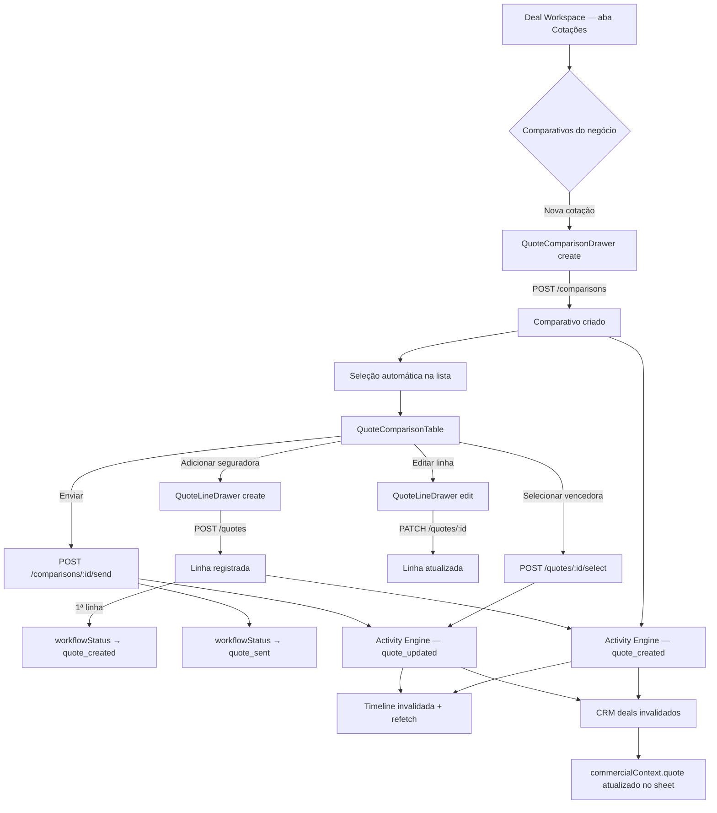

# Sprint 6.2 — Central de Cotações no Deal Workspace

**Data:** 2026-07-08  
**Escopo:** Frontend only — consumo das APIs de Quotes existentes, sem alteração de contratos backend, schema ou regras de negócio.

---

## Resumo

A aba **Cotações** do `DealSheetV2` deixou de ser um hub de navegação read-only e passou a operar como **Central de Cotações inline**: listagem de comparativos do negócio, criação/edição via drawer, tabela comparativa entre seguradoras, seleção da cotação vencedora e envio do comparativo — tudo integrado a React Query, RBAC (`quotes:view` / `quotes:manage`), multi-tenant (via BFF) e Design System.

---

## Componentes criados

| Componente | Caminho | Responsabilidade |
|---|---|---|
| `DealQuotesHub` | `apps/web/components/quotes/deal-quotes-hub.tsx` | Orquestrador da Central de Cotações no Deal Workspace |
| `QuoteComparisonDrawer` | `apps/web/components/quotes/quote-comparison-drawer.tsx` | Drawer (Sheet) de criação e edição de comparativo |
| `QuoteLineDrawer` | `apps/web/components/quotes/quote-line-drawer.tsx` | Drawer de criação e edição de linha (seguradora) |

## Componentes alterados

| Componente | Alteração |
|---|---|
| `DealQuotesSection` | Passa a renderizar `DealQuotesHub` em vez de `EntityQuotesSection` |
| `QuoteComparisonTable` | Suporte a `rowActions` (selecionar vencedora, editar linha) com RBAC |
| `hooks.ts` (quotes) | Invalidação cruzada de CRM deals e activities após mutations |

## Componentes reutilizados (sem alteração estrutural)

- `DealSheetV2` — aba `quotations` já existente
- `EntityQuotesSection` — mantido para lead/customer (fora do escopo deal)
- `SectionPanel`, `StatusPill`, `PropertyGrid`, `DataTable` (Design System)
- `PermissionGate` — ações de escrita condicionadas a `quotes:manage`

---

## Hooks utilizados

### Leitura

| Hook | Uso |
|---|---|
| `useDealQuoteComparisons` | Lista comparativos vinculados ao `dealId` |
| `useQuoteComparison` | Detalhe do comparativo selecionado (linhas, status, cotação vencedora) |

### Escrita (wire completo no hub)

| Hook | Ação na UI |
|---|---|
| `useCreateQuoteComparison` | Botão **Nova cotação** → drawer create |
| `useUpdateQuoteComparison` | Drawer edit (título, notas, `workflowStatus`) |
| `useAddQuoteLine` | Botão **Seguradora** → drawer create line |
| `useUpdateQuoteLine` | Row action **Editar linha** |
| `useSelectQuoteLine` | Row action **Selecionar vencedora** |
| `useMarkComparisonSent` | Botão **Enviar** comparativo |

### Hooks disponíveis mas não expostos nesta fase (sem endpoint backend)

| Hook solicitado no brief | Status |
|---|---|
| `useDeleteQuoteComparison` | **Não existe** — backend não expõe `DELETE /quotes/comparisons/:id` |
| `useDeleteQuoteLine` | **Não existe** — backend não expõe delete de linha |
| `useSelectWinningQuote` | Alias conceitual de `useSelectQuoteLine` (nome canônico no código) |

### Invalidação pós-mutation

Função `invalidateQuoteSideEffects` em `hooks.ts` invalida:

- `queryKeys.quotes.all`
- `queryKeys.crm.deals.all` — atualiza `commercialContext.quote` no deal
- `queryKeys.activities.all` — refresca Timeline após Activity Engine publicar eventos

---

## APIs consumidas (via BFF Next.js)

Todas as rotas passam por `apps/web/app/api/quotes/**` → proxy para `GET/POST/PATCH` da API NestJS.

| Método | Rota BFF | Permissão |
|---|---|---|
| `GET` | `/api/quotes?dealId=…` | `quotes:view` |
| `GET` | `/api/quotes/comparisons/:id` | `quotes:view` |
| `POST` | `/api/quotes/comparisons` | `quotes:manage` |
| `PATCH` | `/api/quotes/comparisons/:id` | `quotes:manage` |
| `POST` | `/api/quotes/comparisons/:id/quotes` | `quotes:manage` |
| `PATCH` | `/api/quotes/comparisons/:id/quotes/:quoteId` | `quotes:manage` |
| `POST` | `/api/quotes/comparisons/:id/quotes/:quoteId/select` | `quotes:manage` |
| `POST` | `/api/quotes/comparisons/:id/send` | `quotes:manage` |

---

## Fluxo completo — Central de Cotações



### Passo a passo operacional

1. Usuário abre negócio no Kanban → `DealSheetV2` → aba **Cotações**.
2. **Resumo comercial** exibe status do comparativo, contagem de linhas, se há cotação selecionada e data de atualização (de `commercialContext.quote` ou do comparativo ativo).
3. **Comparativos do negócio** lista todos os comparativos com `dealId`; clique seleciona o ativo.
4. **Nova cotação** (requer `quotes:manage`) abre drawer → cria comparativo com `dealId` + `leadId` (se houver lead convertido).
5. No comparativo selecionado, **Seguradora** adiciona linhas; a tabela exibe comparação lado a lado (prêmio, franquia, coberturas, status).
6. **Selecionar vencedora** marca a linha via `selectQuoteLine`; backend atualiza `selectedQuoteId` e status da linha.
7. **Enviar** marca comparativo como enviado (`quote_sent`) quando há ao menos uma linha.
8. **Editar** comparativo permite ajustar título, notas e status manual do fluxo.
9. Backend publica eventos no **Activity Engine** (`quote_created`, `quote_updated`); frontend invalida activities + CRM → Timeline e resumo do deal atualizam automaticamente.
10. Link **Abrir central de cotações** mantém acesso ao módulo `/cotacoes` para visão expandida.

---

## Timeline e status do negócio

| Aspecto | Comportamento |
|---|---|
| **Timeline** | Eventos publicados pelo `ActivityEngineService` no backend em create/update/select/send de cotações; frontend invalida `activities` após mutations |
| **Resumo comercial do deal** | `commercialContext.quote` enriquecido em `CrmService.findDeals`; invalidação de `crm.deals` após mutations de quotes |
| **Estágio do pipeline (stage)** | **Não sincronizado automaticamente** pelo backend de quotes — apenas `workflowStatus` do comparativo evolui (`received` → `quote_created` → `quote_sent` → …). Sincronização stage ↔ cotação fica como pendência de integração futura |

---

## RBAC e multi-tenant

- **Leitura:** qualquer usuário com `quotes:view` vê listagem e tabela.
- **Escrita:** botões e row actions envolvidos por `PermissionGate` com `quotes:manage`.
- **Multi-tenant:** tenant resolvido no JWT; BFF repassa token; API filtra por `tenantId` em todas as queries.

---

## Validação

| Check | Resultado |
|---|---|
| `npm run lint` | ✅ Passou |
| `npm run check-types` | ✅ Passou |
| `npm run test -w api` | ⚠️ 56/58 — 2 falhas pré-existentes (`document.util.spec.ts`, `app.controller.spec.ts`) |
| `npm run build` | ✅ Passou |

---

## Pendências — integração futura com seguradoras

1. **APIs de seguradoras** — cotação automática via integradores (Porto, Tokio, etc.); hoje linhas são manuais (`externalSource: manual`, sem `externalRef`).
2. **Delete de comparativo/linha** — endpoints e hooks `useDeleteQuoteComparison` / `useDeleteQuoteLine` inexistentes; UI não expõe exclusão.
3. **Bulk import** — `useBulkAddQuoteLines` disponível mas não wired na UI do deal workspace.
4. **Sincronização deal stage** — mapear `workflowStatus` do comparativo para `CrmStageId` (`proposta`, `negociacao`, `fechado`) de forma automática.
5. **Proposta inline** — criação de proposta a partir da cotação vencedora permanece na aba **Propostas** / Centro de Propostas (`useCreateProposal`).
6. **Questionário → comparativo** — fluxo `syncComparisonFromSubmission` já existe no backend; UI do deal não dispara sync explícito.
7. **Catálogo de seguradoras/produtos** — autocomplete e validação de planos/coberturas padronizados.
8. **Webhooks / polling** — recebimento assíncrono de cotações externas com atualização de linhas em draft → quoted.

---

## Arquivos tocados nesta sprint

```
apps/web/components/quotes/deal-quotes-hub.tsx          (novo)
apps/web/components/quotes/quote-comparison-drawer.tsx  (novo)
apps/web/components/quotes/quote-line-drawer.tsx        (novo)
apps/web/components/quotes/deal-quotes-section.tsx      (alterado)
apps/web/components/quotes/quote-comparison-table.tsx   (alterado)
apps/web/lib/data-access/modules/quotes/hooks.ts        (alterado)
docs/reports/sprint6-phase2.md                          (novo)
```
