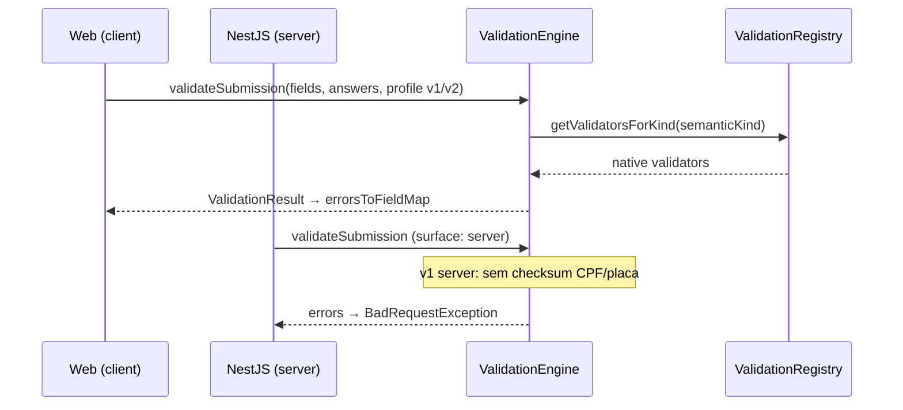

# Sprint 7.1 — EPIC 1: Validation Engine

**Status:** Implementado  
**Pacote:** `@repo/forms-engine`  
**Relacionado:** [smart-forms-engine.md](../architecture/smart-forms-engine.md)

---

## Resumo

Primeiro módulo do Smart Forms Engine entregue: **Validation Engine** unificado em `packages/forms-engine`, consumido pelo frontend (web) e backend (API) sem duplicar regras.

---

## Arquitetura implementada

```
packages/forms-engine/src/
├── index.ts
└── validation/
    ├── validation-engine.ts      # ValidationEngine
    ├── validation-registry.ts    # ValidationRegistry
    ├── field-metadata.ts         # Metadados por tipo (Library futura)
    ├── types/index.ts            # Schemas e interfaces
    ├── validators/index.ts       # Native + generic rule validators
    └── utils/
        ├── validators.util.ts    # CPF, CNPJ, CEP, placa, etc.
        ├── masks.util.ts         # Máscaras BR
        ├── field.util.ts         # resolveSemanticKind, adapters
        ├── answer.util.ts        # isEmptyAnswer, normalize
        └── context.util.ts       # createClient/ServerValidationContext
```

### ValidationEngine

| Método | Responsabilidade |
|--------|------------------|
| `validateField()` | Valida um campo + valor |
| `validateSection()` | Filtra por `settings.section` |
| `validateSubmission()` | Valida todas as respostas + keys desconhecidas (server) |
| `validateTemplate()` | Estrutural: keys duplicadas, opções, labels |
| `buildSubmitAnswers()` | Normalização para submit |
| `buildDraftAnswers()` | Rascunho parcial (draft mode) |

### Registry Pattern

- `ValidationRegistry` registra **native validators** por `SemanticFieldKind`
- `genericRuleValidators` aplicam `field.validation` schema v1 (profile **v2**)
- Extensível via `registerValidator()` e `registerMetadata()`

---

## Validators criados

### Nativos (22 semantic kinds)

| Kind | Validator ID |
|------|----------------|
| short_text, long_text | native.text |
| cpf, cnpj, cep, phone, email, url | native.* |
| date, time, datetime | native.date/time/datetime |
| plate, renavam, chassi | native.plate/renavam/chassi |
| number, decimal, currency | native.number/currency |
| checkbox, select, radio, multiselect | native.checkbox/select/multiselect |
| file | native.file |

### Regras genéricas (ValidationSchema v1)

required, minLength, maxLength, min, max, pattern, oneOf, cpf, cnpj, cep, phone, email, url, plate, renavam, chassi, fileRequired, minItems, maxItems, mask

---

## Fluxo



---

## Compatibilidade

| Profile | Origem | Comportamento |
|---------|--------|---------------|
| **v1** | `engineVersion` ausente ou ≠ 2 | Equivalente ao legado |
| **v2** | `template.settings.engineVersion: 2` | + `field.validation` schema |

| Surface | v1 |
|---------|-----|
| **client** | CPF, telefone, data BR, placa, etc. |
| **server** | Tipos Prisma + email; sem checksum documentos (compat API) |

Templates e submissões existentes **não migrados** — profile v1 por default.

---

## Integrações

| Camada | Arquivo | Mudança |
|--------|---------|---------|
| Frontend | `questionnaire-field-validation.ts` | Delega ao `ValidationEngine` |
| Frontend | `form-preview.tsx` | Erros em tempo real via engine |
| Frontend | `questionnaire-submission-dialog.tsx` | Profile via `template.settings` |
| Backend | `questionnaires.service.ts` | `validateSubmissionAnswers` → engine |

APIs REST, hooks React Query, Prisma, RBAC e Activity Engine **inalterados**.

---

## Cobertura de testes

**Pacote `@repo/forms-engine`:** 17 testes unitários

| Área | Casos |
|------|-------|
| CPF, CNPJ, CEP, email, phone, plate, renavam | validators.util |
| Required draft vs finalize | ValidationEngine |
| CPF client v1 vs server v1 | profile/surface |
| Regex, min/max length v2 | generic rules |
| validateTemplate duplicate keys | ValidationEngine |
| validateSection | ValidationEngine |
| Registry | list validators |

**API legado:** 56/58 (2 testes pré-existentes)

---

## Performance

- Motor **puro** (zero I/O) — O(n) em número de campos
- Registry em memória — lookup O(1) por kind
- Sem impacto mensurável em build (~47s web unchanged band)

---

## Field Metadata (Library futura)

`FIELD_TYPE_METADATA` expõe por kind: label, description, icon, category, supportedRules, supportedMasks, supportedValidators.

---

## Pendências — EPIC 2 (Conditional Engine)

- [ ] `RuleEvaluator` + DSL `rules.v1`
- [ ] `visibleFieldKeys` no `ValidationContext` (hook já preparado)
- [ ] Rule Editor no builder
- [ ] Server-side visibility-aware validation
- [ ] Questionnaire Simulator

---

## Validação final

| Check | Status |
|-------|--------|
| lint / typecheck | ✅ |
| build | ✅ |
| forms-engine tests | ✅ 17/17 |
| api tests | ✅ 56/58 (legado) |

---

## Critérios de sucesso

| Critério | Status |
|----------|--------|
| Único Validation Engine | ✅ `@repo/forms-engine` |
| Frontend + backend mesmas regras | ✅ (com surface v1 documentado) |
| Sem validação duplicada | ✅ Removido switch em `QuestionnairesService` |
| Extensível para novos tipos | ✅ Registry + metadata |
| Preparado para EPIC 2 | ✅ `visibleFieldKeys` no context |
