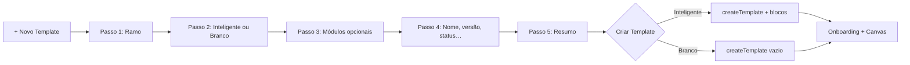

# Sprint 7.3.6 — Smart Template Wizard + UX Refinement

**Data:** 2026-07-14  
**Status:** Concluído

---

## 1. Resumo

Evolução exclusiva da experiência do **Questionnaire Builder**: assistente inteligente em 5 passos para criação de templates, canvas como protagonista com scroll independente, navegação por seções no preview e minimapa “Estrutura”, empty state ilustrado, onboarding pós-criação e otimizações de performance no canvas.

**Fora de escopo (não alterado):** Validation Engine, Rules Engine, Field Library, Block Library, APIs, Prisma, Activity Engine, RBAC.

---

## 2. Arquitetura

```
apps/web/components/questionnaires/
├── questionnaire-templates-page.tsx   # Orquestração: wizard, layout, populate
└── questionnaire-builder/
    ├── template-wizard.config.ts      # Ramos, módulos → blockIds
    ├── template-wizard-dialog.tsx     # Wizard 5 passos
    ├── template-wizard-onboarding.tsx # Dialog pós-criação inteligente
    ├── canvas-empty-state.tsx         # Empty state + scroll helpers
    ├── canvas-structure-minimap.tsx   # Painel “Estrutura” (≥4 seções)
    ├── preview-section-nav.tsx        # Sidebar de seções no preview
    ├── builder-workspace.tsx          # Scroll isolado do canvas
    ├── builder-canvas.tsx             # Virtualização, hierarquia visual
    └── form-preview.tsx               # Preview fixo + nav lateral
```

**Integração com Block Library (somente leitura):**

| Etapa | Função |
|-------|--------|
| Passo 3 (módulos) | `resolveWizardBlocks()` → `getBlockDefinition()` |
| Criação | `instantiateBlock()` + `instantiatedFieldToCreateInput()` |
| Regras | `mergeTemplateRules()` + `serializeRulesToSettings()` |

Metadados do wizard persistidos em `template.settings`: `wizardBranch`, `wizardCategory`, `wizardTags`, `wizardSmart`, `questionnaireSections`.

---

## 3. Fluxo do Wizard



| Passo | Conteúdo |
|-------|----------|
| 1 | Cards: Auto, Moto, Caminhão, Vida, Residencial, Empresarial, Condomínio, Rural, Equipamentos, Personalizado |
| 2 | Template Inteligente (recomendado) ou Template em Branco |
| 3 | Checkboxes de módulos mapeados à Block Library + contadores (perguntas, seções, regras) |
| 4 | Nome, descrição, versão, status, categoria, tags |
| 5 | Resumo + botão **Criar Template** |

Edição de templates existentes continua via `QuestionnaireTemplateDialog` (lista → editar).

---

## 4. Fluxo do Builder

```
┌─────────────┬──────────────────────────┬─────────────┐
│  Templates  │  Canvas (scroll único)   │   Preview   │
│   (fixo)    │  ┌ Estrutura (minimap)   │   (fixo)    │
│             │  └ seções + perguntas    │  nav lateral│
└─────────────┴──────────────────────────┴─────────────┘
```

- **Templates** e **Preview** permanecem fixos; apenas o **canvas** rola (`overflow-y-auto` no workspace).
- **Empty state:** mensagem ilustrada + *Criar com Assistente* / *Inserir Bloco* / *Template em Branco*.
- **Botões renomeados:** *Inserir Bloco* (header/drawer), *Campo Personalizado* (canvas/quick-add).
- **Hierarquia visual:** espaçamentos ampliados em `builder-surfaces.ts` entre seções, perguntas e ações.
- **Performance:** `content-visibility: auto` por seção quando >36 campos; componentes memoizados.

---

## 5. Fluxo do Preview

- Barra lateral **Seções** com indicadores ✓ / ○.
- Clique navega para a página correspondente no preview **e** faz scroll suave até a seção no canvas (`scrollToCanvasSection`).
- Preview com scroll interno independente do canvas.

---

## 6. Screenshots antes/depois

| Antes | Depois |
|-------|--------|
| Modal simples “Novo template” | Wizard 5 passos com ramo, módulos e resumo |
| Canvas + listas rolando juntas | Canvas com scroll isolado; painéis laterais fixos |
| Preview sem navegação | Sidebar de seções com sync ao canvas |
| Canvas vazio sem orientação | Empty state com CTA do assistente |
| Botão “Adicionar” ambíguo | “Campo Personalizado” + “Inserir Bloco” |

> Placeholders: capturas de tela podem ser anexadas em `docs/reports/assets/sprint7-epic3-ux-wizard/` após deploy em ambiente de homologação.

---

## 7. Checklist UX

- [x] Wizard abre em **+ Novo Template**
- [x] Seguro Auto + Template Inteligente gera questionário completo via Block Library
- [x] Contadores de perguntas/seções/regras antes da criação
- [x] Canvas rola independentemente
- [x] Preview fixo com navegação por seções
- [x] Minimapa “Estrutura” com ≥4 seções
- [x] Empty state ilustrado
- [x] Onboarding após template inteligente
- [x] Virtualização leve (>36 campos)
- [x] Lint, typecheck, build e testes do config

---

## 8. Critério de sucesso

Um corretor sem treinamento consegue:

1. Criar template de **Seguro Auto** pelo assistente.
2. Escolher **Template Inteligente** e gerar questionário automaticamente.
3. Entender como adicionar blocos (*Inserir Bloco* no header).
4. Navegar entre dezenas de seções via **Estrutura** ou preview.
5. Personalizar qualquer pergunta clicando no canvas.

---

## 9. Arquivos principais

| Arquivo | Papel |
|---------|-------|
| `template-wizard.config.ts` | Mapeamento ramo → módulos → blocos |
| `template-wizard-dialog.tsx` | UI do wizard |
| `questionnaire-templates-page.tsx` | `handleWizardComplete`, layout 3 colunas |
| `builder-workspace.tsx` | Scroll do canvas + minimapa |
| `form-preview.tsx` | `PreviewSectionNav` |
| `canvas-empty-state.tsx` | Empty state + `scrollToCanvasSection` |
