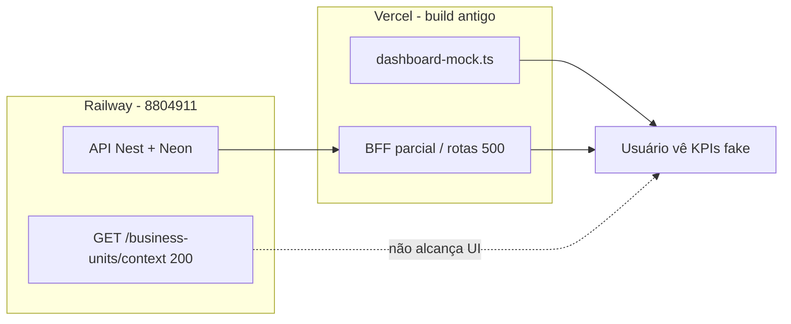

# WEB-001 — Auditoria e redeploy Vercel

**Data:** 24 de agosto de 2026  
**Ambiente:** `https://corretoraavila.com.br` (Vercel) + `https://api.corretoraavila.com.br` (Railway, pós INFRA-006)  
**Commit alvo:** `88049114c8b5f8c4da38d9c284bdd1163d7f54ba` (`8804911`)  
**Branch alvo:** `release/crm-operacao-avila`  
**Restrição:** validação e publicação apenas — **nenhum código alterado**

---

## Classificação final

# BLOCKED — deploy não executado (Vercel CLI sem autenticação)

A auditoria pré-deploy está **completa**. A produção web **continua servindo build anterior a `47702a5`**. O redeploy para `8804911` **não pôde ser disparado** nesta sessão porque `npx vercel whoami` retorna **Logged out** e não há `VERCEL_TOKEN` no ambiente.

---

## Conclusão executiva

| Item | Status |
|------|--------|
| Diagnóstico AUD-001 confirmado | **Sim** — dashboard mock (2.847 / 186 / 1.902) ainda no ar |
| API alinhada ao release | **Sim** — Railway @ `8804911` (INFRA-006) |
| Branch remota no commit alvo | **Sim** — `origin/release/crm-operacao-avila` → `8804911` |
| Config Vercel documentada no repo | **Sim** — projeto `web`, root `apps/web` |
| Redeploy Vercel executado | **Não** — bloqueio de credenciais |
| Smoke pós-deploy (`8804911`) | **Pendente** — aguarda redeploy |

---

## 1. Validação pré-deploy (checklist WEB-001)

### 1.1 Projeto Vercel conectado

| Fonte | Evidência |
|-------|-----------|
| Documentação operacional | [`docs/infra/go-live-production.md`](../infra/go-live-production.md) — projeto **`web`**, domínios apex + www |
| DNS / edge | Resposta `Server: Vercel`, `X-Vercel-Id: gru1::…` em `https://corretoraavila.com.br/` |
| CLI local | **Sem** pasta `.vercel/` linkada no repositório; CLI **não autenticada** |

**Resultado:** projeto Vercel **existe e serve produção**; vínculo CLI local **ausente**; detalhes de painel (team, project ID) **não inspecionados** (sem login Vercel).

### 1.2 Branch utilizada

| Item | Valor |
|------|--------|
| Branch release | `release/crm-operacao-avila` |
| HEAD local | `88049114c8b5f8c4da38d9c284bdd1163d7f54ba` |
| HEAD `origin` (após `git fetch`) | `88049114c8b5f8c4da38d9c284bdd1163d7f54ba` |
| Mensagem | `infra: fix api docker build for release` |

**Resultado:** branch remota **está no commit alvo**. Se o projeto Vercel estiver conectado a esta branch, o próximo deploy deve publicar `8804911`.

### 1.3 Último commit publicado (produção)

| Indicador | Valor |
|-----------|--------|
| Commit esperado | `8804911` |
| Commit inferido em produção | **Anterior a `47702a5`** (`47702a520dbb…`, 21/08/2026) — provável base **`0c8385ba`** (29/05/2026) |
| Evidência UI | Dashboard mock: KPIs **2.847 / 186 / 1.902**, leads demo (Marina Costa…), botões **Últimos 30 dias** / **Exportar** |
| Evidência BFF | `/api/business-units/context` → **500**; `/api/policies`, `/api/quotes/metrics` → **500** (rotas/ausentes no build antigo) |
| Evidência positiva parcial | `/api/leads`, `/api/customers`, `/api/crm/deals` → **200** (handlers parcialmente presentes) |
| Next.js chunks | `/_next/static/chunks/1894kwe6i-lg0.css` (hash opaco — não mapeia SHA Git diretamente) |

**Resultado:** produção **não** reflete `8804911` nem `47702a5`.

### 1.4 Root Directory

| Item | Valor |
|------|--------|
| Documentado (go-live) | `apps/web` |
| Repo (`apps/web/vercel.json`) | Install/build sobem ao monorepo (`cd ../..`) |
| Raiz monorepo | `vercel.json` experimental — **não** usar para o projeto `web` ([INFRA-001](infra-001-deploy-checklist.md)) |

**Resultado:** root **`apps/web`** — conforme runbooks.

### 1.5 Build Command

Definido em [`apps/web/vercel.json`](../../apps/web/vercel.json):

| Campo | Valor |
|-------|--------|
| `installCommand` | `cd ../.. && npm ci` |
| `buildCommand` | `cd ../.. && npx turbo run build --filter=web` |
| `outputDirectory` | `.next` |
| `framework` | `nextjs` |
| `regions` | `["gru1"]` |

**Resultado:** build monorepo via Turbo — conforme documentação.

### 1.6 Environment Variables

| Variável | Valor esperado (produção) | Evidência runtime |
|----------|---------------------------|-------------------|
| `AUTH_SECRET` | ≥ 32 chars (Production) | Login e `/api/auth/me` **200** com sessão — **presumida OK** |
| `API_INTERNAL_URL` | `https://api.corretoraavila.com.br` | BFF leads/customers/crm **200** — **presumida OK** |
| `API_URL` | Igual a `API_INTERNAL_URL` (recomendado) | Não verificável sem painel |
| `NODE_ENV` | `production` | Implícito (cookies secure, edge Vercel) |

**Resultado:** variáveis mínimas **funcionam** (login + BFF parcial). Valores exatos no painel Vercel **não lidos** (sem acesso autenticado).

### 1.7 Produção utiliza build anterior a `47702a5`?

# SIM — CONFIRMADO

| Prova | Detalhe |
|-------|---------|
| AUD-001 | Subtítulo enterprise + KPIs mock byte-a-byte com `dashboard-mock.ts` |
| Browser 24/08/2026 | Dashboard home: **2.847**, **186**, **1.902**, Marina Costa… |
| Git | `47702a5` remove `apps/web/lib/dashboard-mock.ts` (21/08/2026) |
| Company Context | `/api/business-units/context` → **500** (handler do release ausente/quebrado) |
| Business Unit UI | Seletor **Empresa** **ausente** no topbar |

---

## 2. Tentativa de redeploy

### 2.1 CLI Vercel

```text
npx vercel whoami
> Logged out.
> Run `vercel deploy --temporary` ... or `vercel login` to log in.
```

| Check | Resultado |
|-------|-----------|
| `VERCEL_TOKEN` no ambiente | **Não definido** |
| `apps/web/.vercel/project.json` | **Ausente** |
| `vercel login` (device flow) | Iniciado em sessão anterior; **não concluído** |
| Browser em vercel.com | **Tela de login** — sessão não autenticada |

### 2.2 Comando planejado (após autenticação)

```powershell
git worktree add ..\InsureFlow-web-8804911 88049114c8b5f8c4da38d9c284bdd1163d7f54ba
cd ..\InsureFlow-web-8804911\apps\web
npx vercel link    # projeto: web, team Ávila, environment Production
npx vercel deploy --prod --yes
```

Alternativa equivalente: **Vercel Dashboard → projeto `web` → Deployments → Redeploy** da branch `release/crm-operacao-avila` @ `8804911`.

### 2.3 Resultado

| Ação | Status |
|------|--------|
| Redeploy produção | **NÃO EXECUTADO** |
| Motivo | Ausência de credenciais Vercel (CLI + browser) |

---

## 3. Validação operacional (pré-deploy — build atual)

Sessão autenticada: `admin@insureflow.com` (cookie existente no browser).  
Data: 24/08/2026 ~22:00 UTC-3.

### 3.1 Login

| Check | Resultado |
|-------|-----------|
| `/login` | Redireciona para `/` com sessão ativa |
| `GET /api/auth/me` | **200** |
| Usuário | `admin@insureflow.com`, role Administrador |

**Status:** **OK** (autenticação BFF operacional).

### 3.2 Dashboard

| Check | Resultado |
|-------|-----------|
| Rota `/` | **200** — renderiza dashboard |
| Versão | **Mock legado** (pré-`47702a5`) |
| KPIs | 2.847 / 186 / 73 / 1.902 — **não refletem Neon** |
| Seletor Empresa | **Ausente** |

**Status:** **NOT OK** — requer redeploy `8804911`.

### 3.3 Leads

| Check | Resultado |
|-------|-----------|
| Rota `/leads` | **200** |
| Contadores | Leads **0**, Convertidos **0**, Qualificados **0** |
| `GET /api/leads?limit=1` | **200** |
| UI | Filtros + "Novo lead" presentes |

**Status:** **OK** (dados reais; lista vazia coerente com API prod).

### 3.4 Clientes

| Check | Resultado |
|-------|-----------|
| Rota `/customers` | **Erro** — "This page couldn't load" (`ERROR 3873069145@E488`) |
| `GET /api/customers?limit=1` | **200** (BFF OK; falha provável SSR/rota page no build antigo) |

**Status:** **NOT OK** — página quebrada no build atual.

### 3.5 CRM

| Check | Resultado |
|-------|-----------|
| Rota `/crm` | **200** |
| Navegação | Visão geral, Negócios, Contatos, Empresas, Agenda, Tarefas… |
| `GET /api/crm/deals` | **200** |

**Status:** **PARCIAL OK** — shell CRM carrega; validação profunda pós-deploy pendente.

### 3.6 Company Context

| Check | Resultado |
|-------|-----------|
| `GET /api/business-units/context` | **500** |
| Seletor Business Unit | **Ausente** no header |
| API backend (Railway) | `GET /api/v1/business-units/context` → **200**, `units: []` (INFRA-006) |

**Status:** **NOT OK** — BFF web desatualizado; zero BUs no Neon prod.

### 3.7 Business Unit selector

| Check | Resultado |
|-------|-----------|
| Componente esperado (`8804911`) | `BusinessUnitSwitcher` no topbar quando `units.length > 0` |
| Produção atual | **Não renderizado** (layout mock + BFF 500) |

**Status:** **NOT OK** — depende de redeploy + eventual seed/import de BUs.

---

## 4. Validação pós-deploy (pendente)

Após publicar `8804911`, repetir:

| Área | Critério de sucesso |
|------|---------------------|
| Login | `/login` + `/api/auth/me` 200 |
| Dashboard | KPIs reais (~2 clientes, ~1 lead), **sem** mock 2847/186/1902 |
| Leads | Lista carrega; contadores coerentes com API |
| Clientes | `/customers` **200** (sem server error) |
| CRM | Pipeline/negócios navegáveis |
| Company Context | `/api/business-units/context` **200** |
| BU selector | Visível se houver unidades no tenant |

Reclassificar para **READY** / **READY WITH WARNINGS** / **NOT READY** após smoke.

---

## 5. Descompasso atual (Web × API)



---

## 6. Desbloqueio — próximos passos

1. **Autenticar Vercel** (escolher uma):
   - `npx vercel login` e concluir device code no browser, **ou**
   - Exportar `VERCEL_TOKEN` (token de deploy da team) na sessão do agente/terminal.
2. Executar redeploy (CLI ou painel) apontando para **`release/crm-operacao-avila` @ `8804911`**.
3. Confirmar no painel: Root **`apps/web`**, build Turbo, região **`gru1`**, envs **`AUTH_SECRET`** + **`API_INTERNAL_URL`**.
4. Rodar smoke da seção 4 e atualizar a classificação deste relatório.

---

## 7. Referências

- [AUD-001 — Dashboard produção vs local](aud001-dashboard-producao.md)
- [INFRA-006 — Redeploy final API](infra-006-redeploy-final.md)
- [Go-live produção](../infra/go-live-production.md)
- [INFRA-001 — Checklist Vercel](infra-001-deploy-checklist.md)

---

## Histórico

| Horário (UTC-3) | Evento |
|-----------------|--------|
| 24/08/2026 ~18:47 | Início WEB-001 |
| 24/08/2026 ~19:00 | Auditoria pré-deploy concluída; deploy bloqueado (Vercel logout) |
| 24/08/2026 ~22:00 | Smoke pré-deploy via browser; relatório gerado |
