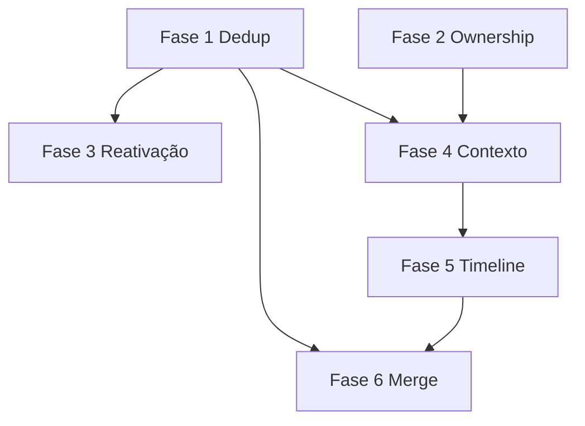

# Roadmap — Evolução do CRM comercial

> Incremental, sem refactor amplo. Status revisado em maio/2026 contra o repositório atual.

## Legenda

| Status | Significado |
|--------|-------------|
| ✅ Pronto | Em produção / código mergeado |
| 🔄 Em andamento | Branch ativa ou WIP não estável |
| 📋 Backlog | Planejado, não iniciado |
| ⚠️ Risco | Pode atrasar ou gerar dívida |

---

## Fase 1 — Deduplicação e qualidade operacional

**Objetivo:** CPF/CNPJ em lead, warnings não bloqueantes, base para qualidade de dados.

| Item | Status |
|------|--------|
| Campo `document` / normalização em Lead | ✅ |
| `GET /leads/duplicates` | ✅ |
| `warnings[]` em POST/PATCH lead | 📋 (banner via endpoint dedicado) |
| Banner UX na criação de lead | ✅ |
| Normalização documento em Customer | 📋 |
| Unicidade parcial documento em Lead | 📋 |

**Dependências:** ADR-005, migration Prisma.

**Riscos:** ⚠️ Conflito com leads históricos sem documento; definir política de backfill.

---

## Fase 1b — RBAC, usuários e perfis (estrutural)

**Objetivo:** Multiusuário com permissões granulares e ownership sistemático. **Arquitetura:** [rbac-architecture.md](../architecture/rbac-architecture.md) · [ownership-architecture.md](../architecture/ownership-architecture.md) · **ADR:** [ADR-006](../decisions/ADR-006-rbac-and-ownership.md) · **Sprint:** [sprint-1-ownership-rbac.md](../sprint-notes/sprint-1-ownership-rbac.md).

| Item | Status |
|------|--------|
| Modelagem RBAC (doc) | ✅ |
| Modelagem Ownership Sprint 1 (doc + schema proposal) | ✅ |
| Matriz permissões + escopos Sprint 1b Fase 2 (doc) | ✅ |
| Catálogo DB único + sync `@repo/auth` | 📋 |
| Papéis sistema corretora (`comercial`, `operacional`, …) | 📋 |
| API CRUD users / roles | 📋 |
| UI admin usuários e perfis | 📋 |
| `ownerUserId` + enforcement backend | 📋 |
| Equipes (`Team`) para escopo gerente | 📋 |
| Auditoria global em mutações | 📋 |

**Fora de escopo desta fase:** WhatsApp, IA, automações, financeiro, BI.

---

## Fase 2 — Ownership comercial

**Objetivo:** Responsável claro por lead/negócio, filtros “meus”, políticas por tenant. Evolui para enforcement completo na Fase 1b.

| Item | Status |
|------|--------|
| `assignedTo` em Lead/Deal | ✅ |
| FK ou resolução para `User` | 📋 |
| Default owner = usuário logado | ✅ |
| Filtro listagem `assignedTo=me` | ✅ (`mine=true`) |
| `Tenant.settings.leadOwnershipMode` | 📋 |
| Warning ao editar lead de outro corretor | 📋 |

**Dependências:** API de usuários do tenant no web (parcial em `users` module).

**Riscos:** ⚠️ Role `sales` sem `questionnaires` no seed vs necessidade operacional.

---

## Fase 3 — Reativação de leads antigos

**Objetivo:** Recuperar leads esquecidos sem criar duplicata.

| Item | Status |
|------|--------|
| `lastContactAt` em Lead | ✅ |
| Lista/smart filter “stale leads” | 📋 |
| Ação “Reativar” (status + timestamp) | 📋 |
| Config dias inatividade em tenant | 📋 |

**Dependências:** Fase 1 (evitar nova duplicata ao reativar).

---

## Fase 4 — Contexto comercial unificado

**Objetivo:** Uma visão lead → questionários → deal → customer.

| Item | Status |
|------|--------|
| Vínculos FK questionário (lead/deal/customer) | ✅ |
| Propagação `dealId` na conversão | ✅ |
| `GET /leads/:id/context` agregado | 📋 |
| Sheet/painel timeline resumida na UI | 📋 |
| Auto-link `customerId` por documento | 📋 |

**Dependências:** Fase 1 (documento).

---

## Fase 5 — Timeline operacional

**Objetivo:** Histórico legível para corretor (não só `AuditLog` técnico).

| Item | Status |
|------|--------|
| `AuditLog` assíncrono (login, etc.) | ✅ |
| Entidade `CommercialEvent` | 📋 |
| Eventos em convert/update/merge | 📋 |
| UI timeline no sheet do lead | 📋 |

**Dependências:** Fase 4 (contexto UI).

**Riscos:** ⚠️ Volume de eventos — indexar por `(tenantId, entityType, entityId)`.

---

## Fase 6 — Merge de leads

**Objetivo:** Consolidar duplicatas com governança.

| Item | Status |
|------|--------|
| `POST /leads/:id/merge/preview` | 📋 |
| `POST /leads/:id/merge` | 📋 |
| `mergedIntoId` + arquivamento soft | 📋 |
| Permissão `leads:merge` | 📋 |
| Redirecionamento FKs (questionários) | 📋 |

**Dependências:** Fase 1, Fase 5 (auditoria de merge).

---

## O que já está pronto (fora das fases)

| Capacidade | Status |
|------------|--------|
| CRUD leads multi-tenant | ✅ |
| Conversão lead → deal transacional | ✅ |
| Módulo questionários (templates + submissions) | ✅ |
| Autosave draft questionário (client) | ✅ |
| CRM kanban + deals API | ✅ |
| Customers com documento único | ✅ |
| RBAC + JWT + guards | ✅ |
| BFF Next + data-access modules | ✅ |
| Session provider + permission gates | ✅ |
| Optimistic updates (leads/crm/customers) | ✅ |

---

## 🔄 Em andamento (working tree típica)

Baseado no desenvolvimento recente do repositório (não necessariamente commitado):

| Área | Indícios |
|------|----------|
| Módulo questionnaires (API + web) | Controllers, hooks, dialogs |
| Integração lead ↔ questionário na lista | Badge, submission dialog |
| Session / permissions panel | Provider, gates em CRM |
| Permissions guard (`:manage` satisfaz `:view`) | Ajuste em guard |
| Proxy routes `app/api/questionnaires/*` | BFF |

> Validar contra `git status` antes de marcar como ✅.

---

## Dependências entre fases

---

## Riscos globais

| Risco | Mitigação |
|-------|-----------|
| Drift validação client/server | Testes de contrato nos DTOs + funções espelhadas |
| `assignedTo` livre sem FK | Fase 2 |
| Delete lead com questionários/deal | Guards de delete (backlog técnico) |
| Role seed `sales` sem questionários | Ajustar seed ou documentar persona |
| Stage `fechado` ≠ `won` | Treinamento + futura automação opcional |

---

## Referências

- [lead-lifecycle.md](../domain/lead-lifecycle.md)
- [commercial-flow.md](../workflows/commercial-flow.md)
- [ADRs](../decisions/README.md)
