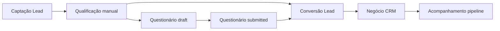

# Fluxo comercial operacional

> Fluxo real suportado pelo produto hoje, com lacunas marcadas como **planejado**.

## Diagrama principal

---

## 1. Captação de lead

| Item | Detalhe |
|------|---------|
| **Entrada** | Formulário em `/leads` ou API `POST /api/v1/leads` |
| **Permissão** | `leads:manage` |
| **Estado inicial** | `status` informado no form (UI default `new`) |
| **Campos** | name, email, phone, company, source, notes, assignedTo |
| **UX** | Dialog modal; nome obrigatório; toast de sucesso/erro |

**Warnings operacionais:** nenhum de duplicidade (planejado).

**Ações permitidas:** criar, editar, excluir, buscar/filtrar por status e origem.

---

## 2. Qualificação

| Item | Detalhe |
|------|---------|
| **Mecanismo** | PATCH manual de `status`: `contacted`, `qualified` |
| **Automação** | Nenhuma (sem SLA, sem tarefas ligadas) |
| **UX** | Select de status no dialog de edição; badges coloridos na tabela |

**Estado terminal alternativo:** `lost` — descarte sem negócio.

---

## 3. Questionário — rascunho

| Item | Detalhe |
|------|---------|
| **Gatilho** | Ação “Preencher questionário” na linha do lead |
| **Permissão** | `questionnaires:manage` (role `sales` do seed **não** tem — usar `broker`/`admin`) |
| **Pré-requisito** | Template `active` |
| **Estado** | `QuestionnaireSubmission.status = draft` |
| **UX** | Dialog grande; indicador de autosave; progresso de required |

**Comportamento:**

- Autosave a cada ~2s após mudança
- Cópia em `localStorage` se offline ou falha API
- Badge na lista: “Rascunho” priorizado sobre submissões antigas

**Warnings:**

- Template inativo → banner âmbar na abertura
- Falha sync → “Falha ao sincronizar — cópia local mantida” (**não bloqueia**)

---

## 4. Questionário — submissão

| Item | Detalhe |
|------|---------|
| **Ação** | Botão “Finalizar” |
| **Validação** | Required + formato (client); mesma regra no server para `submitted` |
| **Estado** | `submitted` + `submittedAt` (ISO enviado pelo client) |
| **UX** | Erros por campo após primeira tentativa; foco no primeiro erro |

**Pós-submit:** submissão editável via API; UI de revisão (`reviewed`) **planejada**, não exposta.

---

## 5. Conversão em negócio

| Item | Detalhe |
|------|---------|
| **Gatilho** | Ação “Converter” no lead (não convertido) |
| **Permissões** | `leads:manage` **e** `crm:manage` |
| **Pré-condição** | `dealId` vazio |
| **Efeitos** | Lead `converted`; Deal `open` stage `novo`; questionários do lead recebem `dealId` |
| **UX** | Dialog com título, valor, estágio; redirecionamento opcional ao CRM |

**Bloqueios:**

- Lead já convertido → erro 409

**Não faz:** criar cliente, vincular `customerId`.

---

## 6. Negócio CRM

| Item | Detalhe |
|------|---------|
| **Visualização** | Kanban por `stage` + lista tabular |
| **Permissão** | `crm:view` / `crm:manage` |
| **Ações** | Criar deal direto, editar, excluir, arrastar estágio |
| **Estados** | 5 stages × 4 statuses (independentes) |

**UX esperada:**

- Card com valor, empresa, owner (`assignedTo` exibido como nome/iniciais normalizados)
- Sheet de detalhe com propriedades e ações de contato (placeholders com `crm:manage`)

**Warnings:** mover para `fechado` sem marcar `won` — inconsistência possível (operador deve ajustar status manualmente se necessário).

---

## 7. Acompanhamento

| Item | Detalhe |
|------|---------|
| **Implementado** | Atualização de stage/status; visualização de lead origem no deal (`convertedLead`) |
| **Parcial** | Páginas CRM de atividades/contatos derivam de deals (sem entidade Activity) |
| **Planejado** | Timeline comercial unificada, reativação de leads antigos |

---

## Matriz estado × ações (lead)

| Status | Editar | Questionário | Converter | Excluir |
|--------|--------|--------------|-----------|---------|
| new | Sim | Sim | Sim* | Sim |
| contacted | Sim | Sim | Sim* | Sim |
| qualified | Sim | Sim | Sim* | Sim |
| converted | Sim** | Sim | Não | Sim*** |
| lost | Sim | Sim | Não | Sim |

\* Requer permissões de conversão  
\** Edição não reverte conversão  
\*** Sem guard de integridade — risco de órfãos

---

## Matriz submissão × ações

| Status | Autosave | Finalizar | Editar via API |
|--------|----------|-----------|----------------|
| draft | Sim | Sim | Sim |
| submitted | N/A | Re-finalizar na UI | Sim |
| reviewed | — | — | Sim (validação required) |
| archived | — | — | Sim |

---

## Personas e permissões no fluxo

| Role (seed / auth package) | Lead | Questionário | Converter | CRM |
|----------------------------|------|--------------|-----------|-----|
| sales | manage | **sem acesso seed** | manage* | manage |
| broker | manage | manage | manage* | manage |
| viewer | view | view | não | view |

\* Converter exige também `crm:manage` — role `sales` possui.

---

## Referências UX

- `apps/web/components/leads/leads-page.tsx`
- `apps/web/components/questionnaires/questionnaire-submission-dialog.tsx`
- `apps/web/components/crm/deals-page.tsx`
- `apps/web/components/crm/pipeline-board.tsx`
